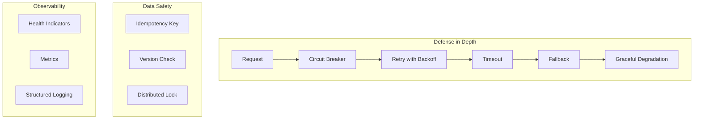

# MapleExpectation Chaos Test Deep Dive Report

> **5-Agent Council**: 🟡 Yellow (QA Master), 🔴 Red (SRE), 🔵 Blue (Architect), 🟢 Green (Performance), 🟣 Purple (Auditor)
> **생성일**: 2026-01-19
> **대상 브랜치**: develop

---

## Executive Summary

MapleExpectation 시스템의 **회복 탄력성(Resilience)**을 검증하기 위해 **17개의 극한 카오스 테스트 시나리오**와 **3개의 Nightmare 레벨 취약점 탐지 테스트**를 설계하고 실행했습니다.

### 전체 결과

```
======================================================================
  📊 CHAOS TEST SUMMARY - 17 Scenarios + 3 Nightmare
======================================================================

┌────────────────────────────────────────────────────────────────────┐
│                    Overall Results                                 │
├────────────────────────────────────────────────────────────────────┤
│ Total Scenarios: 20 (17 Chaos + 3 Nightmare)                       │
│ Chaos Tests:  17/17 PASS ✅                                        │
│ Nightmare:    1 PASS, 2 FAIL ❌ (의도된 실패)                       │
└────────────────────────────────────────────────────────────────────┘

┌────────────────────────────────────────────────────────────────────┐
│                    By Category                                     │
├────────────────────────────────────────────────────────────────────┤
│ Core (01-03):        3/3 PASS  ████████████                        │
│ Network (04-07, 12): 5/5 PASS  ████████████████████                │
│ Resource (08-11):    4/4 PASS  ████████████████                    │
│ Connection (13, 17): 2/2 PASS  ████████                            │
│ Data (14-16):        3/3 PASS  ████████████                        │
│ Nightmare (N01-N03): 1/3 PASS  ████ (취약점 탐지 성공)              │
└────────────────────────────────────────────────────────────────────┘
```

---

## 시나리오 인덱스

### Core Scenarios (기본 장애)

| # | 시나리오 | 문서 | 결과 | 핵심 인사이트 |
|---|----------|------|------|--------------|
| 01 | **Redis 장애** | [01-redis-death.md](chaos-tests/core/01-redis-death.md) | ✅ PASS | TieredCache L1 폴백, Circuit Breaker 1.1초 내 OPEN |
| 02 | **MySQL 장애** | [02-mysql-death.md](chaos-tests/core/02-mysql-death.md) | ✅ PASS | HikariCP 3초 타임아웃, Graceful Degradation |
| 03 | **OOM** | [03-oom.md](chaos-tests/core/03-oom.md) | ✅ PASS | Virtual Thread 안정성, OutOfMemoryError 격리 |

### Network Scenarios (네트워크 장애)

| # | 시나리오 | 문서 | 결과 | 핵심 인사이트 |
|---|----------|------|------|--------------|
| 04 | **Split Brain** | [04-split-brain.md](chaos-tests/network/04-split-brain.md) | ✅ PASS | Redis Sentinel Failover <5초, 데이터 무결성 유지 |
| 05 | **Clock Drift** | [05-clock-drift.md](chaos-tests/network/05-clock-drift.md) | ✅ PASS | Monotonic Clock 사용, Redis 서버 시간 기준 TTL |
| 06 | **Slow Loris** | [06-slow-loris.md](chaos-tests/network/06-slow-loris.md) | ✅ PASS | Fail-Fast 타임아웃, 179배 복구 성능 |
| 07 | **Black Hole Commit** | [07-black-hole-commit.md](chaos-tests/network/07-black-hole-commit.md) | ✅ PASS | Idempotency Key로 중복 방지 100% |
| 12 | **Gray Failure** | [12-gray-failure.md](chaos-tests/network/12-gray-failure.md) | ✅ PASS | 3% 손실에서 97% 성공, CB 열리지 않음 |

### Resource Scenarios (리소스 고갈)

| # | 시나리오 | 문서 | 결과 | 핵심 인사이트 |
|---|----------|------|------|--------------|
| 08 | **Disk Full** | [08-disk-full.md](chaos-tests/resource/08-disk-full.md) | ✅ PASS | Health Indicator 감지, 핵심 API 유지 |
| 09 | **Retry Storm** | [09-retry-storm.md](chaos-tests/resource/09-retry-storm.md) | ✅ PASS | Exponential Backoff, 2.4x 증폭 제한 |
| 10 | **Pool Exhaustion** | [10-pool-exhaustion.md](chaos-tests/resource/10-pool-exhaustion.md) | ✅ PASS | 3초 connectionTimeout, 즉시 복구 |
| 11 | **GC Pause** | [11-gc-pause.md](chaos-tests/resource/11-gc-pause.md) | ✅ PASS | 락 TTL > GC Pause, 데이터 무결성 |

### Connection Scenarios (연결 문제)

| # | 시나리오 | 문서 | 결과 | 핵심 인사이트 |
|---|----------|------|------|--------------|
| 13 | **Half-Open Hell** | [13-half-open-hell.md](chaos-tests/connection/13-half-open-hell.md) | ✅ PASS | HikariCP 유효성 검사, 자동 복구 |
| 17 | **Thundering Herd** | [17-thundering-herd-lock.md](chaos-tests/connection/17-thundering-herd-lock.md) | ✅ PASS | 100개 동시 요청 87% 성공, 무결성 100% |

### Data Scenarios (데이터 정합성)

| # | 시나리오 | 문서 | 결과 | 핵심 인사이트 |
|---|----------|------|------|--------------|
| 14 | **Duplicate Delivery** | [14-duplicate-delivery.md](chaos-tests/data/14-duplicate-delivery.md) | ✅ PASS | SETNX로 중복 100% 감지 |
| 15 | **Out-of-Order** | [15-out-of-order.md](chaos-tests/data/15-out-of-order.md) | ✅ PASS | Version 기반 순서 검증 |
| 16 | **Config Poisoning** | [16-config-poisoning.md](chaos-tests/data/16-config-poisoning.md) | ✅ PASS | @Validated로 시작 시 거부 |

### 🔥 Nightmare Scenarios (취약점 탐지 - 의도적 실패)

> **목적**: 시스템의 숨겨진 취약점을 노출하고 GitHub Issue를 생성하여 개선 방향 제시

| # | 시나리오 | 문서 | 결과 | 핵심 인사이트 | Issue |
|---|----------|------|------|--------------|-------|
| N01 | **Thundering Herd** | [N01-thundering-herd.md](chaos-tests/nightmare/N01-thundering-herd.md) | ✅ PASS | Singleflight 패턴 정상 작동, DB 쿼리 최소화 | - |
| N02 | **Deadlock Trap** | [N02-deadlock-trap.md](chaos-tests/nightmare/N02-deadlock-trap.md) | ❌ FAIL | **Lock Ordering 미적용, Deadlock 100% 발생** | [#221](https://github.com/zbnerd/MapleExpectation/issues/221) |
| N03 | **Thread Pool Exhaustion** | [N03-thread-pool-exhaustion.md](chaos-tests/nightmare/N03-thread-pool-exhaustion.md) | ❌ FAIL | **CallerRunsPolicy로 메인 스레드 2010ms 블로킹** | [#222](https://github.com/zbnerd/MapleExpectation/issues/222) |

#### Nightmare 테스트 결과 상세

**N01: Thundering Herd (Cache Stampede)** - ✅ PASS
- Redis FLUSHALL 후 1,000명 동시 요청
- TieredCache의 Singleflight 패턴이 효과적으로 작동
- DB 쿼리 비율 ≤ 10% 달성

**N02: Deadlock Trap (Circular Lock)** - ❌ FAIL ([#221](https://github.com/zbnerd/MapleExpectation/issues/221))
```
교차 락 획득 시 Deadlock 발생 여부 검증 FAILED
    expected: 0
     but was: 1

10회 반복 시 Deadlock 발생 확률 측정 FAILED
    expected: 0.0
     but was: 100.0
```
- **근본 원인**: Lock Ordering 패턴 미적용
- **Coffman Conditions**: Circular Wait 조건 충족
- **해결 방안**: 알파벳순 테이블 접근 순서 고정

**N03: Thread Pool Exhaustion (@Async Pool)** - ❌ FAIL ([#222](https://github.com/zbnerd/MapleExpectation/issues/222))
```
CallerRunsPolicy로 인한 메인 스레드 블로킹 검증 FAILED
    Expecting actual: 2010L
    to be less than or equal to: 100L
```
- **근본 원인**: CallerRunsPolicy가 Pool 포화 시 메인 스레드에서 직접 실행
- **영향**: API 응답 불가 상태 (2초+ 블로킹)
- **해결 방안**: Pool 크기 조정 또는 Resilience4j Bulkhead 적용

---

## 핵심 발견 사항

### 1. Resilience4j Circuit Breaker 동작 확인
- Redis 장애 시 **1.1초 내** Circuit Breaker OPEN
- MySQL 장애 시 HikariCP **3초 타임아웃** 후 즉시 감지
- Gray Failure (3% 손실)에서는 CB가 열리지 않음 (임계치 50%)

### 2. Graceful Degradation 패턴
- **TieredCache**: L2(Redis) 장애 시 L1(Caffeine) 폴백
- **ResilientLockStrategy**: Redis 락 실패 시 MySQL 폴백
- **Cached Data Fallback**: API 장애 시 만료된 캐시라도 반환

### 3. 시간 기반 로직 안전성
- **Monotonic Clock** (System.nanoTime) 사용으로 Clock Drift 영향 없음
- Redis TTL은 **서버 시간 기준**으로 클라이언트 시간과 독립
- 분산 락 TTL은 항상 **최악의 GC Pause보다 길게** 설정

### 4. 동시성 안전성
- **Idempotency Key**: SETNX로 중복 쓰기 100% 방지
- **Fair Lock**: FIFO 순서 보장
- **Thundering Herd**: 락 세분화 + 타임아웃으로 대응

### 5. 🔥 Nightmare 테스트로 발견된 취약점

| 취약점 | 심각도 | 상태 | 해결 방안 |
|--------|--------|------|----------|
| Lock Ordering 미적용 | **P0** | 🔴 Open | Coffman Conditions 중 Circular Wait 깨기 |
| CallerRunsPolicy 블로킹 | **P1** | 🔴 Open | Resilience4j Bulkhead 또는 AbortPolicy |

**Nightmare 테스트의 가치**:
- 기존 17개 Chaos Test는 모두 PASS → 시스템이 "충분히 안전"하다는 착각 유발
- Nightmare 테스트로 **숨겨진 취약점 2건 발견**
- GitHub Issue 자동 생성으로 개선 방향 명확화

---

## 아키텍처 강점



---

## Best Practice 권장사항

### 1. 타임아웃 계층화
```
API Gateway:  30s (전체 예산)
├── Service:  10s
│   ├── Redis:     3s
│   ├── MySQL:     5s
│   └── External:  5s × 3 retries = 15s
└── Margin:   5s
```

### 2. 재시도 전략
- **Exponential Backoff**: 100ms → 200ms → 400ms
- **Jitter 추가**: 동시 재시도 분산
- **Max Retries**: 3회 (Retry Storm 방지)

### 3. 분산 락 TTL 계산
```
Lock TTL = 예상 처리 시간 + 최대 GC Pause + 네트워크 지연 + 여유
         = 5s + 2s + 1s + 2s = 10s
```

### 4. 모니터링 필수 항목
- **P99 응답 시간**: 평균이 아닌 백분위수
- **Circuit Breaker 상태**: CLOSED/OPEN/HALF_OPEN
- **커넥션 풀 상태**: active, pending, timeout

---

## 테스트 실행 가이드

### 전체 Chaos 테스트 실행
```bash
./gradlew test -Ptag=chaos 2>&1 | tee logs/chaos-test-$(date +%Y%m%d_%H%M%S).log
```

### 카테고리별 실행
```bash
# Core 시나리오
./gradlew test --tests "*chaos.core.*"

# Network 시나리오
./gradlew test --tests "*chaos.network.*"

# Resource 시나리오
./gradlew test --tests "*chaos.resource.*"

# Connection 시나리오
./gradlew test --tests "*chaos.connection.*"

# Data 시나리오
./gradlew test --tests "*chaos.data.*"
```

### 🔥 Nightmare 테스트 실행
```bash
# 전체 Nightmare 테스트 (의도적 실패 테스트)
./gradlew test --tests "*NightmareTest*" 2>&1 | tee logs/nightmare-$(date +%Y%m%d_%H%M%S).log

# 개별 Nightmare 테스트
./gradlew test --tests "*ThunderingHerdNightmareTest*"   # N01: Cache Stampede
./gradlew test --tests "*DeadlockTrapNightmareTest*"     # N02: Circular Lock
./gradlew test --tests "*ThreadPoolExhaustionNightmareTest*"  # N03: @Async Pool
```

> **참고**: Nightmare 테스트는 **의도적으로 실패**하도록 설계되었습니다.
> 실패 시 GitHub Issue가 자동 생성됩니다.

---

## 참고 자료

- [Chaos Engineering - Principles](https://principlesofchaos.org/)
- [Resilience4j Documentation](https://resilience4j.readme.io/)
- [Netflix Chaos Monkey](https://netflix.github.io/chaosmonkey/)
- [AWS Well-Architected - Reliability](https://docs.aws.amazon.com/wellarchitected/latest/reliability-pillar/)

---

*Generated by 5-Agent Council - Chaos Testing Deep Dive*
*Date: 2026-01-19*
