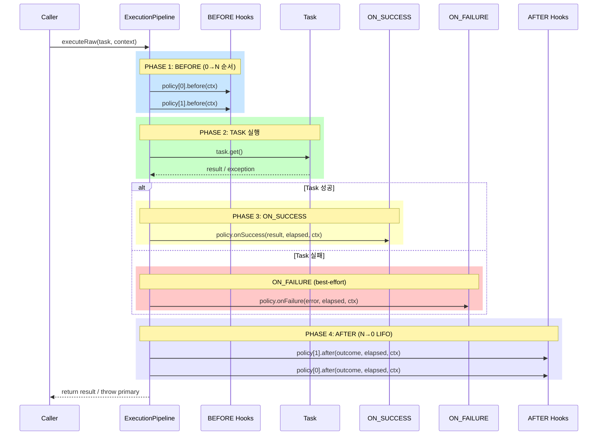
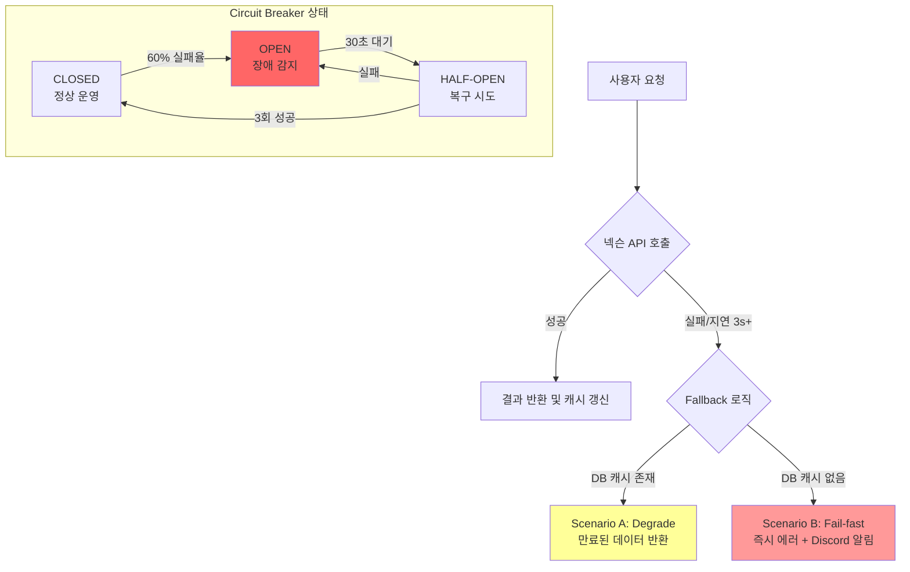
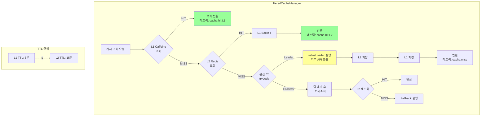
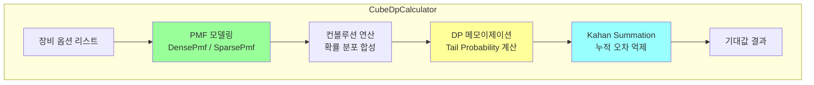
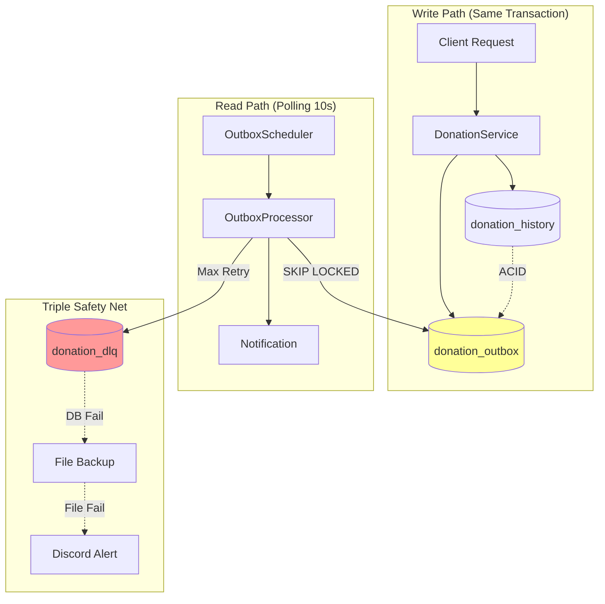
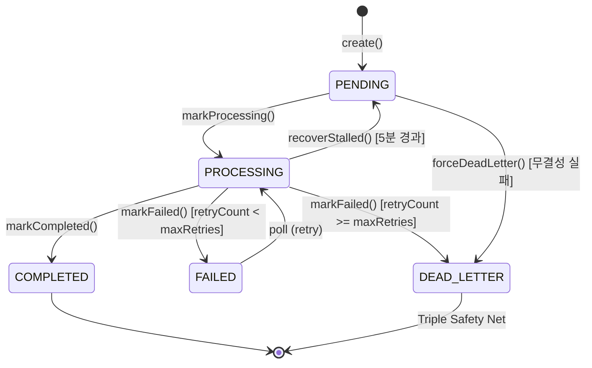

# MapleExpectation - 6개 핵심 모듈 기술 포트폴리오

> **"기능 데모가 아니라, 서비스가 실제로 깨지는 지점을 어떻게 방어했는지를 보여주는 프로젝트"**

---

## Executive Summary

| 지표 | 달성 수치 | 비고 |
|:---|:---:|:---|
| **RPS** | **235** | CPU-Bound 작업 (JSON 350KB 파싱) |
| **Failure Rate** | **0%** | 500명 동시 접속 부하 테스트 |
| **P99 Latency** | **160ms** | Warm Cache 기준 |
| **Try-Catch** | **0개** | 비즈니스 레이어 Zero Policy |
| **PR Count** | **76+** | 모든 PR에 기술적 결정 근거 기록 |
| **Issue Count** | **150+** | Problem-DoD 기반 체계적 관리 |

---

## 프로젝트 개요

### 비즈니스 도메인
넥슨 Open API를 활용하여 메이플스토리 유저 장비 데이터를 수집하고, 확률형 아이템(큐브)의 기대값을 계산하여 **"스펙 완성 비용"을 시뮬레이션**해주는 서비스입니다.

### 기술적 도전 과제
| 도전 과제 | 해결 모듈 |
|:---|:---|
| 외부 API 장애가 서비스 전체에 전파 | **Module 2: Resilience4j** |
| 동일 유저에 대한 중복 요청 (Race Condition) | **Module 3: TieredCache** |
| 저사양 서버(t3.small)에서 고부하 처리 | **Module 4: Async Pipeline** |
| 서버 종료 시 데이터 유실 | **Module 5: Graceful Shutdown** |
| 확률 계산의 성능 및 정확도 | **Module 6: DP Calculator** |
| 예외 처리 정책 파편화 | **Module 1: LogicExecutor** |

### 설계 우선순위
```
1. 데이터 정합성 → 2. 장애 격리 및 복구 가능성 → 3. 성능
```

### 기술 스택
```
Backend:    Java 17, Spring Boot 3.5.4, Spring Data JPA
Database:   MySQL 8.0 (GZIP 압축 저장)
Cache:      Redis (Redisson 3.27.0), Caffeine Cache
Resilience: Resilience4j 2.2.0 (Circuit Breaker, Retry, TimeLimiter)
Testing:    JUnit 5, Testcontainers, Locust (부하 테스트)
Infra:      AWS EC2, Docker, GitHub Actions
```

---

# 7개 핵심 모듈

---

## Module 1: LogicExecutor & Policy Pipeline

### 설계 배경 (Problem)

**Issue #140, #142에서 도출된 문제점:**
- `try-catch` 블록 난립으로 비즈니스 로직 가독성 저하
- 예외 처리 정책 파편화 (로그 레벨, 복구 전략 불일치)
- 관측성(Observability) 확보 어려움

### 해결 목표
- **Zero Try-Catch in Business Layer**: 비즈니스 로직에서 try-catch 완전 제거
- **Policy 기반 실행**: 예외 처리를 정책으로 표준화
- **핵심 규약**: Error 우선 전파, Primary 예외 보존, suppressed 체인

### 아키텍처



### 핵심 불변 조건 (Invariants)

| 규약 | 설명 | 적용 코드 |
|:---|:---|:---|
| **Error 즉시 전파** | Error는 번역/복구/삼킴 금지 | `promoteError()` |
| **Primary 보존** | 최초 예외가 Primary, 후속은 suppressed | `addSuppressedSafely()` |
| **Task-only Timing** | elapsedNanos는 task 구간만 측정 | `System.nanoTime()` |
| **LIFO After** | AFTER는 역순 호출 (정리 누락 방지) | `for (i = N-1; i >= 0; i--)` |
| **Entered Pairing** | before 성공한 정책만 after 호출 | `entered.add(policy)` |

### 8종 표준 패턴

```java
// [패턴 1] 일반 실행
executor.execute(() -> service.process(), context);

// [패턴 2] void 실행
executor.executeVoid(() -> service.update(), context);

// [패턴 3] 기본값 반환 (조회 로직)
executor.executeOrDefault(() -> repository.findById(id), null, context);

// [패턴 4] 복구 로직 실행
executor.executeOrCatch(
    () -> redisTemplate.get(key),
    e -> fallbackToDb(key),
    context
);

// [패턴 5] finally 보장
executor.executeWithFinally(
    () -> acquireLockAndProcess(),
    () -> releaseLock(),
    context
);

// [패턴 6] 예외 변환 (Checked → Unchecked)
executor.executeWithTranslation(
    () -> objectMapper.readValue(json, Dto.class),
    ExceptionTranslator.forJson(),
    context
);
```

### 성과
| 지표 | Before | After |
|:---|:---:|:---:|
| 비즈니스 레이어 try-catch | 다수 | **0개** |
| 예외 처리 정책 | 파편화 | **8종 표준화** |
| 로그 일관성 | 불일치 | **TaskContext 기반 구조화** |

### 관련 Issue/PR
| Issue | 제목 | 핵심 결정 |
|:---|:---|:---|
| #140 | LogicExecutor 기반 예외 처리 구조화 | try-catch 박멸, 8종 패턴 표준화 |
| #142 | Policy Pipeline 아키텍처 구현 | before/after 훅, Error 우선 규약 |
| #138 | 메트릭 카디널리티 제어 | TaskContext 기반 구조화된 로그 |

---

## Module 2: Resilience4j 회복 탄력성

### 설계 배경 (Problem)

**Issue #145에서 도출된 문제점:**
- 넥슨 API 지연/장애 시 워커 스레드가 무한 대기
- 연쇄 장애(Cascading Failure)로 전체 서비스 마비 위험

### 해결 목표
- **Scenario A (Degrade)**: 만료된 캐시라도 반환하여 서비스 유지
- **Scenario B (Fail-fast)**: 캐시 없으면 즉시 실패 + 알림
- **Scenario C (Isolation)**: 3초 타임아웃으로 스레드 고갈 방지

### 장애 대응 흐름도



### 3단계 타임아웃 레이어링

| Layer | Timeout | 용도 |
|:---|:---:|:---|
| TCP Connect | 3s | 네트워크 연결 실패 조기 탐지 |
| HTTP Response | 5s | 느린 응답 차단 |
| TimeLimiter | 28s | 전체 작업 상한 (3회 재시도 포함) |

**타임아웃 예산 계산:**
```
maxAttempts × (connect + response) + (maxAttempts-1) × waitDuration + margin
= 3 × (3s + 5s) + 2 × 0.5s + 3s = 28s
```

### 핵심 코드 (`ResilientNexonApiClient`)

```java
@CircuitBreaker(name = "nexonApi")
@Retry(name = "nexonApi", fallbackMethod = "getItemDataFallback")
@TimeLimiter(name = "nexonApi")  // 3초 타임아웃
public CompletableFuture<EquipmentResponse> getItemDataByOcid(String ocid) {
    return delegate.getItemDataByOcid(ocid);
}

public CompletableFuture<EquipmentResponse> getItemDataFallback(String ocid, Throwable t) {
    // 1. DB에서 만료된 캐시 찾기 (Scenario A)
    EquipmentResponse cached = equipmentRepository.findById(ocid)
        .map(this::convertToResponse)
        .orElse(null);

    if (cached != null) {
        log.warn("[Scenario A] 만료된 캐시 데이터 반환");
        return CompletableFuture.completedFuture(cached);
    }

    // 2. 캐시 없으면 최종 실패 + 알림 (Scenario B)
    log.error("[Scenario B] 캐시 부재. 알림 발송");
    sendAlertBestEffort(ocid, t);
    return failedFuture(new ExternalServiceException("넥슨 API", t));
}
```

### 성과
| 지표 | Before | After |
|:---|:---:|:---:|
| API 지연 시 스레드 대기 | 무한 | **3초 타임아웃** |
| 장애 전파 | 전체 마비 | **격리 (Circuit Breaker)** |
| 사용자 경험 | 무응답 | **Degrade/Fail-fast** |

### 관련 Issue/PR
| Issue | 제목 | 핵심 결정 |
|:---|:---|:---|
| #145 | WebClient 무한 대기 방지 | TimeLimiter 3초, Circuit Breaker 도입 |
| #169 | TimeoutException 처리 개선 | 5xx로 분류, 서킷브레이커 동작 |
| #84 | Fallback 시나리오 문서화 | A/B/C 시나리오 명세 |

---

## Module 3: TieredCache & 분산 Single-flight

### 설계 배경 (Problem)

**Issue #148에서 도출된 문제점:**
- 캐시 스탬피드: 캐시 만료 시 다수 요청이 동시에 외부 API로 쏠림
- L1/L2 캐시 간 불일치 발생 가능성
- Redis 장애 시 전체 서비스 중단 위험

### 해결 목표
- **Multi-Layer 캐시**: L1(Caffeine) → L2(Redis) → L3(MySQL)
- **분산 Single-flight**: Leader/Follower 패턴으로 중복 호출 방지
- **TTL 불변 조건**: L1 TTL ≤ L2 TTL (일관성 보장)

### 아키텍처



### 핵심 불변 조건

| 규칙 | 설명 | 위반 시 문제 |
|:---|:---|:---|
| **Write Order: L2 → L1** | L2 성공 후에만 L1 저장 | L2 실패 시 L1만 데이터 존재 → 불일치 |
| **TTL: L1 ≤ L2** | L2가 항상 Superset | L2 먼저 만료 시 L1에만 데이터 → 불일치 |
| **Watchdog 모드** | leaseTime 생략으로 자동 갱신 | 장시간 작업 시 락 해제 → 동시 실행 |
| **unlock 안전 패턴** | `isHeldByCurrentThread()` 체크 | 타임아웃 후 unlock 시 예외 |

### Leader/Follower 패턴 (NexonDataCacheAspect)

```java
@Around("@annotation(NexonDataCache) && args(ocid, ..)")
public Object handleNexonCache(ProceedingJoinPoint joinPoint, String ocid) {
    return getCachedResult(ocid, returnType)
        .orElseGet(() -> executeDistributedStrategy(joinPoint, ocid, returnType));
}

private Object executeDistributedStrategy(ProceedingJoinPoint jp, String ocid, Class<?> type) {
    String latchKey = "latch:eq:" + ocid;
    RCountDownLatch latch = redissonClient.getCountDownLatch(latchKey);

    if (latch.trySetCount(1)) {
        // Leader: Latch TTL 설정 (리더 크래시 대비)
        redissonClient.getKeys().expire(latchKey, 60, TimeUnit.SECONDS);
        return executeAsLeader(jp, ocid, type, latch);
    }
    return executeAsFollower(ocid, type, latch);
}
```

### 성과
| 지표 | Before | After |
|:---|:---:|:---:|
| 캐시 스탬피드 | 발생 | **완전 차단** |
| 외부 API 호출 | 중복 | **1회로 제한** |
| 캐시 일관성 | 불일치 가능 | **TTL 규칙으로 보장** |

### 관련 Issue/PR
| Issue | 제목 | 핵심 결정 |
|:---|:---|:---|
| #148 | TieredCache Race Condition 제거 | L1/L2 일관성 보장 |
| #118 | 비동기 파이프라인 전환 | Leader/Follower 패턴 |
| #77 | Redis Sentinel HA | Failover 1초, DB Fallback |

---

## Module 4: AOP + Async 비동기 파이프라인

### 설계 배경 (Problem)

**Issue #118에서 도출된 문제점:**
- `.join()` 블로킹으로 톰캣 스레드 점유
- 동기 처리로 인한 RPS 저하
- 순환 참조로 인한 의존성 꼬임

### 해결 목표
- **톰캣 스레드 즉시 반환**: 0ms 목표
- **비동기 논블로킹**: `.handle()` 체이닝
- **Two-Phase Snapshot**: 캐시 HIT 시 불필요한 로드 방지

### Two-Phase Snapshot 패턴

| Phase | 목적 | 로드 데이터 |
|:---|:---|:---|
| **LightSnapshot** | 캐시 키 생성 | 최소 필드 (ocid, fingerprint) |
| **FullSnapshot** | 계산 (MISS 시만) | 전체 필드 |

```java
// ✅ Good (Two-Phase Snapshot)
return CompletableFuture
        .supplyAsync(() -> fetchLightSnapshot(userIgn), executor)  // Phase 1
        .thenCompose(light -> {
            // 캐시 HIT → 즉시 반환 (FullSnapshot 스킵)
            Optional<Response> cached = cacheService.get(light.cacheKey());
            if (cached.isPresent()) {
                return CompletableFuture.completedFuture(cached.get());
            }
            // 캐시 MISS → Phase 2
            return CompletableFuture
                    .supplyAsync(() -> fetchFullSnapshot(userIgn), executor)
                    .thenCompose(full -> compute(full));
        });
```

### .join() 제거 전략

```java
// ❌ Bad (.join()은 호출 스레드 블로킹)
return service.calculateAsync(userIgn).join();

// ✅ Good (체이닝으로 논블로킹 유지)
return service.calculateAsync(userIgn)
        .thenApply(this::postProcess)
        .orTimeout(30, TimeUnit.SECONDS)
        .exceptionally(this::handleException);
```

### 스레드 풀 분리 원칙

| Thread Pool | 역할 | 설정 기준 |
|:---|:---|:---|
| `http-nio-*` | 톰캣 요청 | 즉시 반환 (0ms 목표) |
| `expectation-*` | 계산 전용 | CPU 코어 수 기반 |
| `SimpleAsyncTaskExecutor-*` | Fire-and-Forget | @Async 비동기 |

### 성과
| 지표 | Before | After |
|:---|:---:|:---:|
| 톰캣 스레드 점유 | 블로킹 | **즉시 반환** |
| RPS | ~50 | **235 (370%↑)** |
| .join() 사용 | 다수 | **0개** |

### 관련 Issue/PR
| Issue | 제목 | 핵심 결정 |
|:---|:---|:---|
| #118 | 비동기 파이프라인 전환 및 .join() 제거 | handle() 체이닝 |
| #168 | CallerRunsPolicy 제거 | AbortPolicy + 503 응답 |
| #119 | 순환 참조 제거 | Facade 패턴 |

---

## Module 5: Graceful Shutdown & DLQ

### 설계 배경 (Problem)

**Issue #127, #147에서 도출된 문제점:**
- 서버 종료 시 Redis 버퍼 데이터 유실
- 비동기 저장 작업 미완료 상태에서 종료
- 재시작 후 데이터 복구 불가

### 해결 목표
- **4단계 순차 종료**: SmartLifecycle로 종료 순서 보장
- **데이터 백업**: 종료 전 Redis → 파일 백업
- **DLQ 패턴**: 복구 실패 시 최후의 안전망

### 4단계 순차 종료 프로세스

```mermaid
flowchart TD
    subgraph "GracefulShutdownCoordinator"
        START[SIGTERM 수신] --> PHASE1[Phase 1: Equipment 저장 대기<br/>awaitAllCompletion 20s]

        PHASE1 -->|완료| PHASE2[Phase 2: 좋아요 버퍼 Flush<br/>Local → Redis]
        PHASE1 -->|타임아웃| BACKUP1[미완료 OCID 백업]
        BACKUP1 --> PHASE2

        PHASE2 --> PHASE3[Phase 3: DB 최종 동기화<br/>Redis → MySQL]

        PHASE3 -->|락 획득 성공| SYNC[syncRedisToDatabase]
        PHASE3 -->|락 획득 실패| SKIP[다른 서버가 처리 중<br/>스킵]

        SYNC --> PHASE4[Phase 4: 백업 데이터 저장<br/>JSON 파일]
        SKIP --> PHASE4

        PHASE4 --> END[종료 완료]
    end

    subgraph "ShutdownDataRecoveryService"
        BOOT[서버 시작] --> FIND[백업 파일 검색]
        FIND -->|파일 존재| RECOVER[데이터 복구 시도]
        FIND -->|파일 없음| NORMAL[정상 시작]

        RECOVER --> REDIS_TRY[Redis 복구 시도]
        REDIS_TRY -->|성공| ARCHIVE[파일 아카이브]
        REDIS_TRY -->|실패| DB_FALLBACK[DB 직접 반영]
        DB_FALLBACK -->|성공| ARCHIVE
        DB_FALLBACK -->|실패| PRESERVE[파일 보존<br/>수동 처리 필요]
    end

    style PHASE1 fill:#9f9
    style PHASE2 fill:#ff9
    style PHASE3 fill:#9ff
    style DB_FALLBACK fill:#f99
```



### DLQ (Dead Letter Queue) 패턴

```java
// 보상 실패 시 DLQ 이벤트 발행
private void compensate() {
    executor.executeOrCatch(
            () -> strategy.restore(tempKey, sourceKey),
            e -> {
                // P0 FIX: 복구 실패 시 DLQ 이벤트 발행
                LikeSyncFailedEvent event = LikeSyncFailedEvent.fromFetchResult(result, sourceKey, e);
                eventPublisher.publishEvent(event);
                return null;
            },
            context
    );
}

// Listener: 파일 백업 + 알림
@Async
@EventListener
public void handleSyncFailure(LikeSyncFailedEvent event) {
    // 1. 파일 백업 (데이터 보존 최우선)
    persistenceService.appendLikeEntry(event.userIgn(), event.lostCount());
    // 2. 메트릭 기록
    meterRegistry.counter("like.sync.dlq.triggered").increment();
    // 3. Discord 알림 (운영팀 인지)
    discordAlertService.sendCriticalAlert("DLQ 발생", event.errorMessage());
}
```

### 성과
| 지표 | Before | After |
|:---|:---:|:---:|
| 종료 시 데이터 유실 | 발생 | **0건 보장** |
| 복구 실패 대응 | 없음 | **DLQ + 파일 백업** |
| 재시작 복구 | 수동 | **자동** |

### 관련 Issue/PR
| Issue | 제목 | 핵심 결정 |
|:---|:---|:---|
| #127 | 데이터 복구 로직 멱등성 확보 | Redis → DB Fallback 체인 |
| #147 | LikeSyncService 데이터 유실 방지 | Redis 원자성 + 파일 백업 |
| #175 | 보상 트랜잭션 구현 | DLQ 패턴 도입 |

---

## Module 6: Expectation Calculator (DP)

### 설계 배경 (Problem)

**Issue #139에서 도출된 문제점:**
- 단순 시뮬레이션(Monte Carlo)은 오차율 존재
- 전수 조사는 경우의 수 폭발로 연산 비용 과다
- 부동소수점 누적 오차

### 해결 목표
- **컨볼루션 기반 확률 분포 합성**: 정확한 확률 계산
- **동적 계획법(DP)**: O(n²) → O(n) 최적화
- **Kahan Summation**: 부동소수점 오차 최소화

### 알고리즘 설계



### 핵심 수학적 모델

**Tail Probability 기반 점화식:**
```
dp[i] = dp[i-1] + (1 - cumProb[i]) × cost[i]
의미: i번째 시행까지의 기대 비용 = 이전 비용 + 아직 성공하지 못할 확률 × 비용
```

**Kahan Summation Algorithm:**
```java
private double kahanSum(double[] values) {
    double sum = 0.0;
    double c = 0.0;  // 보정값
    for (double v : values) {
        double y = v - c;
        double t = sum + y;
        c = (t - sum) - y;  // 손실된 하위 비트 복구
        sum = t;
    }
    return sum;
}
```

### 성과
| 지표 | Before | After |
|:---|:---:|:---:|
| 시간 복잡도 | O(n²) | **O(n)** |
| 계산 오차 | 누적 발생 | **Kahan으로 억제** |
| 응답 시간 | 수초 | **실시간** |

### 관련 Issue/PR
| Issue | 제목 | 핵심 결정 |
|:---|:---|:---|
| #139 | DP 기반 기대값 엔진 구현 | Tail Probability + 메모이제이션 |
| #159 | 큐브 기대값 엔진 구현 | 컨볼루션 + Kahan Summation |

---

## Module 7: Transactional Outbox 패턴 (데이터 일관성)

### 설계 배경 (Problem)

**Issue #80, #81, #127에서 도출된 문제점:**
- 도네이션 처리 시 비즈니스 트랜잭션과 이벤트 발행의 원자성 미보장
- 분산 환경에서 이벤트 유실 가능성
- 재시도 시 중복 처리 위험

### 해결 목표
- **At-Least-Once Delivery**: 최소 1회 전달 보장
- **멱등성 (Idempotency)**: requestId 기반 중복 처리 방지
- **Triple Safety Net**: 다중 안전장치로 데이터 영구 손실 방지

### 아키텍처



### 핵심 구현 특성

| 특성 | 구현 | 효과 |
|:-----|:-----|:-----|
| **Content Hash** | SHA-256(requestId\|type\|payload) | 데이터 변조 감지 |
| **SKIP LOCKED** | 분산 환경 중복 처리 방지 | 락 경합 없이 병렬 처리 |
| **Exponential Backoff** | 30s → 60s → 120s... | 부하 분산 |
| **Stalled Recovery** | 5분 간격 PROCESSING → PENDING | JVM 크래시 대응 |
| **Optimistic Locking** | @Version 필드 | 동시 수정 감지 |

### 상태 전이 다이어그램



### Triple Safety Net (P0 - 데이터 영구 손실 방지)

```java
// DlqHandler.java
public void handleDeadLetter(DonationOutbox entry, String reason) {
    // 1차: DB DLQ
    executor.executeOrCatch(
        () -> { dlqRepository.save(DonationDlq.from(entry)); return null; },
        dbEx -> handleDbDlqFailure(entry, reason),  // 2차로 이동
        context
    );
}

private Void handleDbDlqFailure(...) {
    // 2차: File Backup
    executor.executeOrCatch(
        () -> { fileBackupService.appendOutboxEntry(requestId, payload); return null; },
        fileEx -> handleCriticalFailure(entry, reason, fileEx),  // 3차로 이동
        context
    );
}

private Void handleCriticalFailure(...) {
    // 3차: Discord Critical Alert (최후의 안전망)
    discordAlertService.sendCriticalAlert("🚨 OUTBOX CRITICAL", description, exception);
}
```

### 성과
| 지표 | Before | After |
|:---|:---:|:---:|
| 트랜잭션-이벤트 일관성 | 미보장 | **ACID 원자성** |
| 중복 처리 | 발생 가능 | **멱등성 보장** |
| 데이터 유실 | 가능 | **Triple Safety Net** |
| 분산 환경 | 중복 처리 | **SKIP LOCKED** |

### 관련 Issue/PR
| Issue | 제목 | 핵심 결정 |
|:---|:---|:---|
| #80 | Transactional Outbox 패턴 도입 | At-Least-Once + 멱등성 |
| #81 | DLQ Handler Triple Safety Net | DB → File → Discord |
| #127 | 멱등성 키 기반 중복 처리 방지 | requestId unique 제약 |
| #187 | Outbox 패턴 및 멱등성 구현 PR | 통합 구현 |

---

# 종합 성과

## 부하 테스트 결과 (Locust)

| Metric | Before | After | 개선율 |
|:---|:---:|:---:|:---:|
| RPS | ~50 | **235** | **370%** |
| Failure Rate | ~15% | **0%** | **100%** |
| P99 Latency | 2.5s | **160ms** | **94%** |
| Connection Timeout | 다수 | **0건** | **100%** |

## 주요 최적화 내역

| 영역 | 문제 | 해결 | 효과 |
|:---|:---|:---|:---|
| **Redis 락** | 즉시 fallback으로 MySQL 커넥션 고갈 | Pub/Sub 대기 전략 | Connection 안정화 |
| **GZIP 압축** | 350KB JSON 저장 | 17KB로 압축 | **95% 스토리지 절감** |
| **인덱스** | Full Table Scan | 복합 인덱스 설계 | **50배 조회 개선** |

## 설계 결정 요약 (ADR)

| 결정 | 선택 | 대안 | 근거 |
|:---|:---|:---|:---|
| 예외 처리 | LogicExecutor 중앙화 | 각 클래스에서 try-catch | 정책 파편화 방지 |
| 분산 락 | Redis → MySQL 2-Tier | Redlock | 비용 효율성 |
| HA 전략 | Sentinel | Redlock 3대 | 50% 비용 절감 |
| 캐시 전략 | L1/L2/L3 계층형 | 단일 Redis | 외부 API 보호 |
| 장애 대응 | Circuit Breaker A/B/C | 단순 재시도 | 연쇄 장애 방지 |

---

## 프로젝트 통계

| 항목 | 수치 |
|:---|:---:|
| Total Commits | **500+** |
| Merged PRs | **76+** |
| Closed Issues | **150+** |
| Try-Catch in Business Layer | **0개** |

---

## 연락처

- **GitHub**: [zbnerd/MapleExpectation](https://github.com/zbnerd/MapleExpectation)

---

> **"이 프로젝트는 기능 데모가 아니라, 서비스가 실제로 깨지는 지점을 어떻게 방어했는지를 보여주는 프로젝트입니다."**
