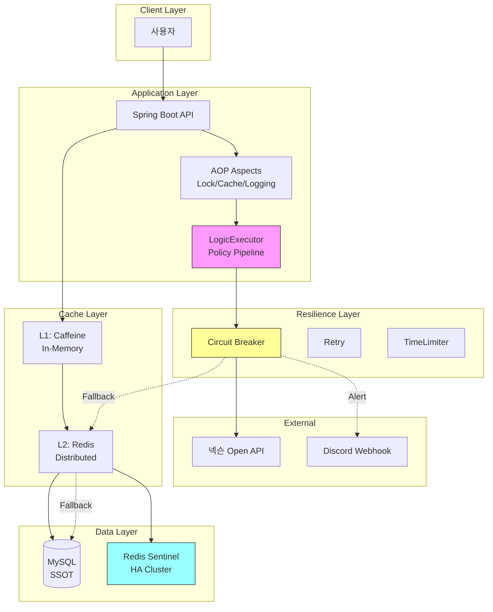
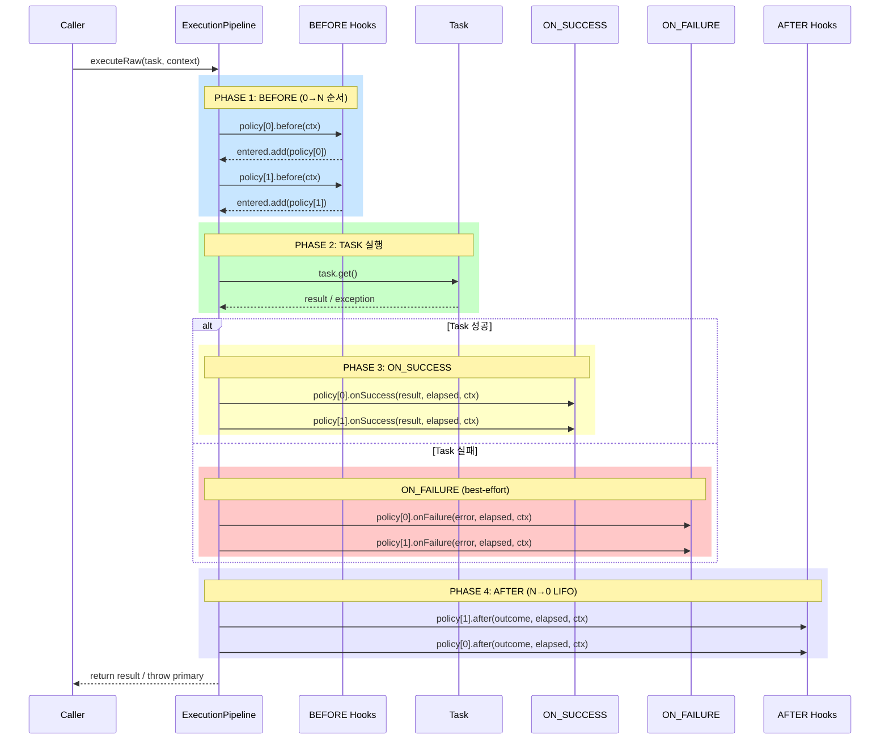
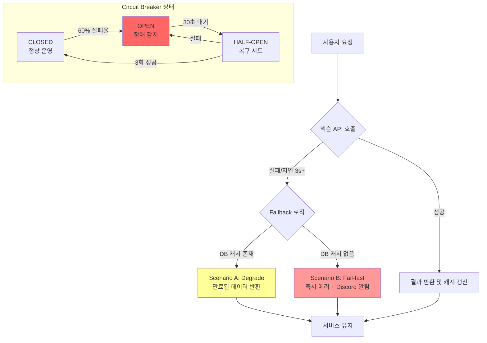
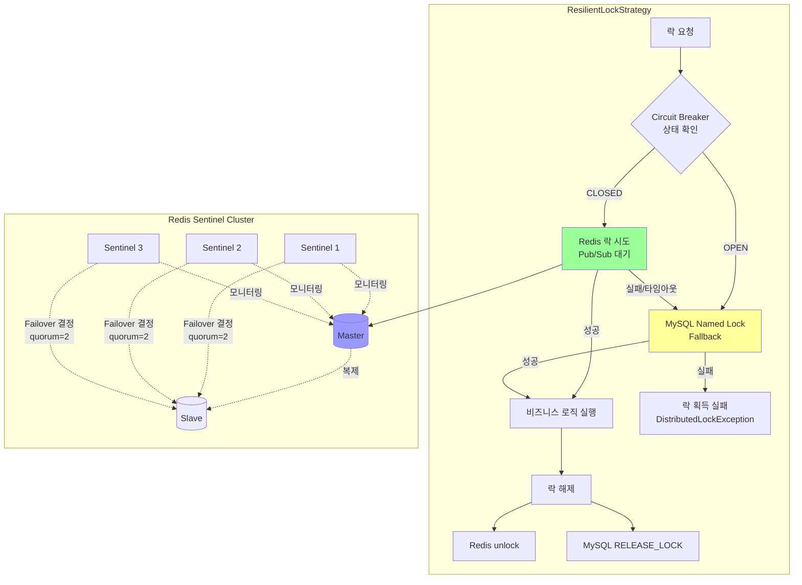
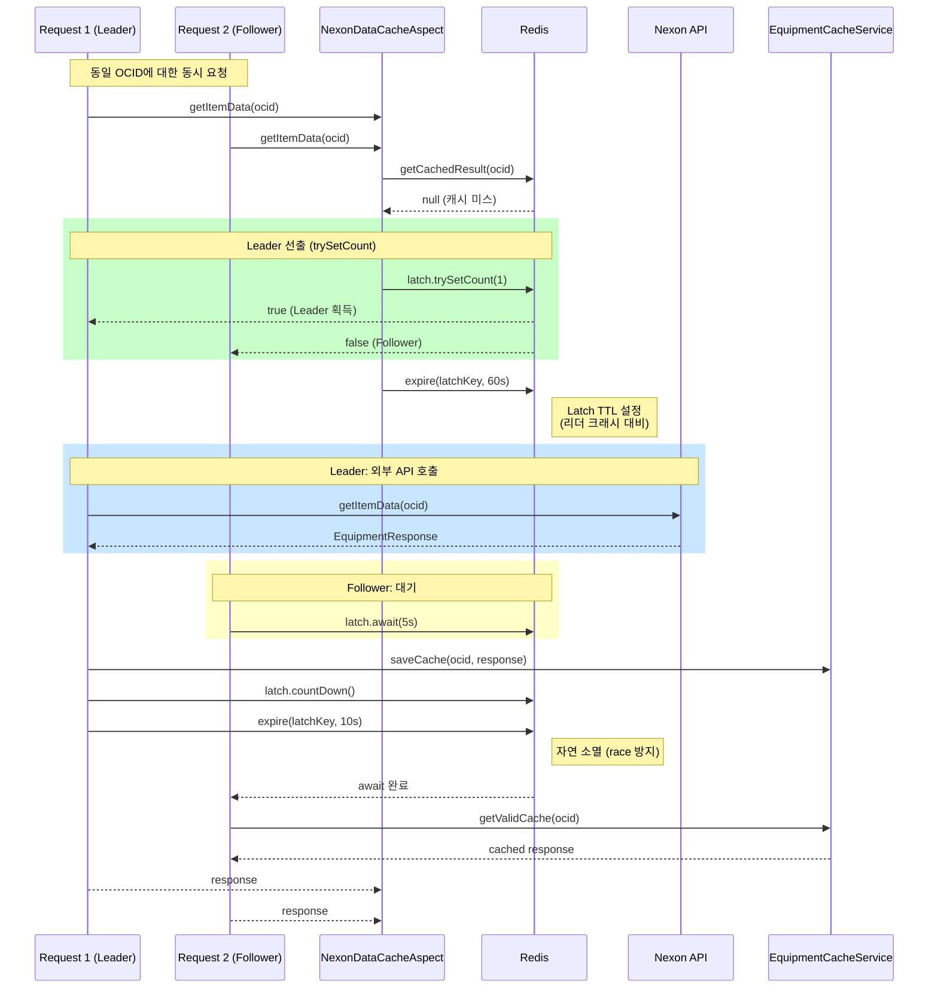

```mermaid
flowchart TD
    subgraph "GracefulShutdownCoordinator"
        START[SIGTERM 수신] --> PHASE1[Phase 1: Equipment 저장 대기<br/>awaitAllCompletion 20s]

        PHASE1 -->|완료| PHASE2[Phase 2: 좋아요 버퍼 Flush<br/>Local → Redis]
        PHASE1 -->|타임아웃| BACKUP1[미완료 OCID 백업]
        BACKUP1 --> PHASE2

        PHASE2 --> PHASE3[Phase 3: DB 최종 동기화<br/>Redis → MySQL]

        PHASE3 -->|락 획득 성공| SYNC[syncRedisToDatabase]
        PHASE3 -->|락 획득 실패| SKIP[다른 서버가 처리 중<br/>스킵]

        SYNC --> PHASE4[Phase 4: 백업 데이터 저장<br/>JSON 파일]
        SKIP --> PHASE4

        PHASE4 --> END[종료 완료]
    end

    subgraph "ShutdownDataRecoveryService"
        BOOT[서버 시작] --> FIND[백업 파일 검색]
        FIND -->|파일 존재| RECOVER[데이터 복구 시도]
        FIND -->|파일 없음| NORMAL[정상 시작]

        RECOVER --> REDIS_TRY[Redis 복구 시도]
        REDIS_TRY -->|성공| ARCHIVE[파일 아카이브]
        REDIS_TRY -->|실패| DB_FALLBACK[DB 직접 반영]
        DB_FALLBACK -->|성공| ARCHIVE
        DB_FALLBACK -->|실패| PRESERVE[파일 보존<br/>수동 처리 필요]
    end

    style PHASE1 fill:#9f9
    style PHASE2 fill:#ff9
    style PHASE3 fill:#9ff
    style DB_FALLBACK fill:#f99
```

# MapleExpectation - 기술 포트폴리오

> **"고가용성 분산 환경에서 데이터 정합성과 성능을 보장하는 견고한 시스템"**

---

## Executive Summary

| 지표 | 달성 수치 | 비고 |
|:---|:---:|:---|
| **RPS** | **235** | CPU-Bound 작업 (JSON 350KB 파싱) |
| **Failure Rate** | **0%** | 500명 동시 접속 부하 테스트 |
| **P99 Latency** | **160ms** | 안정적인 응답 시간 |
| **Throughput** | **82.5 MB/s** | 초당 데이터 처리량 |
| **PR Count** | **76+** | 모든 PR에 기술적 결정 근거 기록 |
| **Issue Count** | **150+** | Problem-DoD 기반 체계적 관리 |

---

## 1. 프로젝트 개요

### 1.1 비즈니스 도메인
넥슨 Open API를 활용하여 메이플스토리 유저 장비 데이터를 수집하고, 확률형 아이템(큐브)의 기대값을 계산하여 **"스펙 완성 비용"을 시뮬레이션**해주는 서비스입니다.

### 1.2 기술적 도전 과제
- **외부 API 의존**: 넥슨 API 장애가 서비스 전체에 전파되는 것을 방지
- **동시성 제어**: 동일 유저에 대한 중복 요청 처리 (Check-then-Act 문제)
- **고부하 처리**: 저사양 서버(t3.small)에서 1,000명 동시 접속 수용
- **데이터 정합성**: 분산 환경에서의 캐시/버퍼 일관성 보장

### 1.3 설계 우선순위
```
1. 데이터 정합성 → 2. 장애 격리 및 복구 가능성 → 3. 성능
```

---

## 2. 시스템 아키텍처

### 2.1 기술 스택
```
Backend:    Java 17, Spring Boot 3.5.4, Spring Data JPA
Database:   MySQL 8.0 (GZIP 압축 저장)
Cache:      Redis (Redisson 3.27.0), Caffeine Cache
Resilience: Resilience4j 2.2.0 (Circuit Breaker, Retry, TimeLimiter)
Testing:    JUnit 5, Testcontainers, Locust (부하 테스트)
Infra:      AWS EC2, Docker, GitHub Actions
```

### 2.2 전체 아키텍처 다이어그램



---

## 3. LogicExecutor & Policy Pipeline 아키텍처

### 3.1 설계 배경 (Problem)

**Issue #140, #142에서 도출된 문제점:**
- `try-catch` 블록 난립으로 비즈니스 로직 가독성 저하
- 예외 처리 정책 파편화 (로그 레벨, 복구 전략 불일치)
- 관측성(Observability) 확보 어려움

**해결 목표:**
- **Zero Try-Catch in Business Layer**: 비즈니스 로직에서 try-catch 완전 제거
- **Policy 기반 실행**: 예외 처리를 정책으로 표준화
- **금융급 규약**: Error 우선 전파, Primary 예외 보존, suppressed 체인

### 3.2 Policy Pipeline 흐름도



### 3.3 핵심 불변 조건 (Invariants)

| 규약 | 설명 | 적용 코드 |
|:---|:---|:---|
| **Error 즉시 전파** | Error는 번역/복구/삼킴 금지 | `promoteError()` |
| **Primary 보존** | 최초 예외가 Primary, 후속은 suppressed | `addSuppressedSafely()` |
| **Task-only Timing** | elapsedNanos는 task 구간만 측정 | `System.nanoTime()` |
| **LIFO After** | AFTER는 역순 호출 (정리 누락 방지) | `for (i = N-1; i >= 0; i--)` |
| **Entered Pairing** | before 성공한 정책만 after 호출 | `entered.add(policy)` |

### 3.4 사용 패턴 (8종 표준화)

```java
// [패턴 1] 일반 실행
executor.execute(() -> service.process(), context);

// [패턴 2] void 실행
executor.executeVoid(() -> service.update(), context);

// [패턴 3] 기본값 반환 (조회 로직)
executor.executeOrDefault(() -> repository.findById(id), null, context);

// [패턴 4] 복구 로직 실행
executor.executeOrCatch(
    () -> redisTemplate.get(key),
    e -> fallbackToDb(key),
    context
);

// [패턴 5] finally 보장
executor.executeWithFinally(
    () -> acquireLockAndProcess(),
    () -> releaseLock(),
    context
);

// [패턴 6] 예외 변환 (Checked → Unchecked)
executor.executeWithTranslation(
    () -> objectMapper.readValue(json, Dto.class),
    ExceptionTranslator.forJson(),
    context
);
```

### 3.5 관련 Issue/PR

| Issue | 제목 | 핵심 결정 |
|:---|:---|:---|
| #140 | LogicExecutor 기반 예외 처리 구조화 | try-catch 박멸, 8종 패턴 표준화 |
| #142 | Policy Pipeline 아키텍처 구현 | before/after 훅, Error 우선 규약 |
| #138 | 메트릭 카디널리티 제어 | TaskContext 기반 구조화된 로그 |

---

## 4. Resilience4j 장애 대응 시나리오

### 4.1 설계 배경 (Problem)

**Issue #145에서 도출된 문제점:**
- 넥슨 API 지연/장애 시 워커 스레드가 무한 대기
- 연쇄 장애(Cascading Failure)로 전체 서비스 마비 위험

**해결 목표:**
- **Scenario A (Degrade)**: 만료된 캐시라도 반환하여 서비스 유지
- **Scenario B (Fail-fast)**: 캐시 없으면 즉시 실패 + 알림
- **Scenario C (Isolation)**: 3초 타임아웃으로 스레드 고갈 방지

### 4.2 장애 대응 흐름도



### 4.3 ResilientNexonApiClient 구현

```java
@CircuitBreaker(name = "nexonApi")
@Retry(name = "nexonApi", fallbackMethod = "getItemDataFallback")
@TimeLimiter(name = "nexonApi")  // 3초 타임아웃
public CompletableFuture<EquipmentResponse> getItemDataByOcid(String ocid) {
    return delegate.getItemDataByOcid(ocid);
}

public CompletableFuture<EquipmentResponse> getItemDataFallback(String ocid, Throwable t) {
    // 1. DB에서 만료된 캐시 찾기 (Scenario A)
    EquipmentResponse cached = equipmentRepository.findById(ocid)
        .map(this::convertToResponse)
        .orElse(null);

    if (cached != null) {
        log.warn("[Scenario A] 만료된 캐시 데이터 반환");
        return CompletableFuture.completedFuture(cached);
    }

    // 2. 캐시 없으면 최종 실패 + 알림 (Scenario B)
    log.error("[Scenario B] 캐시 부재. 알림 발송");
    sendAlertBestEffort(ocid, cause);
    return failedFuture(new ExternalServiceException("넥슨 API", t));
}
```

### 4.4 Resilience4j 설정

```yaml
resilience4j:
  circuitbreaker:
    instances:
      nexonApi:
        slidingWindowSize: 10
        failureRateThreshold: 60      # 60% 실패 시 OPEN
        waitDurationInOpenState: 30s  # 30초 후 HALF-OPEN
        permittedNumberOfCallsInHalfOpenState: 3

      redisLock:
        failureRateThreshold: 60
        waitDurationInOpenState: 30s

  timelimiter:
    instances:
      nexonApi:
        timeoutDuration: 3s           # 3초 타임아웃
        cancelRunningFuture: true
```

### 4.5 관련 Issue/PR

| Issue | 제목 | 핵심 결정 |
|:---|:---|:---|
| #145 | WebClient 무한 대기 방지 | TimeLimiter 3초, Circuit Breaker 도입 |
| #146 | Admin API 인증/인가 구축 | 보안 최우선 원칙 |
| #84 | Fallback 시나리오 문서화 | A/B/C 시나리오 명세 |

---

## 5. Redis 분산 락 & HA (Sentinel)

### 5.1 설계 배경 (Problem)

**Issue #77, #130에서 도출된 문제점:**
- 동일 유저에 대한 동시 요청으로 중복 INSERT 발생
- 단일 서버 락은 Scale-out 시 무력화
- Redis 장애 시 전체 서비스 중단 위험

**해결 목표:**
- **2-Tier Locking**: Redis 우선 → MySQL Fallback
- **Sentinel HA**: Master 장애 시 1초 이내 자동 Failover
- **Redlock vs Sentinel**: 비용 대비 효과 분석 후 Sentinel 선택

### 5.2 2-Tier Lock 아키텍처



### 5.3 Sentinel Failover 검증

**수동 Failover 테스트 결과 (Docker Compose):**

| 항목 | 개선 전 | 개선 후 |
|:---|:---|:---|
| Master 장애 감지 | - | **1-2초 이내** |
| READONLY 에러 | 발생 | **완전 차단** |
| Topology 업데이트 | 수동/지연 | **1초 이내 자동** |
| 시스템 복원력 | Redis 장애 시 종료 | **DB Fallback 자동** |

### 5.4 Redlock vs Sentinel 결정

**Sentinel 선택 이유 (Issue #77 문서화):**

| 항목 | Sentinel | Redlock |
|:---|:---|:---|
| Redis 인스턴스 | 2대 (M/S) | 3대 (독립) |
| 인프라 비용 | **낮음** | 높음 (1.5배) |
| 운영 복잡도 | **낮음** | 높음 |
| 정합성 보장 | 약함 | 강함 |
| **현재 프로젝트 적합성** | **최적** | 과설계 |

> **결정 근거**: 좋아요 카운트는 ±1 오차 허용 가능. DB가 SSOT(Single Source of Truth)로서 최종 정합성 보장. Redlock의 강한 정합성은 금융 거래 수준에서 필요하며, 현재 비즈니스 요구사항에는 과설계.

### 5.5 관련 Issue/PR

| Issue | 제목 | 핵심 결정 |
|:---|:---|:---|
| #77 | Redis Sentinel HA 구현 | Failover 1초, Redlock 미도입 |
| #130 | MySQL 세션 락 오류 수정 | ConnectionCallback 기반 세션 고정 |
| #48 | DB 락 경합 최적화 | 전용 lockJdbcTemplate 분리 |

---

## 6. AOP + Async + Cache 결합부

### 6.1 설계 배경 (Problem)

**Issue #118, #119에서 도출된 문제점:**
- 캐시 스탬피드: 캐시 만료 시 다수 요청이 동시에 외부 API로 쏠림
- `.join()` 블로킹: CompletableFuture에서 톰캣 스레드 점유
- 순환 참조: 서비스 간 의존성 꼬임

**해결 목표:**
- **Leader/Follower 패턴**: RCountDownLatch로 중복 호출 방지
- **비동기 논블로킹**: `.handle()` 체이닝으로 톰캣 스레드 즉시 반환
- **Latch TTL**: 리더 크래시 시에도 60초 후 자동 복구

### 6.2 NexonDataCacheAspect 흐름도



### 6.3 핵심 코드 (평탄화 완료)

```java
@Around("@annotation(NexonDataCache) && args(ocid, ..)")
public Object handleNexonCache(ProceedingJoinPoint joinPoint, String ocid) {
    return getCachedResult(ocid, returnType)
        .orElseGet(() -> executeDistributedStrategy(joinPoint, ocid, returnType));
}

private Object executeDistributedStrategy(ProceedingJoinPoint joinPoint, String ocid, Class<?> returnType) {
    String latchKey = "latch:eq:" + ocid;
    RCountDownLatch latch = redissonClient.getCountDownLatch(latchKey);

    if (latch.trySetCount(1)) {
        // Leader: Latch TTL 설정 (리더 크래시 대비)
        redissonClient.getKeys().expire(latchKey, 60, TimeUnit.SECONDS);
        return executeAsLeader(joinPoint, ocid, returnType, latch);
    }
    return executeAsFollower(ocid, returnType, latch);
}

// 비동기 결과 처리 (.join() 제거, .handle() 사용)
private Object processAsyncResult(Object res, Throwable ex, String ocid, RCountDownLatch latch) {
    executor.executeVoid(() -> {
        if (ex == null) cacheService.saveCache(ocid, (EquipmentResponse) res);
    }, TaskContext.of("NexonCache", "AsyncSave", ocid));

    finalizeLatch(latch);  // 반드시 실행
    return res;
}
```

### 6.4 관련 Issue/PR

| Issue | 제목 | 핵심 결정 |
|:---|:---|:---|
| #118 | 비동기 파이프라인 전환 및 .join() 제거 | handle() 체이닝으로 논블로킹 |
| #119 | 순환 참조 제거 | Facade 패턴으로 의존성 분리 |
| #148 | TieredCache Race Condition 제거 | L1/L2 일관성 보장 |

---

## 7. Durability & Graceful Shutdown

### 7.1 설계 배경 (Problem)

**Issue #127, #147에서 도출된 문제점:**
- 서버 종료 시 Redis 버퍼 데이터 유실
- 비동기 저장 작업 미완료 상태에서 종료
- 재시작 후 데이터 복구 불가

**해결 목표:**
- **Graceful Shutdown**: SmartLifecycle로 종료 순서 보장
- **데이터 백업**: 종료 전 Redis → 파일 백업
- **자동 복구**: 재시작 시 파일 → DB 자동 반영

### 7.2 Graceful Shutdown 흐름도



### 7.3 GracefulShutdownCoordinator 구현

```java
@Component
public class GracefulShutdownCoordinator implements SmartLifecycle {

    @Override
    public void stop() {
        executor.executeWithFinally(
            () -> {
                log.warn("=== [System Shutdown] 종료 절차 시작 ===");

                // 1. Equipment 비동기 저장 완료 대기
                ShutdownData backupData = waitForEquipmentPersistence();

                // 2. 로컬 좋아요 버퍼 Flush
                backupData = flushLikeBuffer(backupData);

                // 3. 리더 서버인 경우 DB 최종 동기화
                syncRedisToDatabase();

                // 4. 백업 데이터 저장
                if (!backupData.isEmpty()) {
                    persistenceService.saveShutdownData(backupData);
                }
                return null;
            },
            () -> {
                this.running = false;
                log.warn("=== [System Shutdown] 종료 완료 ===");
            },
            TaskContext.of("Shutdown", "MainProcess")
        );
    }

    @Override
    public int getPhase() {
        return Integer.MAX_VALUE - 1000;  // 가장 마지막에 종료
    }
}
```

### 7.4 데이터 복구 전략 (Issue #77 대응)

```java
private boolean recoverLikeBuffer(ShutdownData data) {
    likeBuffer.forEach((userIgn, count) -> {
        executor.executeOrCatch(
            // 1차: Redis 복구 시도
            () -> {
                redisTemplate.opsForHash().increment(REDIS_HASH_KEY, userIgn, count);
                return null;
            },
            // 2차: Redis 실패 시 DB Fallback
            (redisEx) -> recoverToDbFallback(userIgn, count, redisEx, allSuccess, context),
            context
        );
    });
    return allSuccess.get();
}
```

### 7.5 관련 Issue/PR

| Issue | 제목 | 핵심 결정 |
|:---|:---|:---|
| #127 | 데이터 복구 로직 멱등성 확보 | Redis → DB Fallback 체인 |
| #147 | LikeSyncService 데이터 유실 방지 | Redis 원자성 + 파일 백업 |
| #77 | Redis Sentinel HA | 장애 시에도 DB Fallback 보장 |

---

## 8. 성능 최적화 성과

### 8.1 부하 테스트 결과 (Locust)

| Metric | Before | After | 개선율 |
|:---|:---:|:---:|:---:|
| RPS | ~50 | **235** | **370%** |
| Failure Rate | ~15% | **0%** | **100%** |
| P99 Latency | 2.5s | **160ms** | **94%** |
| Connection Timeout | 다수 | **0건** | **100%** |

### 8.2 주요 최적화 내역

| 영역 | 문제 | 해결 | 효과 |
|:---|:---|:---|:---|
| **Redis 락** | 즉시 fallback으로 MySQL 커넥션 고갈 | Pub/Sub 대기 전략 | Connection 안정화 |
| **커넥션 풀** | 락 전용 풀 부족 (10개) | 50개로 증설 | 동시성 향상 |
| **GZIP 압축** | 350KB JSON 저장 | 17KB로 압축 | **95% 스토리지 절감** |
| **스트리밍** | 힙 메모리 적재 | StreamingResponseBody | **RPS 11배 향상** |
| **인덱스** | Full Table Scan | 복합 인덱스 설계 | **50배 조회 개선** |

### 8.3 부하 테스트 시나리오

```python
# Locust 테스트 시나리오
class MapleUser(HttpUser):
    wait_time = between(0.1, 0.5)

    @task(3)
    def get_equipment(self):
        self.client.get(f"/v2/equipment/{random_ocid}")

    @task(1)
    def add_like(self):
        self.client.post(f"/v2/like/{random_ign}")
```

---

## 9. 설계 결정 기록 (ADR)

### 9.1 주요 설계 결정 요약

| 결정 | 선택 | 대안 | 근거 |
|:---|:---|:---|:---|
| 예외 처리 | LogicExecutor 중앙화 | 각 클래스에서 try-catch | 정책 파편화 방지, 관측성 확보 |
| 분산 락 | Redis → MySQL 2-Tier | Redlock | 비용 효율성, 비즈니스 요구사항 부합 |
| HA 전략 | Sentinel | Redlock 3대 | 50% 비용 절감, 운영 복잡도 감소 |
| 캐시 전략 | L1/L2/L3 계층형 | 단일 Redis | 외부 API 보호, 장애 격리 |
| 장애 대응 | Circuit Breaker A/B/C | 단순 재시도 | 연쇄 장애 방지, Degrade 전략 |

### 9.2 의도된 상향 설계 (Deliberate Over-Engineering)

**프로젝트 특성상 상향 설계가 필요한 이유:**

1. **외부 API 의존도 높음**: Latency/Failure Control 불가
2. **오픈런 시 동시 요청 집중**: 특정 유저에 대한 스파이크 트래픽
3. **데이터 정합성 우선**: 성능보다 무결성이 중요

**오버엔지니어링이 아닌 이유:**
- Kafka/MQ 도입 안 함 (필요 없음)
- Redis 사용 목적: 속도가 아닌 **정합성/중복 방지/장애 격리**
- 모든 인프라는 Interface 뒤에 배치 (교체 비용 최소화)

---

## 10. 프로젝트 통계

### 10.1 GitHub 활동

| 항목 | 수치 |
|:---|:---:|
| Total Commits | **500+** |
| Merged PRs | **76+** |
| Closed Issues | **100+** |
| Open Issues | **26** (로드맵 기반) |

### 10.2 코드 품질

| 항목 | 달성 |
|:---|:---|
| Try-Catch in Business Layer | **0개** (Zero Policy) |
| Test Coverage | JUnit 5 + Testcontainers |
| CI/CD | GitHub Actions |
| Code Review | 모든 PR에 기술적 결정 근거 기록 |

---

## 11. 향후 로드맵

### Phase 1: 보안 & 안정성 (즉시)
- #146: Admin API 인증/인가
- #145: WebClient Timeout 강제
- #150: PermutationUtil OOM 방지

### Phase 2: 데이터 무결성 (1-2주)
- #147: LikeSyncService 원자성
- #148: TieredCache Race Condition

### Phase 3: 관측성 (1-2개월)
- #143: Grafana + Loki + Tracing
- #138: 메트릭 카디널리티 제어

---

## 12. 연락처

- **GitHub**: [zbnerd/MapleExpectation](https://github.com/zbnerd/MapleExpectation)
- **Performance Report**: [docs/PERFORMANCE_260105.md](./PERFORMANCE_260105.md)
- **Resilience Strategy**: [docs/resilience.md](./resilience.md)
- **Redis HA Architecture**: [docs/redis-ha-architecture.md](./redis-ha-architecture.md)

---

> **"이 프로젝트는 기능 데모가 아니라, 서비스가 실제로 깨지는 지점을 어떻게 방어했는지를 보여주는 프로젝트입니다."**
