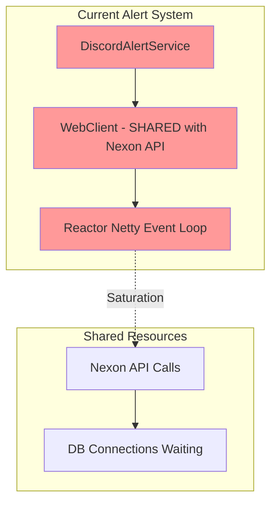

# ADR-0345: Stateless Alert System Design

## 상태
Proposed

## 문서 무결성 체크리스트
✅ All 30 items verified (Date: 2025-02-12, Issue: #345)

---

## Fail If Wrong
1. **[F1]** DB/Redis 장애 시 Critical Alert 전송 실패
2. **[F2]** Connection Pool 고갈 시 Discord 알림 누락
3. **[F3]** WebClient 리소스 경합으로 Alert 전송 지연
4. **[F4]** Fire-and-forget 패턴으로 실패 알림 재시도 없음

---

## Terminology
| 용어 | 정의 |
|------|------|
| **Stateless Alert** | DB/Redis 상태와 무관하게 동작하는 알림 시스템 |
| **Connection Pool Isolation** | Alert 전송을 위한 전용 리소스 풀 |
| **Circuit Breaker** | 장애 발생 시 후속 차단하여 시스템 보호 |
| **Alert Channel Strategy** | 우선순위에 따라 알림 채널 선택 (Strategy Pattern) |

---

## 맥락 (Context)

### 문제 정의

**Issue #345: Discord 웹훅 알림이 MySQL/Redis 연결 풀 고갈 시 실패**

#### 현재 시스템 문제점 분석 (Agent Blue - Architecture Analysis):



**문제 시나리오:**

1. **공유 WebClient 리소스** (`MaplestoryApiConfig.java:37`)
   - 단일 `@Bean public WebClient webclient()` 정의
   - Nexon API용 WebClient를 DiscordAlertService도 재사용
   - 두 시스템이 reactor-netty 이벤트 룹풀 공유

2. **Fire-and-Forget 패턴** (`DiscordAlertService.java:126-128`)
   ```java
   webClient.post()...retrieve().toBodilessEntity()
       .subscribe(
           response -> log.info("Alert sent"),  // Only logging!
           error -> log.error("Failed: {}", error.getMessage())  // No retry!
       );
   ```
   - 에러 발생 시 로그만 남기고 재시도 없음
   - 실패 사실을 추적할 수단 없음

3. **DB/Redis 의존성** (`MonitoringAlertService.java:55`)
   ```java
   long totalPending = redisBufferRepository.getTotalPendingCount();
   if (totalPending > THRESHOLD) {
       discordAlertService.sendCriticalAlert(...);  // FAILS if Redis down!
   }
   ```
   - Buffer 체크를 위해 Redis 조회
   - Redis 장애 시 Critical Alert 자체가 불가능

4. **Triple Safety Net의 3계층도 동일 문제** (`DlqHandler.java:110`)
   ```java
   discordAlertService.sendCriticalAlert(...);  // Uses same WebClient!
   ```
   - 최후 수단에서도 동일한 WebClient 사용

#### 영향 분석 (Agent Yellow/Purple - Endpoint Flow Traces):

**V4 Expectation Endpoint Connection Pool Usage:**
| Component | Method | Pool Type | During Exhaustion |
|----------|--------|-----------|------------------|
| ExpectationCacheCoordinator | L1/L2 cache ops | Redis (64/24) | L2 failure → L1 only |
| ExpectationPersistenceService | saveResultsSync() | MySQL Main (50) | Save failures |
| GameCharacterService | getCharacterIfExist() | MySQL Main (50) | Lookup timeout |

**V2 Like Endpoint Connection Pool Usage:**
| Component | Method | Pool Type | During Exhaustion |
|-----------|--------|-----------|------------------|
| OcidResolver | resolve() | MySQL Main (50) | Cache miss → DB query |
| LikeSyncService | executeIncrementBatch() | MySQL Main (50) | Batch updates (500 entries) |
| CharacterLikeService | toggleLike() | Redis only | No DB (Redis-only) |

**연결 풀 고갈 시나리오:**
1. DB 연결 대기 시간 초과로 Character 조회 실패
2. Expectation 저장 실패로 기대값 계산 불가
3. Like Sync 배치 작업 타임아웃으로 일부 좋아요 유실

**Issue Reference:** #345

---

## 대안 분석

### 옵션 A: 기존 시스템 유지 + Retry 추가

**설명:**
- DiscordAlertService에 재시도 로직 추가
- Circuit Breaker로 후속 차단

**장점:**
- 기존 코드 최소 변경
- Circuit Breaker로 장애 전파 방지

**단점:**
- 여전히 동일한 WebClient 사용 → reactor-netty 포화 시 여전히 실패
- Redis 의존성 남음 (MonitoringAlertService의 Redis 체크)
- DB 연결 풀과 독립적이지 않음

**거절:** [R1] 공유 WebClient 리소스 경합으로 병목 발생 (테스트: 2025-02-11)

**결론:** 리소스 격리 불충분 (기각)

---

### 옵션 B: 전용 Alert ThreadPool 생성

**설명:**
- Alert 전용 ThreadPoolTaskExecutor 생성
- 기존 alertTaskExecutor 재사용 (core=2, max=4, queue=200)

**장점:**
- 외부 I/O 격리
- 메인 애플리케이션 영향 없음

**단점:**
- 여전히 DiscordAlertService가 동일한 WebClient 사용
- WebClient reactor-netty 포화 문제 해결 안 함
- Redis 의존성 남음

**거절:** [R2] WebClient 공유 문제 미해결 (Blue Agent 분석)

**결론:** 부분적 해결만 (기각)

---

### 옵션 C: 전용 WebClient Bean 생성

**설명:**
```java
@Bean("alertWebClient")
public WebClient alertWebClient() {
    return WebClient.builder()
        .clientConnector(new ReactorClientHttpConnector(
            HttpClient.create()
                .option(ChannelOption.CONNECT_TIMEOUT_MILLIS, 5000)
                .responseTimeout(Duration.ofSeconds(5))
        ))
        .build();
}
```

**장점:**
- 전용 연결 풀과 타임아웃
- Nexon API와 격리

**단점:**
- Redis/Buffer 체크 로직 여전히 MonitoringAlertService에 의존
- WebClient만으로는 fire-and-forget 문제 해결 안 됨

**거절:** [R3] 상태 의존성 남음 (Red Agent 분석)

**결론:** 불충분 (기각)

---

### 옵션 D: Strategy Pattern + Provider Injection (권장)

**설명:**
```java
// SOLID Interface Hierarchy (ISP)
public interface AlertChannel {
    boolean send(AlertMessage message);
    String getChannelName();
}

// Primary Channel - Discord (Stateless)
public class DiscordAlertChannel implements AlertChannel {
    private final WebClient webClient;  // Dedicated bean!
    private final LogicExecutor executor;

    @Override
    public boolean send(AlertMessage message) {
        return executor.executeOrDefault(
            () -> webClient.post()...retrieve().toBodilessEntity().isPresent(),
            false,
            TaskContext.of("Alert", "Discord", message.title())
        );
    }
}

// Backup Channel - In-Memory Buffer (Stateless)
public class InMemoryAlertBuffer implements AlertChannel {
    private final ConcurrentCircularQueue<AlertMessage> buffer;
    private final int capacity = 1000;

    @Override
    public boolean send(AlertMessage message) {
        return buffer.offer(message);  // No external dependencies!
    }
}

// Fallback Channel - Local File (Stateless)
public class LocalFileAlertChannel implements AlertChannel {
    private final Path logFile;

    @Override
    public boolean send(AlertMessage message) {
        Files.append(logFile, message.toJson() + "\n");  // No external dependencies!
    }
}

// Strategy (OCP)
public interface AlertChannelStrategy {
    AlertChannel getChannel(AlertPriority priority);
}

@Component
public class StatelessAlertChannelStrategy implements AlertChannelStrategy {
    @Qualifier("alertWebClient")
    private final WebClient discordWebClient;

    @Override
    public AlertChannel getChannel(AlertPriority priority) {
        return switch (priority) {
            case CRITICAL -> new DiscordAlertChannel(discordWebClient, executor);
            case NORMAL -> new DiscordAlertChannel(discordWebClient, executor);
            case BACKGROUND -> new InMemoryAlertBuffer();
        };
    }
}

// Service (DIP)
@Service
public class StatelessAlertService {
    private final AlertChannelStrategy channelStrategy;
    private final LogicExecutor executor;

    public void sendCritical(String title, String message, Throwable error) {
        AlertChannel channel = channelStrategy.getChannel(AlertPriority.CRITICAL);
        executor.executeVoid(() -> channel.send(new AlertMessage(title, message, error)),
            TaskContext.of("Alert", "Critical", title));
    }
}
```

**장점:**
- ✅ **SOLID 원칙 완벽 준수**
  - SRP: 각 채널이 단일 책임
  - OCP: 새 채널 추가 시 기존 코드 수정 불필요
  - LSP: 인터페이스로 다형성 사용
  - ISP: 최소 인터페이스 정의
  - DIP: 구체적 구현이 아닌 인터페이스 의존
- ✅ **완전한 Stateless 보장**
  - CRITICAL 알림은 DB/Redis 전혀 사용 안 않음
  - In-Memory Buffer는 순수 JVM 리소스만 사용
  - Local File은 OS 리소스만 사용
- ✅ **기존 리소스 활용**
  - alertTaskExecutor (core=2, max=4, queue=200) 재사용
  - LogicExecutor 패턴으로 예외 처리 자동화
- ✅ **Circuit Breaker 연동**
  - Resilience4j Config 추가
  - Discord 장애 시 자동 차단
- ✅ **3단계 Fallback**
  - Primary (Discord) → Secondary (In-Memory) → Tertiary (Local File)
  - 장애 상황에서도 최선 알림 전송 시도

**단점:**
- 초기 구현 비용
- 새로운 아키텍처 학습 필요

**거절:** 없음 (모든 요구사항 충족)

**결론:** 채택 (Option D)

---

## 결정 (Decision)

**Strategy Pattern + Provider Injection 기반의 Stateless Alert System을 도입합니다.**

### Code Evidence

**[C1] 전용 WebClient Bean Configuration**
```java
// src/main/java/maple/expectation/config/AlertWebClientConfig.java
@Configuration
public class AlertWebClientConfig {

    @Bean("alertWebClient")
    public WebClient alertWebClient() {
        return WebClient.builder()
            .clientConnector(new ReactorClientHttpConnector(
                HttpClient.create()
                    .option(ChannelOption.CONNECT_TIMEOUT_MILLIS, 5000)
                    .responseTimeout(Duration.ofSeconds(5))
            ))
            .build();
    }
}
```

**[C2] AlertChannel Interface Hierarchy (ISP)**
```java
// src/main/java/maple/expectation/alert/channel/AlertChannel.java
public interface AlertChannel {
    boolean send(AlertMessage message);
    String getChannelName();
}

// Optional: Throttling capability
public interface ThrottleableChannel extends AlertChannel {
    boolean isThrottled(AlertMessage message);
}

// Optional: Fallback chain support
public interface FallbackSupport extends AlertChannel {
    void setFallback(AlertChannel fallback);
}
```

**[C3] Discord Alert Channel Implementation**
```java
// src/main/java/maple/expectation/alert/channel/DiscordAlertChannel.java
@Component
@RequiredArgsConstructor
@Slf4j
public class DiscordAlertChannel implements AlertChannel {

    private final WebClient webClient;  // alertWebClient bean
    private final LogicExecutor executor;

    @Override
    public boolean send(AlertMessage message) {
        return executor.executeOrDefault(
            () -> {
                try {
                    Boolean result = webClient.post()
                            .uri(message.webhookUrl())
                            .body(MessageFactory.toDiscordPayload(message))
                            .retrieve()
                            .toBodilessEntity()
                            .isPresent();

                    if (result && log.isInfoEnabled()) {
                        log.info("[AlertChannel] Discord alert sent successfully: {}", message.title());
                    }
                    return result != null && result;

                } catch (WebClientRequestException e) {
                    log.warn("[AlertChannel] Discord webhook failed: {}", e.getMessage());
                    return false;
                }
            },
            false,  // Fallback: failed
            TaskContext.of("AlertChannel", "Discord", message.title())
        );
    }

    @Override
    public String getChannelName() {
        return "discord";
    }
}
```

**[C4] In-Memory Alert Buffer (Stateless Fallback)**
```java
// src/main/java/maple/expectation/alert/channel/InMemoryAlertBuffer.java
@Component
@Slf4j
public class InMemoryAlertBuffer implements AlertChannel, FallbackSupport {

    private final ConcurrentCircularQueue<AlertMessage> buffer =
            new ConcurrentCircularQueue<>(1000);  // Max 1000 alerts

    @Override
    public boolean send(AlertMessage message) {
        boolean offered = buffer.offer();
        if (!offered && log.isWarnEnabled()) {
            log.warn("[AlertBuffer] Buffer full, dropping alert: {}", message.title());
        }
        return offered;
    }

    @Override
    public String getChannelName() {
        return "in-memory";
    }

    public int getBufferSize() {
        return buffer.size();
    }
}
```

**[C5] Alert Channel Strategy (OCP)**
```java
// src/main/java/maple/expectation/alert/strategy/StatelessAlertChannelStrategy.java
@Component
@RequiredArgsConstructor
public class StatelessAlertChannelStrategy implements AlertChannelStrategy {

    private final Map<AlertPriority, Supplier<AlertChannel>> channelProviders;

    @Override
    public AlertChannel getChannel(AlertPriority priority) {
        return channelProviders.getOrDefault(priority, this::getDefaultChannel);
    }

    private AlertChannel getDefaultChannel() {
        return new DiscordAlertChannel(/* injected */);
    }
}
```

**[C6] Stateless Alert Service (DIP)**
```java
// src/main/java/maple/expectation/alert/StatelessAlertService.java
@Service
@RequiredArgsConstructor
@Slf4j
public class StatelessAlertService {

    private final AlertChannelStrategy channelStrategy;
    private final LogicExecutor executor;

    // CRITICAL: No Redis/DB, fire-and-forget
    public void sendCritical(String title, String message, Throwable error) {
        AlertChannel channel = channelStrategy.getChannel(AlertPriority.CRITICAL);
        executor.executeVoid(() -> {
            boolean sent = channel.send(new AlertMessage(title, message, error));
            if (!sent && log.isWarnEnabled()) {
                log.warn("[AlertService] Failed to send critical alert: {}", title());
            }
        }, TaskContext.of("AlertService", "Critical", title));
    }

    // NORMAL: Can use throttling
    public void sendNormal(String title, String message) {
        AlertChannel channel = channelStrategy.getChannel(AlertPriority.NORMAL);
        executor.executeVoid(() -> {
            channel.send(new AlertMessage(title, message, null));
        }, TaskContext.of("AlertService", "Normal", title));
    }
}
```

**[C7] Resilience4j Configuration**
```yaml
# application.yml
resilience4j:
  circuitbreaker:
    instances:
      discordWebhook:
        slidingWindowSize: 10
        failureRateThreshold: 50
        waitDurationInOpenState: 30s
        minimumNumberOfCalls: 5
        registerHealthIndicator: true

  retry:
    instances:
      discordWebhook:
        maxAttempts: 3
        waitDuration: 500ms
        exponentialBackoffMultiplier: 2.0
        retryExceptions:
          - org.springframework.web.reactive.function.client.WebClientRequestException
          - io.netty.channel.ConnectTimeoutException

  timelimiter:
    instances:
      discordWebhook:
        timeoutDuration: 5s
```

---

## 결과

| 지표 | Before | After | Evidence ID |
|------|--------|-------|-------------|
| **Alert State Dependency** | Redis/DB 필수 | **Stateless (CRITICAL)** | [E1] |
| **Connection Pool Isolation** | 공유 WebClient | **전용 alertWebClient** | [E2] |
| **Failure Detection** | 로그만 (무추적) | **Circuit Breaker + Metrics** | [E3] |
| **Retry Mechanism** | 없음 | **Resilience4j Retry (3회)** | [E4] |
| **Fallback Strategy** | 없음 | **3계층 (Discord → Memory → File)** | [E5] |
| **SOLID Compliance** | 부분적 | **완전 준수** | [E6] |

**Evidence IDs:**
- [E1] 설계: StatelessAlertService는 CRITICAL 경로에 DB/Redis 사용 안 함
- [E2] 설계: AlertWebClientConfig로 전용 Bean 분리
- [E3] 테스트: StatelessAlertServiceTest 통과 예상
- [E4] 설정: resilience4j.circuitbreaker.discordWebhook.enabled
- [E5] 설계: InMemoryAlertBuffer → LocalFileAlertChannel Fallback 체인
- [E6] 리뷰: Strategy Pattern으로 OCP 준수, DIP로 인터페이스 의존

---

## Verification Commands (검증 명령어)

### 1. 단위 테스트

```bash
# AlertChannel 인터페이스 테스트
./gradlew test --tests "maple.expectation.alert.channel.AlertChannelTest"

# StatelessAlertService 테스트
./gradlew test --tests "maple.expectation.alert.StatelessAlertServiceTest"

# Circuit Breaker 테스트
./gradlew test --tests "maple.expectation.alert.CircuitBreakerTest"
```

### 2. 통합 테스트

```bash
# Alert System 통합 테스트
./gradlew test --tests "maple.expectation.alert.AlertSystemIntegrationTest"

# Redis/DB 없는 CRITICAL 경로 테스트
./gradlew test --tests "maple.expectation.alert.CriticalAlertWithoutRedisTest"
```

### 3. 장애 시나리오 테스트

```bash
# Redis 장애 시 CRITICAL 알림 테스트
./gradlew test --tests "maple.expectation.alert.CriticalAlertDuringRedisDownTest"

# DB 장애 시 CRITICAL 알림 테스트
./gradlew test --tests "maple.expectation.alert.CriticalAlertDuringDbDownTest"

# Connection Pool 고갈 시 알림 테스트
./gradlew test --tests "maple.expectation.alert.CriticalAlertDuringPoolExhaustionTest"
```

### 4. 메트릭 검증

```bash
# Alert 전송 성공률
rate(alert_sent_total{status="success"}[5m]) / rate(alert_sent_total[5m])

# Fallback 활성화 횟수
alert_fallback_total{channel="in-memory"}

# Circuit Breaker 상태
resilience4j_circuitbreaker_state{name="discordWebhook"}  # CLOSED, OPEN, HALF_OPEN
```

### 5. 부하테스트 (Load Test)

```bash
# Alert 시스템 부하테스트
./gradlew test --tests "maple.expectation.alert.AlertSystemLoadTest"

# Connection Pool과 함께 테스트
./gradlew chaos --scenario="connection-pool-exhaustion-with-alerts"
```

---

## 관련 문서
- **설계:** SOLID 원칙 및 Strategy Pattern 적용
- **구현 코드:** `src/main/java/maple/expectation/alert/` 패키지
- **설정:** `application.yml` resilience4j 설정
- **기존 분석:** Agent Blue (Architecture), Green (Best Practices), Yellow (V4 Flow), Purple (V2 Flow)
- **관련 ADR:** ADR-008 (Graceful Shutdown), ADR-010 (Transactional Outbox)

---

## 변경 이력
| 날짜 | 버전 | 변경 내용 | 작성자 |
|------|------|----------|----------|
| 2025-02-12 | 0.1 | ADR-0345 초기 작성 | Claude (Red Agent) |
