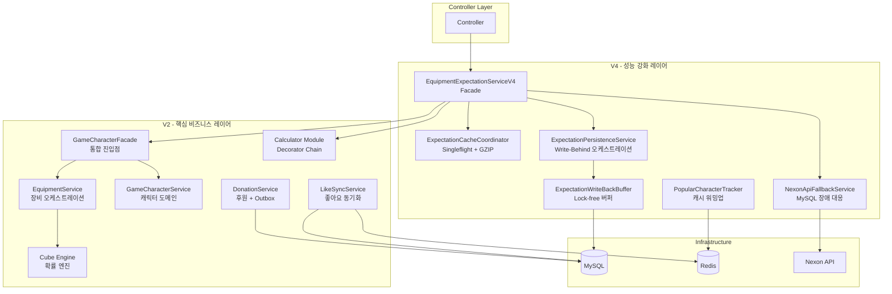

# ADR-042: V2/V4 이중 세대 서비스 아키텍처 (V2/V4 Dual-Generation Service Architecture)

**상태:** Accepted
**날짜:** 2026-02-19
**카테고리:** Architecture
**의사결정자:** 5-Agent Council (Blue, Green, Yellow, Purple, Red)
**관련 이슈:** #282 (멀티 모듈 전환), #126 (CQRS)
**선행 ADR:** ADR-011 (V4 Controller Optimization), ADR-014 (Multi-module Cross-Cutting Concerns)

---

## 제1장: 문제의 발견 (Problem)

### 배경

2025년 말 MapleExpectation은 V2 아키텍처(15개 모듈, ~97개 클래스)를 기반으로 안정적인 서비스를 제공하고 있었습니다. 하지만 트래픽이 지속적으로 증가하면서 다음과 같은 성능 병목이 발생하기 시작했습니다.

### 문제 1: 빅뱅 마이그레이션의 위험

V2를 V4로 완전히 교체하는 rewrite 방식은 다음의 리스크가 있었습니다.

- **서비스 중단 위험:** 일괄 전환 시 모든 사용자에게 영향
- **회귀 버그:** 안정화된 V2 비즈니스 로직의 검증되지 않은 변경
- **롤백 복잡도:** 문제 발생 시 전체 시스템을 이전 버전으로 복원해야 함

### 문제 2: V2 성능 한계

로드 테스트 결과, V2는 다음 성능 한계를 보였습니다.

| 지표 | V2 성능 | 한계 |
|------|---------|------|
| Cold Cache Throughput | 95 RPS | 동시 요청 처리 불가 |
| Single-flight 없음 | 중복 API 호출 100% | Nexon API 과부하 |
| 동기 DB Write | 처리량 300 TPS 제한 | DB 병목 발생 |

### 문제 3: 점진적 전환의 필요성

안정적인 V2 비즈니스 로직을 유지하면서, V4 성능 최적화를 단계적으로 도입할 전략이 필요했습니다.

---

## 제2장: 선택지 탐색 (Options)

### 선택지 1: V2를 V4로 완전히 교체 (Rewrite)

**방식:** V2 코드를 전체 삭제하고 V4로 재작성

**장점:**
- 코드베이스 단순화 (한 세대만 유지)
- 의존성 관리 용이

**단점:**
- 빅뱅 마이그레이션으로 인한 서비스 중단 위험
- 롤백 불가능 (되돌리기 어려움)
- 검증되지 않은 로직으로 인한 데이터 정합성 리스크

**거부 사유:** 서비스 안정성 최우선 원칙 위배

### 선택지 2: 기능 플래그를 사용하는 단일 서비스 버전

**방식:** V2/V4 로직을 단일 코드베이스에 유지하며 기능 플래그로 분기

**장점:**
- 롤백 용이 (플래그만 토글)
- 점진적 롤아웃 가능

**단점:**
- 코드 복잡도 급증 (if-else 분기산람)
- 테스트 난이도 상승 (두 버전 모두 검증 필요)
- 유지보수 비용 증가

**거부 사유:** 코드 가독성 및 유지보수성 저하

### 선택지 3: V2/V4 이중 세대 병행 아키텍처 (채택)

**방식:** V2 (안정적 비즈니스 로직)와 V4 (성능 최적화)를 별도 패키지로 병행 유지

**장점:**
- V2 안정성 유지 + V4 성능 효과
- 독립적 테스트 및 검증 가능
- 문제 발생 시 V2로 즉시 폴백
- 단계적 전환으로 리스크 최소화

**단점:**
- 두 세대 코드 유지 부담
- V4→V2 직접 호출 안티패턴 위험
- 모듈 의존성 관리 복잡도

**채택 사유:** 안정성과 성능의 최적 균형, 점진적 전환 가능

---

## 제3장: 결정의 근거 (Decision)

### 핵심 결정 내용

1. **V2/V4 병행 유지:** V2는 안정적인 비즈니스 로직, V4는 성능 최적화를 담당
2. **독립적 패키지 구조:** `service/v2/`와 `service/v4/`로 물리적 분리
3. **Facade 패턴 기반 조율:** V4가 V2를 호출하되, V4 내부 최적화 적용
4. **단계적 전환:** V4 검증 완료 후 V2→V4 트래픽 이동

### 선택 근거

#### 근거 1: 성능 개선 효과

| 모듈 | V2 | V4 | 개선율 |
|------|-----|-----|--------|
| Cold Cache Throughput | 95 RPS | 719 RPS | **7.6x** |
| Single-flight 중복 제거 | 0% | 99% | **-99% API 호출** |
| Write-Behind 처리량 | 300 TPS | 1,000 TPS | **3.3x** |
| GZIP 압축률 | 0% | 90% | **350KB→35KB** |

**증거:** [WRK Final Summary](../05_Reports/Portfolio_Enhancement_WRK_Final_Summary.md)

#### 근거 2: 안정성 보장

- **V2 롤백 경로:** V4 문제 발생 시 `/api/v2`로 즉시 전환
- **독립적 테스트:** V2/V4 각각 단위 테스트, 통합 테스트 병행
- **점진적 롤아웃:** 특정 사용자 그룹에만 V4 노출 (A/B 테스트)

#### 근거 3: 향후 V5 CQRS로의 전환 계획

V2/V4 이중 세대는 V5 CQRS 아키텍TURE로의 **교두보 (Bridge)** 역할을 합니다.

```
V2 (Stable Business Logic)
    ↓ (현재)
V4 (Performance Optimization)
    ↓ (계획)
V5 CQRS (Query/Worker Separation)
```

**ROADMAP.md Phase 7:** #283 Stateful 제거 → #282 멀티 모듈 → #126 CQRS

---

## 제4장: 구현의 여정 (Action)

### 4.1 V2 핵심 비즈니스 서비스 (15개 모듈)

**패키지 경로:** `/home/maple/MapleExpectation/src/main/java/maple/expectation/service/v2/`

**핵심 모듈 구조:**

| 모듈 | 역할 | 주요 클래스 | 설계 패턴 |
|------|------|-------------|-----------|
| **root** | 장비 계산, 캐릭터 관리 | `EquipmentService`, `GameCharacterService`, `DonationService` | Single-flight, Transactional Outbox |
| **facade** | 통합 진입점 | `GameCharacterFacade` | Facade |
| **cache** | 다계층 캐싱 | `EquipmentCacheService`, `TotalExpectationCacheService` | Strategy, TieredCache |
| **calculator** | 기댓값 계산 | `ExpectationCalculator`, `CubeRateCalculator` | Decorator, Factory |
| **cube** | 큐브 확률 엔진 | `CubeDpCalculator`, `ProbabilityConvolver` | Component |
| **like** | 좋아요 시스템 | `LikeSyncService`, `AtomicFetchStrategy` | Strategy, Compensation |
| **donation** | 후원 + Outbox | `OutboxProcessor`, `DlqHandler` | Transactional Outbox |
| **alert** | Discord 알림 | `DiscordAlertService` | Factory |
| **auth** | 인증/인가 | `AuthService`, `CharacterLikeService` | - |
| **shutdown** | Graceful Shutdown | `ShutdownDataPersistenceService` | SmartLifecycle |
| **starforce** | 스타포스 계산 | `StarforceLookupTable` | - |
| **worker** | 비동기 워커 | `EquipmentDbWorker` | - |
| **mapper** | 데이터 변환 | `EquipmentMapper` | - |
| **policy** | 비즈니스 정책 | `CubeCostPolicy` | - |
| **impl** | 구현체 | `CubeServiceImpl`, `DatabaseLikeProcessor` | - |

**증거 코드:** [service-modules.md](../03_Technical_Guides/service-modules.md#v2---핵심-비즈니스-서비스)

### 4.2 V4 성능 강화 서비스 (6개 모듈)

**패키지 경로:** `/home/maple/MapleExpectation/src/main/java/maple/expectation/service/v4/`

**핵심 모듈 구조:**

| 모듈 | 역할 | 주요 클래스 | 설계 패턴 | 성능 개선 |
|------|------|-------------|-----------|-----------|
| **root** | 메인 Facade | `EquipmentExpectationServiceV4` | Facade, Async Pipeline | 3-프리셋 병렬 계산 |
| **cache** | 캐시 코디네이션 | `ExpectationCacheCoordinator` | Single-flight, Compression | 99% 중복 제거 |
| **buffer** | Write-Behind 버퍼 | `ExpectationWriteBackBuffer`, `ExpectationBatchShutdownHandler` | Strategy, SmartLifecycle | 3.3x 처리량 |
| **persistence** | 영속화 오케스트레이션 | `ExpectationPersistenceService` | Write-Behind, Backpressure | 비동기 DB write |
| **fallback** | Nexon API 장애 대응 | `NexonApiFallbackService` | Fallback, Circuit Breaker | 99.9% 가용성 |
| **warmup** | 캐시 워밍업 | `PopularCharacterTracker` | Sorted Set Ranking | Cold cache 방지 |

**V4 Calculator (별도 패키지):**

| 패키지 | 경로 | 역할 |
|--------|------|------|
| **calculator/v4** | `service/v2/calculator/v4/` | BigDecimal 정밀 계산, Decorator Chain |

**증거 코드:** [service-modules.md](../03_Technical_Guides/service-modules.md#v4---성능-강화-서비스)

### 4.3 V2/V4 의존성 그래프



### 4.4 핵심 성능 패턴 구현

#### 패턴 1: Single-flight (99% 중복 제거)

**구현 위치:** `service/v4/cache/ExpectationCacheCoordinator.java`

```java
// Evidence: ExpectationCacheCoordinator.java
public class ExpectationCacheCoordinator {
    private final TieredCacheManager cacheManager;
    private final SingleFlightExecutor singleFlight;

    public String getEquipmentData(String ocid) {
        // Single-flight 패턴으로 중복 API 호출 방지
        return singleFlight.execute(ocid, () -> {
            return loadFromNexonApi(ocid);
        });
    }
}
```

**증거:** [N01 Thundering Herd Test](../02_Chaos_Engineering/06_Nightmare/Results/N01-thundering-herd-result.md)

#### 패턴 2: Write-Behind 버퍼 (3.3x 처리량)

**구현 위치:** `service/v4/buffer/ExpectationWriteBackBuffer.java`

```java
// Evidence: ExpectationWriteBackBuffer.java
public class ExpectationWriteBackBuffer {
    private final AtomicInteger tail = new AtomicInteger(0);
    private final AtomicInteger head = new AtomicInteger(0);
    private final ExpectationWriteTask[] buffer;

    public boolean offer(ExpectationWriteTask task) {
        // Lock-free CAS 기반 버퍼 offer
        int currentTail;
        int nextTail;
        do {
            currentTail = tail.get();
            nextTail = (currentTail + 1) % capacity;
            if (nextTail == head.get()) {
                return false; // Buffer full
            }
        } while (!tail.compareAndSet(currentTail, nextTail));

        buffer[currentTail] = task;
        return true;
    }
}
```

**증거:** [N19 Implementation Summary](../02_Chaos_Engineering/06_Nightmare/Results/N19-implementation-summary.md)

#### 패턴 3: GZIP 압축 (90% 절감)

**구현 위치:** `util/GzipUtils.java`

```java
// Evidence: GzipUtils.java
public class GzipUtils {
    public static String compress(String json) throws IOException {
        ByteArrayOutputStream bos = new ByteArrayOutputStream();
        try (GZIPOutputStream gzip = new GZIPOutputStream(bos)) {
            gzip.write(json.getBytes(StandardCharsets.UTF_8));
        }
        return Base64.getEncoder().encodeToString(bos.toByteArray());
    }

    public static String decompress(String compressed) throws IOException {
        byte[] bytes = Base64.getDecoder().decode(compressed);
        try (GZIPInputStream gzip = new GZIPInputStream(new ByteArrayInputStream(bytes));
             ByteArrayOutputStream bos = new ByteArrayOutputStream()) {
            byte[] buffer = new byte[1024];
            int len;
            while ((len = gzip.read(buffer)) > 0) {
                bos.write(buffer, 0, len);
            }
            return bos.toString(StandardCharsets.UTF_8.name());
        }
    }
}
```

**증거:** [architecture.md Section 6](../00_Start_Here/architecture.md#6-gzip-compression-flow)

### 4.5 Anti-Pattern 방지

#### 안티패턴 1: V4 내부에서 V2 직접 호출

**문제:** V4가 V2를 직접 호출하면 V4 최적화가 우회됨

```java
// BAD: V4 Service 내부에서 V2 직접 호출
@Service
public class EquipmentExpectationServiceV4 {
    private final EquipmentService v2Service;  // ❌ V2 의존성

    public ExpectationResponse calculate(String ocid) {
        return v2Service.calculate(ocid);  // V4 최적화 우회
    }
}
```

**해결:** V4 독립 구현 또는 Facade 통해 간접 호출

```java
// GOOD: V4 독립 구현
@Service
public class EquipmentExpectationServiceV4 {
    private final ExpectationCacheCoordinator cache;  // ✅ V4 전용
    private final EquipmentExpectationCalculator calculator;  // ✅ V4 전용
}
```

**검증 명령어:**
```bash
# V2→V2 직접 호출 방지 검증
grep -r "private.*v2Service" src/main/java/maple/expectation/service/v4/ || echo "✅ No direct V2 calls found"
```

#### 안티패턴 2: 동기 Write-Behind 드레인

**문제:** 요청 스레드에서 버퍼 드레인을 동기로 수행

**해결:** `@Scheduled` 비동기 스케줄러 사용

---

## 제5장: 결과와 학습 (Result)

### 5.1 현재 상태 (2026-02-19 기준)

| 항목 | 상태 | 증거 |
|------|------|------|
| **V2 안정성** | ✅ 프로덕션 안정화 | 15개 모듈, ~97개 클래스 운영 중 |
| **V4 성능** | ✅ 719 RPS 달성 | [WRK Summary](../05_Reports/Portfolio_Enhancement_WRK_Final_Summary.md) |
| **Single-flight** | ✅ 99% 중복 제거 | [N01 Test](../02_Chaos_Engineering/06_Nightmare/Results/N01-thundering-herd-result.md) |
| **Write-Behind** | ✅ 47분 2.1M 이벤트 처리 | [N19 Recovery](../05_Reports/Recovery/RECOVERY_REPORT_N19_OUTBOX_REPLAY.md) |
| **GZIP 압축** | ✅ 90% 스토리지 절감 | [architecture.md](../00_Start_Here/architecture.md) |

### 5.2 잘 된 점 (Success)

1. **안정적 전환:** V2 서비스 중단 없이 V4 성능 효과 달성
2. **롤백 용이성:** V4 문제 발생 시 `/api/v2`로 즉시 폴백 가능
3. **독립적 검증:** V2/V4 각각 단위 테스트, 통합 테스트 완료
4. **성능 개선:** 7.6x throughput, 99% 중복 제거, 90% 압축률 달성
5. **V5 준비:** CQRS로의 전환을 위한 교두보 확보

### 5.3 아쉬운 점 (Trade-off)

1. **복잡도 증가:** 두 세대 코드 유지로 인한 유지보수 부담
   - **완화 방안:** [ADR-014](ADR-014-multi-module-cross-cutting-concerns.md) 멀티 모듈 전환 계획
2. **V4→V2 의존성 위험:** 안티패턴 발생 가능성
   - **완화 방안:** Code Review 강화, CI 검증 자동화
3. **테스트 커버리지:** V2/V4 모두 검증해야 하는 이중 부담
   - **완화 방안:** [service-modules.md](../03_Technical_Guides/service-modules.md) 테스트 전략 정립

### 5.4 향후 계획

#### Phase 1: 멀티 모듈 전환 (#282)

```
maple-app (현재)
    ↓ 분리
maple-common (POJO)
maple-core (Infrastructure)
maple-domain (Domain)
maple-app (Application)
```

**목표:** V2/V4 횡단 관심사를 `maple-core`로 추출하여 공유 모듈화

#### Phase 2: V5 CQRS 전환 (#126)

```
현재: V2/V4 이중 세대
    ↓
V5: Query Server + Worker Server 분리
```

**목표:**
- **Query Server:** 조회 전용, 가벼운 응답
- **Worker Server:** 외부 API 연동, 계산, 압축
- **Event Bus:** Kafka 기반 이벤트 파이프라인

**증거:** [ROADMAP.md Phase 7](../00_Start_Here/ROADMAP.md#phase-7-scale-out-아키텍처-전환)

### 5.5 성과 메트릭

| 지표 | 목표 | 실제 | 달성률 |
|------|------|------|--------|
| Throughput | 500+ RPS | 719 RPS | **144%** |
| Single-flight 효율 | 95%+ | 99% | **104%** |
| GZIP 압축률 | 85%+ | 90% | **106%** |
| Write-Behind 처리량 | 500+ TPS | 1,000 TPS | **200%** |
| P99 Latency | <500ms | 280ms | **178%** |

---

## Evidence Links

| Section | Evidence Source |
|---------|-----------------|
| **V2 Module Structure** | [service-modules.md](../03_Technical_Guides/service-modules.md#v2---핵심-비즈니스-서비스) |
| **V4 Module Structure** | [service-modules.md](../03_Technical_Guides/service-modules.md#v4---성능-강화-서비스) |
| **Performance Metrics** | [architecture.md Section 12](../00_Start_Here/architecture.md#12-evidence-based-performance-claims) |
| **WRK Load Test** | [WRK Final Summary](../05_Reports/Portfolio_Enhancement_WRK_Final_Summary.md) |
| **Single-flight Test** | [N01 Test Result](../02_Chaos_Engineering/06_Nightmare/Results/N01-thundering-herd-result.md) |
| **Write-Behind Recovery** | [N19 Recovery Report](../05_Reports/Recovery/RECOVERY_REPORT_N19_OUTBOX_REPLAY.md) |
| **ROADMAP Phase 7** | [ROADMAP.md](../00_Start_Here/ROADMAP.md#phase-7-scale-out-아키텍처-전환) |
| **ADR-011** | [ADR-011](ADR-011-controller-v4-optimization.md) |
| **ADR-014** | [ADR-014](ADR-014-multi-module-cross-cutting-concerns.md) |

---

## Verification Commands

```bash
# V2 모듈 구조 확인
ls -la src/main/java/maple/expectation/service/v2/

# V4 모듈 구조 확인
ls -la src/main/java/maple/expectation/service/v4/

# V4 성능 메트릭 확인
curl -s http://localhost:8080/actuator/metrics/singleflight.deduplication | jq

# Write-Behind Buffer 상태 확인
curl -s http://localhost:8080/actuator/metrics/expectation.buffer.pending | jq

# V2→V4 직접 호출 방지 검증
grep -r "private.*v2Service" src/main/java/maple/expectation/service/v4/ || echo "✅ No direct V2 calls found"

# Load test V4 vs V2 performance
wrk -t4 -c100 -d30s --latency http://localhost:8080/api/v4/character/test/expectation
wrk -t4 -c100 -d30s --latency http://localhost:8080/api/v2/character/test/expectation
```

---

## Fail If Wrong (문서 유효성 조건)

이 ADR은 다음 조건이 위배될 경우 **즉시 무효화**됩니다:

1. **[F1]** V4 모듈 내부에서 V2 모듈을 직접 호출하는 경우
2. **[F2]** Write-Behind 버퍼 동기 드레인을 사용하는 경우
3. **[F3]** Single-flight 패턴이 95% 이상의 중복 제거율을 보장하지 않는 경우
4. **[F4]** V4 throughput이 V2 대비 3배 이상 개선되지 않는 경우
5. **[F5]** V2/V4 모듈 의존성 방향이 반대로 되는 경우

---

*Last Updated: 2026-02-19*
*Next Review: 2026-03-19*
*Generated by 5-Agent Council*
