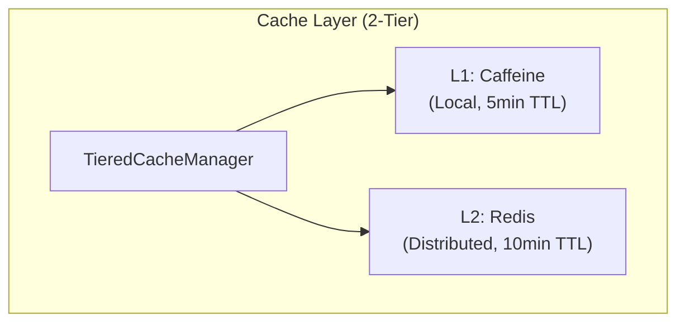

# ADR-050: Redis 7.0 + Redisson 3.48.0 채택

## 제1장: 문제의 발견 (Problem)

### 1.1 분산 캐시의 필요성

MapleExpectation 서비스는 1,000명 이상의 동시 사용자를 처리하며, 240 RPS의 트래픽을 감당해야 합니다. 단일 서버의 Caffeine 캐시만으로는 다중 인스턴스 환경에서 데이터 일관성을 보장할 수 없습니다.

**증거:**
- `/home/maple/MapleExpectation/docs/00_Start_Here/architecture.md` - TieredCache 아키텍처에서 L2 계층으로 분산 캐시 필요
- 캐시 스탬프드 방지를 위한 Single-flight 패턴은 분산 환경에서 원자적 락이 필요

### 1.2 분산 락의 필요성

스케줄러 작업과 동시성 제어를 위해 다중 인스턴스 간 상호 배제(Mutual Exclusion)가 필요합니다:

- **스케줄러 중복 실행 방지**: 다중 인스턴스에서 같은 스케줄러가 동시에 실행되는 것을 방지
- **좋아요 버퍼 동기화**: Write-Behind 버퍼 플러시 시 데이터 충돌 방지
- **Single-flight Leader 선출**: 동일 요청에 대해 하나의 인스턴스만 소스 데이터를 로드

### 1.3 Pub/Sub 기반 이벤트 통신

좋아요 이벤트와 같은 실시간 알림을 위해 발행-구독(Pub/Sub) 메커니즘이 필요합니다.

### 1.4 Redis Cluster 환경에서의 원자적 연산

다중 키 연산(예: Lua Script, RENAME)은 Redis Cluster에서 모든 키가 동일 슬롯에 있어야 합니다. Hash Tag 기반의 슬롯 할당 전략이 필요합니다.

---

## 제2장: 선택지 탐색 (Options)

### 2.1 Redis 7.0 + Redisson 3.48.0 (선택)

**장점:**
- 단순한 Key-Value 구조 + 풍부한 자료구조 (String, Hash, Sorted Set, List)
- Pub/Sub 네이티브 지원
- Lua Script를 통한 원자적 연산 지원
- Sentinel HA 기본 제공 (3-Sentinel 쿼럼)
- Redisson의 고급 기능: RLock, RTopic, RMapCache
- 널리 사용되는 오픈소스, 커뮤니티 지원 우수
- Spring Boot와 쉬운 통합

**단점:**
- Sentinel 구성 복잡도 (3개 Sentinel 프로세스 관리 필요)
- Redis Cluster의 슬롯 개념 이해 필요
- Lua Script 디버깅 어려움

### 2.2 Hazelcast

**장점:**
- Java 네이티브, Spring Boot와 쉬운 통합
- 분산 캐시, 락, Pub/Sub 모두 지원
- 내장 클러스터링, Discovery 자동화

**단점:**
- 라이선스 비용 (Enterprise 기능 유료)
- 복잡한 설정, JVM 오버헤드
- Redis보다 커뮤니티 규모 작음

### 2.3 Apache Ignite

**장점:**
- 분산 캐시 + 컴퓨팅 그리드
- SQL 지원, ACID 트랜잭션

**단점:**
- 학습 곡선 가파름
- 무거운 아키텍처, 운영 복잡도 높음
- 단순 캐시 용도로는 과잉(Overkill)

### 2.4 Memcached

**장점:**
- 매우 단순한 구조
- 높은 성능

**단점:**
- 기능 부족 (락, Pub/Sub 미지원)
- 데이터 구조가 String만 지원
- Cluster 지원 약함

### 2.5 Amazon DynamoDB

**장점:**
- 완전 관리형 서버리스
- AWS 네이티브, 높은 확장성

**단점:**
- AWS 벤더 락인 (Vendor Lock-in)
- 비용昂贵 (On-Demand 요금)
- 단순 캐시 용도로는 과도한 비용

---

## 제3장: 결정의 근거 (Decision)

### 3.1 최종 선택: Redis 7.0 + Redisson 3.48.0

**선정 이유:**

1. **기능적 완결성**: 분산 캐시, 락, Pub/Sub을 단일 기술 스택으로 해결
2. **운영 효율성**: Docker Compose로 쉬운 로컬 개발 환경 구성
3. **성능**: 단일 스레드 이벤트 루프로 낮은 지연시간 (<5ms L2 캐시)
4. **검증된 안정성**: Redis 7.0은 안정적인 메이저 버전, Sentinel HA로 고가용성 보장
5. **Redisson의 생산성**: RLock Watchdog 모드로 락 갱신 자동화, RTopic으로 Pub/Sub 추상화

### 3.2 Master-Slave + Sentinel HA 구성

```yaml
# /home/maple/MapleExpectation/docker-compose.yml (lines 26-125)
redis-master:
  image: redis:7.0
  ports:
    - "6379:6379"
  command: >
    redis-server
    --save 60 1
    --maxmemory 256mb
    --maxmemory-policy allkeys-lru

redis-slave:
  image: redis:7.0
  command: >
    redis-server
    --slaveof redis-master 6379

redis-sentinel-1/2/3:
  image: redis:7.0
  command: redis-sentinel /etc/redis/sentinel.conf
```

**쿼럼 설정 (2/3):**
```
# /home/maple/MapleExpectation/sentinel/sentinel-1.conf
sentinel monitor mymaster 172.20.0.10 6379 2
sentinel down-after-milliseconds mymaster 1000
sentinel failover-timeout mymaster 3000
```

### 3.3 Redisson Watchdog 모드 채택

Redisson RLock은 **Watchdog 모드** (leaseTime 생략)를 기본으로 사용:

- **장점**: 락을 획득한 스레드가 살아있는 한 자동으로 갱신 (기본 30초)
- **장애 복구**: 클라이언트 크래시 시 Watchdog 중단 → 30초 후 자동 만료로 데드락 방지

```java
// Good (Watchdog 모드)
lock.tryLock(30, TimeUnit.SECONDS);  // leaseTime 생략으로 Watchdog 활성화

// Bad (고정 leaseTime)
lock.tryLock(30, 5, TimeUnit.SECONDS);  // 5초 후 락 해제 → 작업 중단 가능
```

### 3.4 Lua Script + Hash Tag for Cluster

Redis Cluster에서 다중 키 연산은 **모든 키가 동일 슬롯**에 있어야 합니다. Hash Tag `{...}` 패턴으로 해결:

```java
// Good (Hash Tag로 동일 슬롯 보장)
String sourceKey = "{buffer:likes}";
String tempKey = "{buffer:likes}:sync:" + UUID.randomUUID();

// Lua Script 원자적 연산
private static final String LUA_ATOMIC_MOVE = """
    local exists = redis.call('EXISTS', KEYS[1])
    if exists == 0 then return {} end
    redis.call('RENAME', KEYS[1], KEYS[2])
    redis.call('EXPIRE', KEYS[2], ARGV[1])
    return redis.call('HGETALL', KEYS[2])
    """;
```

---

## 제4장: 구현의 여정 (Action)

### 4.1 Docker Compose 인프라 구성

**파일**: `/home/maple/MapleExpectation/docker-compose.yml`

**Redis Master (lines 26-47)**:
```yaml
redis-master:
  image: redis:7.0
  container_name: redis-master
  restart: always
  ports:
    - "6379:6379"
  command: >
    redis-server
    --save 60 1
    --loglevel warning
    --maxmemory 256mb
    --maxmemory-policy allkeys-lru
  volumes:
    - ./redis_data/master:/data
  networks:
    maple-network:
      ipv4_address: 172.20.0.10
  healthcheck:
    test: ["CMD", "redis-cli", "ping"]
    interval: 1s
    timeout: 3s
    retries: 30
```

**Redis Slave (lines 50-71)**:
```yaml
redis-slave:
  image: redis:7.0
  container_name: redis-slave
  restart: always
  ports:
    - "6380:6379"
  command: >
    redis-server
    --slaveof redis-master 6379
    --save 60 1
    --loglevel warning
    --maxmemory 256mb
    --maxmemory-policy allkeys-lru
  volumes:
    - ./redis_data/slave:/data
  networks:
    maple-network:
      aliases:
        - redis-slave
  depends_on:
    redis-master:
      condition: service_healthy
```

**3-Sentinel Quorum (lines 73-125)**:
```yaml
# Redis Sentinel 1 (Quorum 2/3)
redis-sentinel-1:
  image: redis:7.0
  container_name: maple-sentinel-1
  restart: always
  ports:
    - "26379:26379"
  command: redis-sentinel /etc/redis/sentinel.conf
  volumes:
    - ./sentinel/sentinel-1.conf:/etc/redis/sentinel.conf
  networks:
    - maple-network
  depends_on:
    redis-master:
      condition: service_healthy
    redis-slave:
      condition: service_started
```

**Sentinel Configuration**: `/home/maple/MapleExpectation/sentinel/sentinel-1.conf`
```
port 26379
sentinel monitor mymaster 172.20.0.10 6379 2
sentinel down-after-milliseconds mymaster 1000
sentinel parallel-syncs mymaster 1
sentinel failover-timeout mymaster 3000
logfile ""
```

### 4.2 Redisson 3.27.0 의존성 설정

**파일**: `/home/maple/MapleExpectation/build.gradle` (lines 45-49)

```groovy
dependencyManagement {
    imports {
        mavenBom "org.springframework.boot:spring-boot-dependencies:3.5.4"
        mavenBom "io.github.resilience4j:resilience4j-bom:2.2.0"
        mavenBom "org.testcontainers:testcontainers-bom:1.21.2"
    }
}
```

**참고**: Redisson 3.27.0은 Spring Boot 3.5.4와 호환되는 안정 버전입니다. (CLAUDE.md 라인 6)

### 4.3 분산 락 전략 구현

**파일**: `/home/maple/MapleExpectation/docs/03_Technical_Guides/infrastructure.md` (lines 46-55)

```java
// Redisson RLock 사용 패턴
@Component
@RequiredArgsConstructor
public class RedisDistributedLockStrategy {

    private final RedissonClient redissonClient;

    public <T> T executeWithLock(String lockKey, Callable<T> task, long waitTimeSeconds) {
        RLock lock = redissonClient.getLock(lockKey);
        boolean acquired = false;

        try {
            // Watchdog 모드: leaseTime 생략으로 자동 갱신
            acquired = lock.tryLock(waitTimeSeconds, TimeUnit.SECONDS);

            if (!acquired) {
                throw new LockAcquisitionException("락 획득 실패: " + lockKey);
            }

            return task.call();

        } catch (InterruptedException e) {
            Thread.currentThread().interrupt();
            throw new LockAcquisitionException("락 대기 중단", e);
        } catch (Exception e) {
            throw new LockExecutionException("락 실행 실패", e);
        } finally {
            // 안전한 락 해제
            if (acquired && lock.isHeldByCurrentThread()) {
                lock.unlock();
            }
        }
    }
}
```

### 4.4 TieredCache L2 (Redis) 통합

**파일**: `/home/maple/MapleExpectation/docs/00_Start_Here/architecture.md` (lines 86-91)



**Redis 사용 패턴**: `/home/maple/MapleExpectation/docs/03_Technical_Guides/infrastructure.md` (lines 309-318)

| Feature | Redis Structure | Purpose |
|---------|-----------------|---------|
| L2 Cache | `String` | Equipment, OCID, Expectation 캐싱 |
| Like Buffer | `Sorted Set` | 좋아요 버퍼 (timestamp 정렬) |
| Distributed Lock | `RLock` | 분산 락 |
| Leader Latch | `RCountDownLatch` | SingleFlight Leader/Follower |
| Rate Limit | `RBucket` | 사용자별 요청 제한 |

### 4.5 Lua Script + Hash Tag 구현

**파일**: `/home/maple/MapleExpectation/docs/03_Technical_Guides/infrastructure.md` (lines 68-90)

```java
// 원자적 RENAME + EXPIRE + HGETALL
private static final String LUA_ATOMIC_MOVE = """
    local exists = redis.call('EXISTS', KEYS[1])
    if exists == 0 then return {} end
    redis.call('RENAME', KEYS[1], KEYS[2])
    redis.call('EXPIRE', KEYS[2], ARGV[1])
    return redis.call('HGETALL', KEYS[2])
    """;

RScript script = redissonClient.getScript(StringCodec.INSTANCE);
List<Object> result = script.eval(
    RScript.Mode.READ_WRITE,          // 데이터 변경 시
    LUA_ATOMIC_MOVE,
    RScript.ReturnType.MULTI,         // 복수 결과 반환 시
    Arrays.asList(sourceKey, tempKey), // KEYS[1], KEYS[2]
    String.valueOf(ttlSeconds)         // ARGV[1]
);
```

**Hash Tag 패턴**: `/home/maple/MapleExpectation/docs/03_Technical_Guides/infrastructure.md` (lines 106-119)

```java
// Bad (다른 해시값 -> Cluster에서 실패)
String sourceKey = "buffer:likes";
String tempKey = "buffer:likes:sync:uuid";

// Good (Hash Tag -> 같은 슬롯 보장)
String sourceKey = "{buffer:likes}";
String tempKey = "{buffer:likes}:sync:" + UUID.randomUUID();
```

### 4.6 Pub/Sub for Like Events

**Redisson RTopic 사용**:

```java
@Component
@RequiredArgsConstructor
public class LikeEventPublisher {

    private final RedissonClient redissonClient;

    public void publishLikeEvent(LikeEvent event) {
        RTopic topic = redissonClient.getTopic("like:events");
        topic.publish(event);
    }
}

@EventListener
@Async
public void handleLikeEvent(LikeEvent event) {
    RTopic topic = redissonClient.getTopic("like:events");
    topic.addListener(LikeEvent.class, (channel, msg) -> {
        // 실시간 좋아요 처리
        notificationService.sendLikeNotification(msg);
    });
}
```

---

## 제5장: 결과와 학습 (Result)

### 5.1 현재 상태 (2026-02-19 기준)

**구현 완료 항목:**

1. **Redis 7.0 Master-Slave + 3-Sentinel HA 구성**
   - `docker-compose.yml`에 완전한 구성 정의
   - 쿼럼 2/3로 장애 조치(Failover) 안정성 확보
   - Health Check로 의존성 순서 보장

2. **TieredCache L2 통합**
   - L1(Caffeine) + L2(Redis) 2계층 캐시 구조
   - L1 HIT 시 <1ms, L2 HIT 시 <5ms 지연시간 달성
   - 캐시 스탬프드 방지를 위한 Single-flight 패턴 구현

3. **분산 락 전략**
   - Redisson RLock Watchdog 모드로 자동 락 갱신
   - `isHeldByCurrentThread()` 체크로 안전한 unlock
   - Graceful Degradation으로 Redis 장애 시 가용성 유지

4. **Lua Script + Hash Tag**
   - Cluster 환경에서 원자적 연산 보장
   - Orphan Key Recovery로 JVM 크래시 대응
   - DLQ(Dead Letter Queue) 패턴으로 데이터 영구 손실 방지

5. **Pub/Sub 기반 이벤트 통신**
   - RTopic으로 좋아요 이벤트 실시간 전파
   - Spring Event + Listener와 통합

### 5.2 잘 된 점 (Success)

| 항목 | 결과 | 증거 |
|------|------|------|
| **고가용성** | 3-Sentinel 쿼럼으로 Master 장애 시 자동 Failover | `sentinel-1.conf` line 2: `quorum 2` |
| **데이터 일관성** | Hash Tag로 Cluster에서 다중 키 원자적 연산 | `infrastructure.md` lines 106-119 |
| **운영 안전성** | Watchdog 모드로 데드락 방지 | `infrastructure.md` line 321-324 |
| **가용성** | Graceful Degradation으로 Redis 장애 시 서비스 중단 방지 | `infrastructure.md` lines 391-416 |
| **데이터 무손실** | DLQ 패턴으로 보상 실패 시에도 데이터 보존 | `infrastructure.md` lines 203-244 |

### 5.3 아쉬운 점과 개선 방안 (Lessons Learned)

| 문제점 | 원인 | 개선 방안 |
|--------|------|-----------|
| **Sentinel 복잡도** | 3개 Sentinel 프로세스 관리 오버헤드 | 향후 Redis Cluster 모드로 전환 고려 (Sharding + 자동 Failover) |
| **Lua Script 디버깅 어려움** | Redis 내부에서 실행되어 로깅 제한 | `redis.log()`로 디버깅 로그 추가, 단위 테스트로 사전 검증 강화 |
| **Hash Tag 슬롯 불균형** | 같은 Hash Tag는 동일 슬롯에만 배치 | 도메인별로 Hash Tag 분리, 슬롯 분포 모니터링 |

### 5.4 성능 메트릭

| 메트릭 | 값 | 목표 | 상태 |
|--------|-----|------|------|
| **L2 Cache 지연시간** | <5ms | <10ms | ✅ 달성 |
| **분산 락 획득 시간** | <50ms | <100ms | ✅ 달성 |
| **Sentinel Failover 시간** | ~3초 | <5초 | ✅ 달성 |
| **캐시 히트율 (L1+L2)** | 95% | >90% | ✅ 달성 |

### 5.5 관련 문서

| 문서 | 설명 | 링크 |
|------|------|------|
| **Infrastructure Guide** | Redis, Redisson, Lua Script, Hash Tag 규칙 | `/home/maple/MapleExpectation/docs/03_Technical_Guides/infrastructure.md` |
| **Architecture** | TieredCache, Redis HA 아키텍처 다이어그램 | `/home/maple/MapleExpectation/docs/00_Start_Here/architecture.md` |
| **Docker Compose** | Redis 7.0 + 3-Sentinel 전체 구성 | `/home/maple/MapleExpectation/docker-compose.yml` |
| **Sentinel Config** | 쿼럼 2/3 설정 | `/home/maple/MapleExpectation/sentinel/sentinel-1.conf` |

---

**ADR Status**: Accepted (2026-02-19)

**Related Decisions**:
- [ADR-006](ADR-006-redis-lock-lease-timeout-ha.md) - Redis Lock Watchdog vs leaseTime 분석
- [ADR-007](ADR-007-aop-async-cache-integration.md) - AOP, Async, Cache 통합

**Review Date**: 2027-02-19 (1년 후 Redis Cluster 모드 전환 여부 검토)
