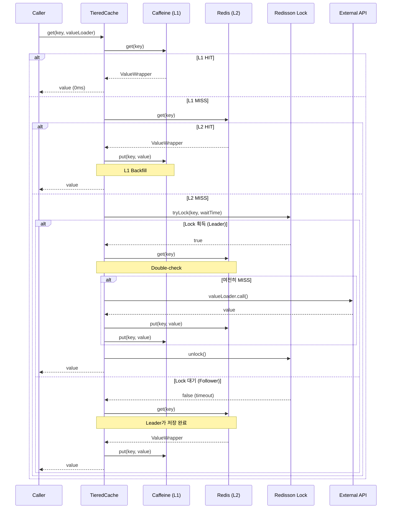
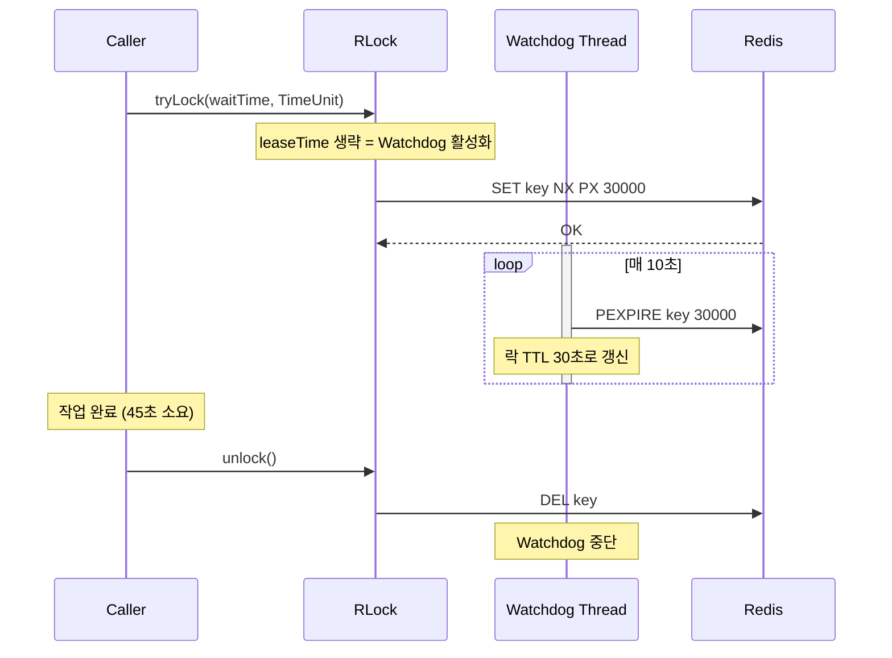
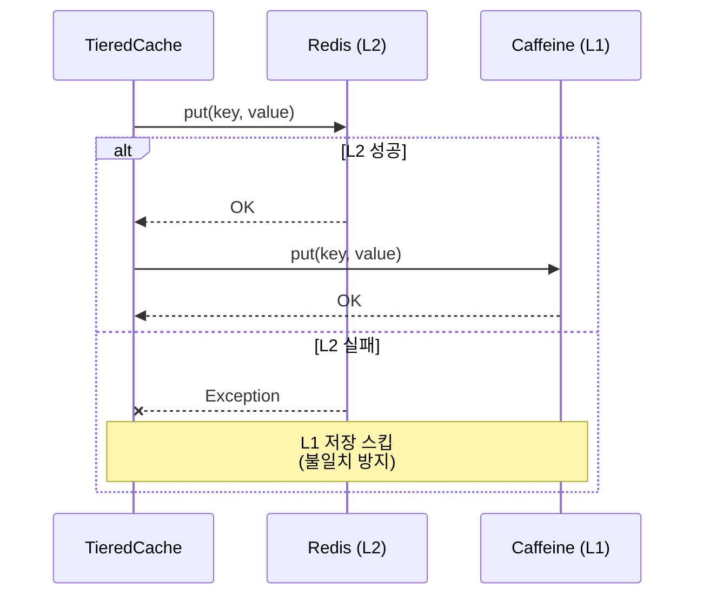

# TieredCache Single-flight 시퀀스 다이어그램

## 개요

Multi-Layer 캐시(L1: Caffeine, L2: Redis)와 분산 Single-flight 패턴으로 **Cache Stampede**를 방지합니다.

## 캐시 조회 시퀀스



## Watchdog 모드 (락 자동 갱신)



## Write Order 규칙 (L2 → L1)



## TTL 규칙

| 계층 | TTL | 이유 |
|------|-----|------|
| L1 (Caffeine) | 5분 | 로컬 메모리 절약 |
| L2 (Redis) | 30분 | L1 만료 시 Fallback |

**규칙:** L1 TTL ≤ L2 TTL (L2가 항상 Superset)

## 설정

```yaml
# application.yml
cache:
  equipment:
    l1-ttl: 300        # 5분
    l2-ttl: 1800       # 30분
    lock-wait-time: 30  # 초
```

## E2E 테스트 결과

| 시나리오 | 결과 | 증거 |
|---------|------|------|
| RD-S01: L1 캐시 HIT | PASS | `fetchWithCache` 0ms |
| AO-G01: Two-Phase Snapshot | PASS | 1차: 617ms → 2차: 1ms |

## 관련 파일

- `src/main/java/maple/expectation/global/cache/TieredCache.java`
- `src/main/java/maple/expectation/global/cache/TieredCacheManager.java`
- `src/main/java/maple/expectation/config/RedissonConfig.java`
