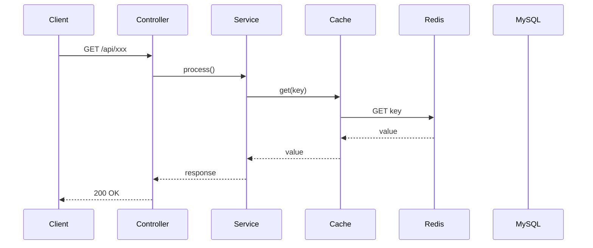
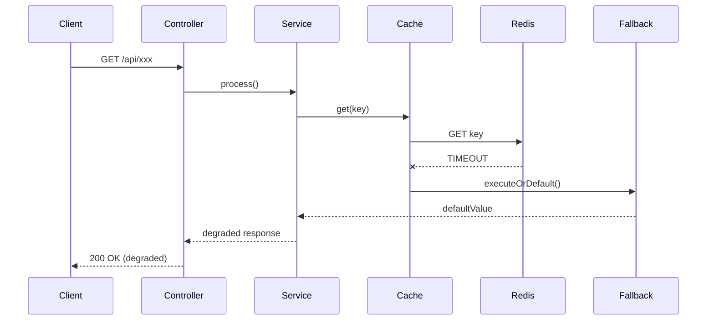

# Scenario XX: [시나리오명]

> **담당 에이전트**: 🔴 Red (장애주입) & 🟣 Purple (데이터검증)
> **난이도**: P0 (Critical) / P1 (Important) / P2 (Nice-to-have)
> **테스트 일시**: YYYY-MM-DD HH:mm

---

## 1. 테스트 전략 (🟡 Yellow's Plan)

### 목적
우리는 OOO 상황에서 시스템이 XXX 하게 반응하는지 검증한다.

### 검증 포인트
- [ ] 포인트 1
- [ ] 포인트 2
- [ ] 포인트 3

### 성공 기준
- 조건 1
- 조건 2

---

## 2. 장애 주입 (🔴 Red's Attack)

### 주입 방법
```bash
# 장애 주입 명령어
docker-compose stop [service]
```

### 방어 기제 검증
- Circuit Breaker 상태 확인
- Retry 동작 확인
- Fallback 전환 확인

---

## 3. 그라파나 대시보드 전/후 비교 + 관련 로그 (🟢 Green's Analysis)

### 모니터링 대시보드
- URL: `http://localhost:3000/d/maple-chaos`

### 전 (Before) - 메트릭
| 메트릭 | 값 |
|--------|---|
| CPU 사용률 | XX% |
| Memory | XX MB |
| Connection | XX |
| Error Rate | 0% |

### 전 (Before) - 관련 로그 (Baseline)

정상 상태(`HH:MM:SS`)의 애플리케이션 로그. **비교 기준점(Baseline)**으로 사용.

```text
# Application Log Output (정상 상태)
YYYY-MM-DD HH:MM:SS.mmm INFO  [thread-name] ClassName - 정상 동작 로그  <-- 정상 상태 설명
```

**(정상 상태에서는 XXX - 이 값들이 장애 후 어떻게 변하는지 주목)**

### 후 (After) - 메트릭
| 메트릭 | 변화 |
|--------|-----|
| CPU 사용률 | XX% → YY% |
| Memory | XX MB → YY MB |
| Error Rate | 0% → Z% |
| Circuit Breaker State | CLOSED → OPEN |

### 후 (After) - 관련 로그 증거 ⚠️

장애 주입 직후(`HH:MM:SS`), 애플리케이션에서 **Graceful Degradation 동작 로그**가 확인됨.

```text
# Application Log Output (시간순 정렬)
YYYY-MM-DD HH:MM:SS.mmm WARN  [thread-name] ClassName - 장애 감지 로그  <-- 1. 핵심 포인트 설명
YYYY-MM-DD HH:MM:SS.mmm ERROR [thread-name] ClassName - 에러 로그  <-- 2. 다음 핵심 포인트
YYYY-MM-DD HH:MM:SS.mmm INFO  [thread-name] ClassName - 복구 로그  <-- 3. 결론! (장애 격리 완료)
```

**(위 로그를 통해 XXX가 YYY초 만에 ZZZ 되었음을 입증함)**

### 로그-메트릭 상관관계 분석
| 시간 | 로그 이벤트 | 메트릭 변화 |
|------|-------------|------------|
| T+0s | 장애 주입 | - |
| T+Xs | 로그 이벤트 1 | 메트릭 변화 1 |
| T+Ys | 로그 이벤트 2 | 메트릭 변화 2 |

### Loki 검색 쿼리 모음
```bash
# 전체 에러 로그
{app="maple-expectation"} |= "ERROR" | json

# 특정 TraceId 추적
{app="maple-expectation"} | json | traceId="xxx"

# Circuit Breaker 상태 변경
{app="maple-expectation"} |= "CircuitBreaker" |= "changed"
```

---

## 4. 테스트 Quick Start

### 환경 설정
```bash
# 1. 컨테이너 시작
cd docker && docker-compose up -d

# 2. 애플리케이션 시작 (DEBUG 로그)
./gradlew bootRun --args='--spring.profiles.active=local --logging.level.maple.expectation=DEBUG'

# 3. 상태 확인
curl http://localhost:8080/actuator/health
```

### JUnit 테스트 실행
```bash
# 테스트 실행 (로그 파일로 출력)
./gradlew test --tests "[TestClassName]" \
  -Dtest.logging=true \
  2>&1 | tee logs/chaos-test-$(date +%Y%m%d_%H%M%S).log
```

### 실제 환경 수동 테스트
```bash
# 1. 정상 상태 로그 수집 (Before)
docker-compose logs --tail=50 app > logs/baseline-$(date +%H%M%S).log

# 2. 장애 주입
[장애 주입 명령어]

# 3. 장애 로그 수집 (After)
docker-compose logs --since=1m app | grep -E "ERROR|WARN|Circuit|fallback" > logs/failure-$(date +%H%M%S).log

# 4. 복구
[복구 명령어]
```

---

## 5. 테스트 실패 시나리오

### 실패 조건
1. 조건 A가 만족될 때
2. 조건 B가 만족될 때

### 예상 실패 메시지
```
ERROR [xxx] - Expected failure message here
```

### 실패 시 시스템 상태
- Redis: XXX 상태
- MySQL: YYY 상태
- Application: ZZZ 상태

---

## 6. 복구 시나리오

### 자동 복구
1. Circuit Breaker가 OPEN → HALF_OPEN → CLOSED로 전환
2. Retry 메커니즘이 3회 시도 후 성공

### 수동 복구 필요 조건
- 조건 A인 경우 수동 개입 필요

---

## 7. 복구 과정 (Step-by-Step)

### Phase 1: 장애 인지 (T+0s)
```text
# 알람/로그
YYYY-MM-DD HH:MM:SS.mmm ERROR [xxx] - 장애 감지  <-- 장애 최초 인지
```

### Phase 2: 원인 분석 (T+30s)
1. Grafana 대시보드 확인
2. Loki 로그 검색
```bash
{app="maple-expectation"} |~ "ERROR|WARN" | json
```

### Phase 3: 복구 실행 (T+60s)
```bash
# 복구 명령어
docker-compose start [service]
```

### Phase 4: 검증 (T+120s)
```bash
# Health Check
curl http://localhost:8080/actuator/health

# Circuit Breaker 상태 확인
curl http://localhost:8080/actuator/circuitbreakers
```

### 복구 완료 로그 증거
```text
# Recovery Log Output
YYYY-MM-DD HH:MM:SS.mmm INFO  [xxx] - Service restored  <-- 1. 서비스 복구 확인
YYYY-MM-DD HH:MM:SS.mmm INFO  [xxx] - CircuitBreaker changed from OPEN to CLOSED  <-- 2. CB 정상화
```

**(위 로그를 통해 복구가 XX초 만에 완료되었음을 입증함)**

---

## 8. 실패 복구 사고 과정

### 1단계: 증상 파악
- "어떤 에러가 발생했는가?"
- "언제부터 발생했는가?"
- "영향 범위는?"

### 2단계: 가설 수립
- 가설 1: XXX가 원인일 수 있다
- 가설 2: YYY가 원인일 수 있다

### 3단계: 가설 검증
```bash
# 가설 1 검증 명령어
[검증 명령어]
```

### 4단계: 근본 원인 확인
- Root Cause: ZZZ

### 5단계: 해결책 결정
- 단기: 임시 우회
- 장기: 아키텍처 개선

---

## 9. 실패 복구 실행 과정

### 복구 명령어
```bash
# Step 1: 서비스 재시작
docker-compose restart [service]

# Step 2: 상태 확인
docker-compose ps

# Step 3: 로그 확인
docker-compose logs -f [service]
```

### 복구 검증
```bash
# Health Check
curl http://localhost:8080/actuator/health

# 기능 테스트
curl http://localhost:8080/api/v2/characters/test/expectation
```

---

## 10. 데이터 흐름 (🔵 Blue's Blueprint)

### 정상 흐름


### 장애 시 흐름


---

## 11. 데이터 무결성 (🟣 Purple's Audit)

### 검증 항목
- [ ] 트랜잭션 롤백 확인
- [ ] 데이터 불일치 여부
- [ ] Redis-DB 정합성

### 검증 쿼리
```sql
-- 데이터 정합성 확인
SELECT COUNT(*) FROM [table] WHERE [condition];
```

### 검증 결과
| 항목 | Before | After | 판정 |
|------|--------|-------|------|
| 데이터 A | X | X | PASS |
| 데이터 B | Y | Y | PASS |

---

## 12. 관련 CS 원리 (학습용)

### 핵심 개념
1. **개념 1**: 설명
2. **개념 2**: 설명
3. **개념 3**: 설명

### 참고 자료
- [링크 1](URL)
- [링크 2](URL)

### 이 시나리오에서 배울 수 있는 것
- XXX 상황에서 시스템이 어떻게 동작하는지
- YYY 패턴이 왜 필요한지
- ZZZ 설정의 중요성

---

## 13. 슬로우 쿼리 분석 (해당 시)

### 발생 쿼리
```sql
-- 문제가 된 쿼리
SELECT * FROM [table] WHERE [condition];
```

### 원인 분석
- 원인 1
- 원인 2

### 해결 방법
```sql
-- 개선 쿼리 또는 인덱스 추가
CREATE INDEX idx_xxx ON [table]([column]);
```

### 개선 후 실행 계획
```
EXPLAIN 결과...
```

---

## 14. 이슈 정의 (실패 시)

> **이 섹션은 테스트 실패 시에만 작성합니다.**

### 📌 Problem Definition (문제 정의)
[문제 설명]

### 🎯 Goal (목표)
[해결 목표]

### 🔍 Workflow (작업 방식)
1. 단계 1
2. 단계 2

### 🛠️ 해결 (Resolve)
[해결 방법]

### 📝 Analysis Plan (중점 분석 대상)
- 분석 대상 1
- 분석 대상 2

### ⚖️ Trade-off (트레이드오프)
| 선택지 | 장점 | 단점 |
|--------|------|------|
| A | ... | ... |
| B | ... | ... |

### ✅ Action Items
- [ ] Action 1
- [ ] Action 2

### 🏁 Definition of Done (완료 조건)
- [ ] 완료 조건 1
- [ ] 완료 조건 2

### Why
[근본 원인 및 배경 설명]

---

## 15. 최종 판정 (🟡 Yellow's Verdict)

### 결과: **PASS / FAIL / CONDITIONAL PASS**

### 조건부 승인 사유 (해당 시)
- 조건 1
- 조건 2

### 기술적 인사이트
- 발견 1
- 발견 2

### 개선 제안
| 영역 | 현재 | 개선안 | 우선순위 |
|------|------|--------|----------|
| XXX | ... | ... | P0 |
| YYY | ... | ... | P1 |

---

*Tested by 5-Agent Council on YYYY-MM-DD*
