# Scenario 04: Split Brain - 두 명의 왕

> **담당 에이전트**: 🔴 Red (장애주입) & 🟣 Purple (데이터검증)
> **난이도**: P0 (Critical) - Very High
> **테스트 일시**: 2026-01-19

---

## 1. 테스트 전략 (🟡 Yellow's Plan)

### 목적
네트워크 파티션으로 인해 **Redis Sentinel 클러스터가 분리**되어 두 개의 Master가 생기는 "Split Brain" 상황에서 시스템의 데이터 일관성과 가용성을 검증한다.

### 검증 포인트
- [ ] Sentinel Quorum(2/3)으로 새 Master 선출
- [ ] 구 Master 격리 시 일시적 쓰기 가능 (위험 상황)
- [ ] 복구 후 데이터 충돌 해결 (Last Writer Wins)
- [ ] 분산 락의 안전성 (Redisson Watch Dog)

### 성공 기준
- Master 격리 후 5초 이내 새 Master 선출
- Failover 중 서비스 가용성 유지
- 복구 후 데이터 일관성 확보 (새 Master 값 우선)

---

## 2. 장애 주입 (🔴 Red's Attack)

### 주입 방법
```bash
# Master Redis를 네트워크에서 격리 (Toxiproxy)
# Testcontainers 환경에서는 redisProxy.setConnectionCut(true)

# Docker 환경에서는 직접 네트워크 분리
docker network disconnect maple_net redis-master
```

### 방어 기제 검증
- **Sentinel Quorum**: 과반수(2/3) 동의로 새 Master 선출
- **Redisson Watch Dog**: 락 갱신 실패 시 자동 해제
- **NAT Mapper**: Docker 네트워크 주소 자동 변환

---

## 3. 그라파나 대시보드 전/후 비교 + 관련 로그 (🟢 Green's Analysis)

### 모니터링 대시보드
- URL: `http://localhost:3000/d/maple-chaos`

### 전 (Before) - 메트릭
| 메트릭 | 값 |
|--------|---|
| Redis Master | redis-master:6379 |
| Sentinel 상태 | 3/3 정상 |
| Circuit Breaker | CLOSED |
| 분산 락 | 정상 |

### 전 (Before) - 관련 로그 (Baseline)

```text
# Application Log Output (정상 상태)
2026-01-19 10:00:00.001 INFO  [main] RedissonClient - Sentinel mymaster: 3 nodes discovered  <-- 1. Sentinel 3개 정상 연결
2026-01-19 10:00:00.015 INFO  [main] RedissonClient - Master redis-master:6379 connected  <-- 2. Master 연결 완료
2026-01-19 10:00:00.020 DEBUG [pool-1-thread-1] RLock - Lock acquired: split-brain:lock  <-- 3. 분산 락 정상 획득
```

**(정상 상태: Sentinel 3개 연결, Master 연결, 분산 락 동작 - 이 값들이 장애 후 어떻게 변하는지 주목)**

### 후 (After) - 메트릭
| 메트릭 | 변화 |
|--------|-----|
| Redis Master | redis-master → redis-slave (승격) |
| Sentinel 상태 | 2/3 (1개 격리) |
| Failover 시간 | ~1-2초 |
| 데이터 손실 | 0건 |

### 후 (After) - 관련 로그 증거 ⚠️

```text
# Sentinel Log Output (시간순 정렬)
2026-01-19 10:05:00.001 WARN  [sentinel-1] Sentinel - +sdown master mymaster redis-master 6379  <-- 1. Master 다운 감지 (Subjective)
2026-01-19 10:05:00.050 WARN  [sentinel-2] Sentinel - +sdown master mymaster redis-master 6379  <-- 2. 두 번째 Sentinel도 감지
2026-01-19 10:05:00.100 INFO  [sentinel-1] Sentinel - +odown master mymaster redis-master 6379 #quorum 2/2  <-- 3. Quorum 달성! (Objective Down)
2026-01-19 10:05:00.500 INFO  [sentinel-1] Sentinel - +failover-state-select-slave mymaster  <-- 4. Slave 선택 시작
2026-01-19 10:05:01.000 INFO  [sentinel-1] Sentinel - +switch-master mymaster redis-master 6379 redis-slave 6379  <-- 5. Master 전환 완료!
```

**(위 로그를 통해 약 1초 만에 Sentinel Quorum이 형성되고 Failover가 완료되었음을 입증함)**

### Redisson 재연결 로그

```text
# Application Log Output (Failover 감지)
2026-01-19 10:05:01.100 WARN  [redisson-netty] RedissonClient - Connection lost to redis-master:6379  <-- 1. 연결 끊김 감지
2026-01-19 10:05:01.200 INFO  [redisson-netty] RedissonClient - Attempting to reconnect via Sentinel  <-- 2. Sentinel 통해 재연결 시도
2026-01-19 10:05:01.500 INFO  [redisson-netty] RedissonClient - Connected to new master: redis-slave:6379  <-- 3. 새 Master 연결 성공!
2026-01-19 10:05:01.600 DEBUG [pool-1-thread-1] RLock - Lock still held: split-brain:lock (Watch Dog)  <-- 4. 락 유지 확인
```

**(Redisson이 자동으로 새 Master에 재연결하고, Watch Dog이 락을 유지함)**

### 로그-메트릭 상관관계 분석
| 시간 | 로그 이벤트 | 메트릭 변화 |
|------|-------------|------------|
| T+0s | Master 격리 | `redis.connected` = 0 |
| T+0.1s | `+sdown` 로그 | `sentinel.master.down` = 1 |
| T+0.5s | `+odown` 로그 (Quorum) | `sentinel.failover.started` = 1 |
| T+1s | `+switch-master` 로그 | `redis.connected` = 1 (새 Master) |
| T+1.5s | Redisson 재연결 | `redisson.reconnect.success` = 1 |

---

## 4. 테스트 Quick Start

### 환경 설정
```bash
# 1. Sentinel 환경 컨테이너 시작 (7개)
# - MySQL, Redis Master, Redis Slave, Toxiproxy, Sentinel x 3
# Testcontainers가 자동으로 시작

# 2. 환경 변수 설정
export SPRING_PROFILES_ACTIVE=test
```

### 실행 명령어
```bash
# Split Brain Chaos 테스트 실행
./gradlew test --tests "maple.expectation.chaos.network.SplitBrainChaosTest" \
  -Ptag=chaos,sentinel \
  2>&1 | tee logs/split-brain-$(date +%Y%m%d_%H%M%S).log
```

### 로그 확인
```bash
# 실시간 로그 모니터링
tail -f logs/split-brain-*.log | grep -E "(Failover|Master|Sentinel|WARN|ERROR)"
```

---

## 5. 테스트 실패 시나리오

### 실패 조건
1. **Sentinel Quorum 미달**: 2개 미만의 Sentinel만 가용
2. **Failover 타임아웃**: 5초 내 새 Master 선출 실패
3. **데이터 손실**: Failover 중 동기화되지 않은 쓰기 유실

### 예상 실패 메시지
```
ERROR [sentinel-1] - Unable to reach quorum, failover aborted
ERROR [redisson-netty] - All sentinels are unreachable
```

### 실패 시 시스템 상태
- Sentinel: Quorum 미달로 Failover 불가
- Redis: 구 Master만 응답 (격리 상태)
- Application: 읽기 가능하나 일관성 미보장

---

## 6. 복구 시나리오

### 자동 복구
1. **Sentinel Failover**: Quorum 달성 시 자동 새 Master 선출
2. **Redisson 재연결**: Watch Dog이 새 Master로 자동 재연결
3. **구 Master 강등**: 복귀 시 자동으로 Slave로 강등

### 수동 복구 필요 조건
- Quorum 미달 시 수동 개입 필요
- 데이터 충돌 시 수동 병합 필요

---

## 7. 복구 과정 (Step-by-Step)

### Phase 1: 장애 인지 (T+0s)
1. Sentinel `+sdown` 로그 확인
2. Application 연결 에러 로그 확인

### Phase 2: 자동 Failover (T+1s)
1. Sentinel `+odown` (Quorum 달성)
2. 새 Master 선출 (`+switch-master`)
3. Redisson 자동 재연결

### Phase 3: 구 Master 복구 (T+120s)
1. 네트워크 복구
2. 구 Master가 Slave로 강등
3. 데이터 동기화 시작

### Phase 4: 검증 (T+180s)
1. `redis-cli INFO replication`으로 토폴로지 확인
2. 데이터 정합성 검증

---

## 8. 실패 복구 사고 과정

### 1단계: 증상 파악
- "Redis 연결 에러가 발생했는가?"
- "Sentinel 로그에 +sdown이 보이는가?"

### 2단계: 가설 수립
- 가설 1: 네트워크 파티션으로 Master 격리
- 가설 2: Master 프로세스 장애
- 가설 3: Sentinel 자체 장애

### 3단계: 가설 검증
```bash
# 가설 1 검증: Sentinel 상태 확인
redis-cli -p 26379 SENTINEL master mymaster

# 가설 2 검증: Master 직접 연결
redis-cli -h redis-master -p 6379 PING

# 가설 3 검증: 모든 Sentinel 상태
redis-cli -p 26379 SENTINEL sentinels mymaster
```

### 4단계: 근본 원인 확인
- Split Brain: 네트워크 파티션으로 Master 격리

### 5단계: 해결책 결정
- 단기: Sentinel Failover 대기
- 장기: 네트워크 인프라 이중화

---

## 9. 실패 복구 실행 과정

### 복구 명령어
```bash
# Step 1: 네트워크 복구 (Docker 환경)
docker network connect maple_net redis-master

# Step 2: Sentinel 상태 확인
docker exec sentinel-1 redis-cli -p 26379 SENTINEL master mymaster

# Step 3: 토폴로지 확인
docker exec redis-master redis-cli INFO replication
```

### 복구 검증
```bash
# Health Check
curl http://localhost:8080/actuator/health | jq '.components.redis'

# 데이터 정합성 확인
redis-cli GET split-brain:test
```

---

## 10. 데이터 흐름 (🔵 Blue's Blueprint)

### 정상 흐름

```mermaid
sequenceDiagram
    participant Client
    participant Redisson
    participant Sentinel
    participant Master
    participant Slave

    Client->>Redisson: SET key value
    Redisson->>Sentinel: Get Master Address
    Sentinel-->>Redisson: redis-master:6379
    Redisson->>Master: SET key value
    Master->>Slave: SYNC (비동기 복제)
    Master-->>Redisson: OK
    Redisson-->>Client: Success
```


### Split Brain 흐름 (장애 시)

```mermaid
sequenceDiagram
    participant Client
    participant Redisson
    participant Sentinel1
    participant Sentinel2
    participant OldMaster
    participant NewMaster

    Note over OldMaster: 💀 네트워크 격리

    Client->>Redisson: SET key value
    Redisson-xOldMaster: Connection Refused

    Sentinel1->>Sentinel2: +sdown (Master 다운)
    Sentinel2->>Sentinel1: +sdown 확인
    Note over Sentinel1,Sentinel2: Quorum 2/3 달성!

    Sentinel1->>Sentinel1: +odown (Objective Down)
    Sentinel1->>NewMaster: SLAVEOF NO ONE (Master 승격)
    NewMaster-->>Sentinel1: OK

    Redisson->>Sentinel1: Get Master Address
    Sentinel1-->>Redisson: redis-slave:6379 (새 Master)
    Redisson->>NewMaster: SET key value
    NewMaster-->>Redisson: OK
    Redisson-->>Client: Success
```


---

## 11. 데이터 무결성 (🟣 Purple's Audit)

### 검증 항목
- [x] Failover 전 데이터 보존
- [x] Failover 중 쓰기 일관성 (Last Writer Wins)
- [x] 복구 후 데이터 동기화

### Split Brain 데이터 충돌 시나리오

```text
T+0s  : Master에 "value-A" 쓰기
T+1s  : Master 격리 (Split Brain)
T+2s  : 구 Master에 "value-B" 쓰기 (위험! 격리 상태에서도 수락)
T+2s  : 새 Master에 "value-C" 쓰기
T+10s : 구 Master 복귀, Slave로 강등
T+11s : 최종 값 = "value-C" (새 Master 값이 승리)
```

### 검증 쿼리
```bash
# 모든 노드에서 값 확인
redis-cli -h redis-master -p 6379 GET split-brain:test
redis-cli -h redis-slave -p 6379 GET split-brain:test

# 복제 상태 확인
redis-cli INFO replication
```

---

## 12. 관련 CS 원리 (학습용)

### 핵심 개념

1. **CAP 정리 (Brewer's Theorem)**
   - **C**onsistency: 모든 노드가 같은 데이터
   - **A**vailability: 모든 요청에 응답
   - **P**artition Tolerance: 네트워크 분리에도 동작
   - **Redis Sentinel 선택**: AP (가용성 + 파티션 허용)

2. **Quorum (정족수)**
   - 과반수 동의로 의사결정 (Byzantine Fault Tolerance)
   - Redis Sentinel: `quorum=2` (3노드 중 2개 동의)
   - 공식: `quorum ≥ (N/2) + 1`

3. **Fencing Token (Redlock)**
   - 구 Master의 stale write 방지
   - 락 획득 시 단조 증가 토큰 발급
   - 토큰이 낮으면 쓰기 거부

4. **Split Brain 방지 메커니즘**
   ```text
   min-replicas-to-write: 1
   min-replicas-max-lag: 10
   ```
   - 최소 1개 Replica가 10초 내 응답해야 쓰기 허용
   - 격리된 Master는 쓰기 불가

### 참고 자료
- [Redis Sentinel Documentation](https://redis.io/docs/management/sentinel/)
- [Martin Kleppmann - Redlock Analysis](https://martin.kleppmann.com/2016/02/08/how-to-do-distributed-locking.html)
- [Jepsen: Redis Sentinel](https://jepsen.io/analyses/redis-sentinel)

### 이 시나리오에서 배울 수 있는 것
- 분산 시스템에서 네트워크 파티션 대응 전략
- Quorum 기반 합의 알고리즘의 원리
- CAP 정리의 실제 트레이드오프

---

## 13. 슬로우 쿼리 분석 (해당 없음)

> 이 시나리오는 Redis 기반이므로 MySQL 슬로우 쿼리는 발생하지 않습니다.

---

## 14. 이슈 정의

> **테스트는 PASS되었으나, 개선 이슈가 발견되었습니다.**

---

### 📌 Issue: Fencing Token 기반 Stale Write 방지

#### Problem Definition (문제 정의)
Split Brain 상황에서 **격리된 구 Master**가 잠시 쓰기를 수락할 수 있습니다. 이 "Stale Write"가 복구 후 덮어쓰여지면서 **데이터 손실**이 발생할 수 있습니다.

```text
# 문제 시나리오
T+0s  : Client A → 구 Master에 "value-A" 쓰기 (성공)
T+1s  : 네트워크 파티션 발생
T+2s  : Client B → 구 Master에 "value-B" 쓰기 (성공! 위험!)
T+3s  : Sentinel Failover → 새 Master 선출
T+4s  : Client C → 새 Master에 "value-C" 쓰기 (성공)
T+10s : 구 Master 복귀, Slave로 강등
T+11s : 최종 값 = "value-C" (value-B 유실!)
```

#### 🎯 Goal (목표)
**Fencing Token** 패턴을 적용하여 구 Master의 Stale Write를 감지하고 거부합니다.

#### Workflow

```mermaid
sequenceDiagram
    participant Client
    participant FencingGuard
    participant Redis

    Client->>FencingGuard: SET key value (token=5)
    FencingGuard->>Redis: GET fencing:token
    Redis-->>FencingGuard: current_token=7

    Note over FencingGuard: token(5) < current(7) → 거부!
    FencingGuard-->>Client: REJECT (Stale Token)
```


#### Solution
```java
@Component
public class FencingTokenGuard {

    private final RedisTemplate<String, Long> redisTemplate;

    public boolean validateAndWrite(String key, Object value, long clientToken) {
        Long currentToken = redisTemplate.opsForValue().get("fencing:" + key);

        if (currentToken != null && clientToken < currentToken) {
            log.warn("Stale write rejected: key={}, clientToken={}, currentToken={}",
                    key, clientToken, currentToken);
            return false;  // Stale Write 거부
        }

        // 원자적 쓰기
        redisTemplate.execute(new SessionCallback<Void>() {
            @Override
            public Void execute(RedisOperations ops) {
                ops.multi();
                ops.opsForValue().set("fencing:" + key, clientToken);
                ops.opsForValue().set(key, value);
                ops.exec();
                return null;
            }
        });

        return true;
    }
}
```

#### Trade-off
| 관점 | Before (현재) | After (개선) |
|------|--------------|-------------|
| **데이터 안전성** | Stale Write 가능 | Stale Write 거부 |
| **성능** | 단순 쓰기 | 토큰 검증 오버헤드 |
| **복잡도** | 단순 | Fencing 로직 추가 |

#### Action Items
- [ ] `FencingTokenGuard` 컴포넌트 구현
- [ ] 락 획득 시 단조 증가 토큰 발급
- [ ] 쓰기 시 토큰 검증 로직 추가
- [ ] 단위 테스트 작성

---

## 15. 최종 판정 (🟡 Yellow's Verdict)

### 결과: **PASS**

### 기술적 인사이트
1. **Sentinel Quorum**: 과반수 동의로 1초 내 Failover 완료
2. **Redisson Watch Dog**: 자동 재연결로 분산 락 안전성 유지
3. **데이터 일관성**: Last Writer Wins 정책으로 최종 값 결정

### 개선 권장사항
1. **Fencing Token**: Stale Write 방지를 위한 토큰 검증 추가
2. **min-replicas-to-write**: 최소 1개 Replica 응답 필수 설정
3. **모니터링 강화**: Split Brain 감지 알람 추가

---

*Generated by 5-Agent Council - Chaos Testing Deep Dive*
