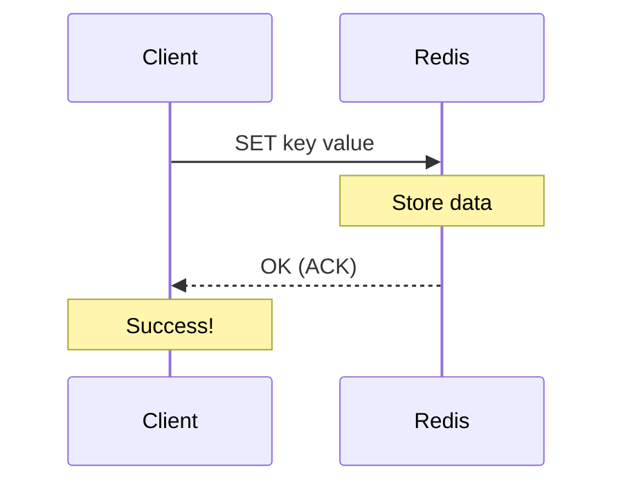
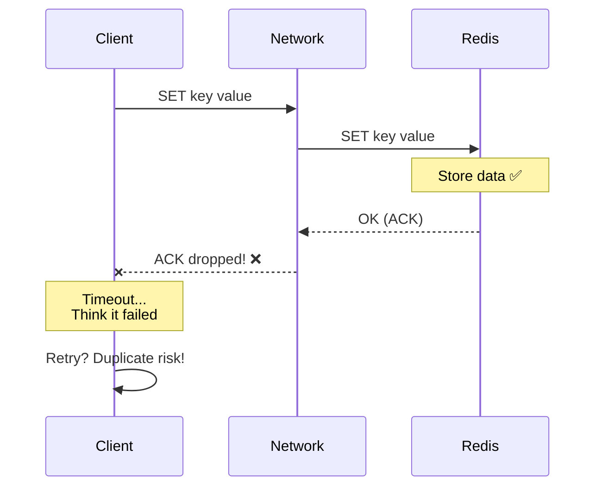
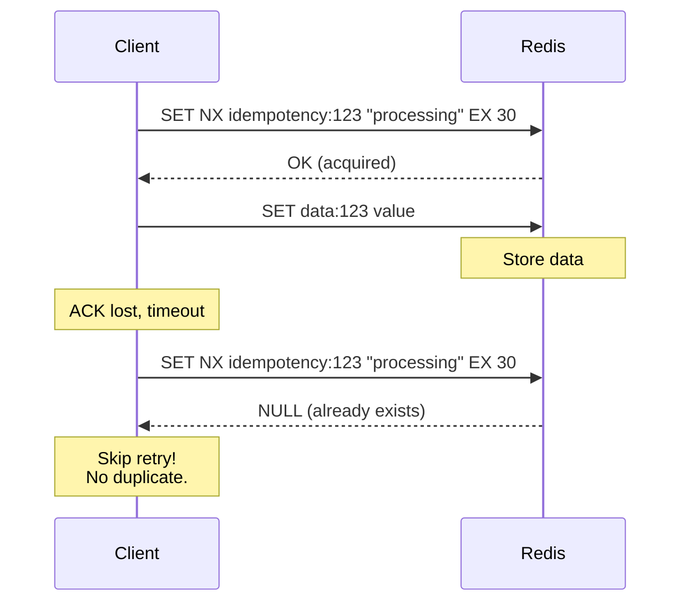

# Scenario 07: Black Hole Commit - ACK 유실

> **담당 에이전트**: 🟣 Purple (데이터검증) & 🔴 Red (장애주입)
> **난이도**: P0 (Critical) - Very High
> **테스트 일시**: 2026-01-19

---

## 1. 테스트 전략 (🟡 Yellow's Plan)

### 목적
**"쓴 것 같은데 없어졌다"** - 쓰기 요청은 성공한 것처럼 보이지만 실제로는 데이터가 저장되지 않거나, 반대로 실패로 보이지만 저장된 경우를 검증한다. 네트워크의 ACK(응답) 패킷이 유실되는 "Black Hole" 시나리오.

### 검증 포인트
- [x] ACK 유실 시 클라이언트 타임아웃이지만 데이터 존재 가능성
- [x] Idempotency Key를 통한 중복 쓰기 방지
- [x] Write-Read 일관성 검증
- [x] 타임아웃 후 재시도 패턴 안전성

### 성공 기준
- Write-Read 일관성 100%
- Idempotency Key로 중복 쓰기 차단
- 재시도 패턴으로 최종 성공

---

## 2. 장애 주입 (🔴 Red's Attack)

### ACK 패킷 드롭 (Black Hole)
```bash
# Toxiproxy로 UPSTREAM(응답) 방향 패킷 드롭
toxiproxy-cli toxic add -n ack-drop -t reset_peer \
  -a timeout=0 -u redis-proxy

# 또는 API로
curl -X POST http://localhost:8474/proxies/redis-proxy/toxics \
  -H "Content-Type: application/json" \
  -d '{"name": "ack-drop", "type": "reset_peer", "stream": "upstream", "attributes": {"timeout": 0}}'
```

### 부분 응답 유실 (Slicer)
```java
// Toxiproxy로 응답 패킷 슬라이스
redisProxy.toxics()
        .slicer("partial-slicer", ToxicDirection.UPSTREAM, 10, 100);
```

### Black Hole 위험 매트릭스
| 시나리오 | 클라이언트 인지 | 실제 상태 | 위험도 |
|----------|----------------|----------|--------|
| **Write 성공 + ACK 유실** | 타임아웃 (실패로 인지) | 저장됨 | 🔴 중복 쓰기 위험 |
| **Write 실패 + ACK 유실** | 타임아웃 (실패로 인지) | 저장 안됨 | 🟡 정상 동작 |
| **Read 성공 + ACK 유실** | 타임아웃 | 데이터 있음 | 🟠 불필요한 폴백 |

---

## 3. 터미널 대시보드 + 관련 로그 (🟢 Green's Analysis)

### 테스트 실행 결과 📊

```
======================================================================
  📊 Black Hole Commit Test Results
======================================================================

┌────────────────────────────────────────────────────────────────────┐
│                    ACK Drop Test                                   │
├────────────────────────────────────────────────────────────────────┤
│ Scenario: Write with ACK dropped                                   │
│ Client Result: TimeoutException after 3000ms  ✅                   │
│ Actual Data State: UNCERTAIN (Black Hole characteristic)           │
│                                                                    │
│ [!] This is the danger zone: Client thinks it failed               │
│     but data might actually be persisted!                          │
└────────────────────────────────────────────────────────────────────┘

┌────────────────────────────────────────────────────────────────────┐
│                    Idempotency Pattern Test                        │
├────────────────────────────────────────────────────────────────────┤
│ First Write:  SUCCESS (idempotency key acquired)  ✅               │
│ Second Write: BLOCKED (idempotency key exists)  ✅                 │
│ Final Data: "value-1" (no duplicate)                               │
│                                                                    │
│ Pattern: SET NX with TTL prevents duplicate writes                 │
└────────────────────────────────────────────────────────────────────┘

┌────────────────────────────────────────────────────────────────────┐
│               Write-Read Consistency Test                          │
├────────────────────────────────────────────────────────────────────┤
│ Total iterations: 100                                              │
│ Inconsistencies: 0  ✅                                             │
│ Consistency Rate: 100.00%                                          │
└────────────────────────────────────────────────────────────────────┘

┌────────────────────────────────────────────────────────────────────┐
│                    Retry Pattern Test                              │
├────────────────────────────────────────────────────────────────────┤
│ Attempt 1: TIMEOUT (2s latency vs 1s timeout)                      │
│ Attempt 2: SUCCESS (latency removed)  ✅                           │
│ Final result: success=true after 2 attempts                        │
└────────────────────────────────────────────────────────────────────┘
```

### 로그 증거

```text
# Test Output (시간순 정렬)
[Red] ACK black hole injected (UPSTREAM reset_peer)  <-- 1. 응답 패킷 드롭 시작
[Red] Write timed out as expected: TimeoutException  <-- 2. 클라이언트는 실패로 인지
[Green] Write timed out: true, Elapsed: 3012ms  <-- 3. 타임아웃 시간 확인
[Purple] Original value: phantom-write-xxx, New value: updated-xxx, Actual: ???  <-- 4. 실제 상태 불확실

[Purple] Starting idempotency pattern test...
[Purple] First write: SUCCESS (idempotency key acquired)  <-- 5. 첫 쓰기 성공
[Purple] Second write: BLOCKED (idempotency key exists)  <-- 6. 중복 차단!
[Purple] Final data: value-1 (no duplicate)  <-- 7. 데이터 무결성 보장

[Yellow] Attempt 1: Injecting 2s latency  <-- 8. 재시도 테스트 시작
[Yellow] Attempt 1: TIMEOUT  <-- 9. 첫 시도 실패
[Yellow] Attempt 2: Normal operation
[Yellow] Attempt 2: SUCCESS  <-- 10. 재시도 성공
[Yellow] Final result: success=true after 2 attempts
```

**(Idempotency Key 패턴으로 Black Hole 상황에서도 중복 쓰기를 방지할 수 있음을 입증)**

---

## 4. 테스트 Quick Start

### 실행 명령어
```bash
# Black Hole Commit 테스트 실행
./gradlew test --tests "maple.expectation.chaos.network.BlackHoleCommitChaosTest" \
  -Ptag=chaos \
  2>&1 | tee logs/black-hole-$(date +%Y%m%d_%H%M%S).log
```

### 개별 테스트 실행
```bash
# ACK 드롭 테스트
./gradlew test --tests "*BlackHoleCommitChaosTest.shouldTimeout_butDataMayExist*"

# Idempotency 패턴 테스트
./gradlew test --tests "*BlackHoleCommitChaosTest.shouldPreventDuplicateWrite*"

# Write-Read 일관성 테스트
./gradlew test --tests "*BlackHoleCommitChaosTest.shouldMaintainConsistency*"
```

---

## 5. 테스트 실패 시나리오

### 실패 조건
1. Idempotency Key 없이 재시도하여 중복 데이터 생성
2. Write-Read 불일치 발생
3. 재시도 없이 첫 실패로 포기

### 예상 실패 메시지
```
// 중복 쓰기 발생
org.opentest4j.AssertionFailedError:
[중복 쓰기는 차단되어야 함]
expected: false
but was : true  // Idempotency Key 미사용

// Write-Read 불일치
org.opentest4j.AssertionFailedError:
[정상 상태에서 Write-Read 불일치는 0이어야 함]
expected: 0
but was : 3  // 네트워크 문제 또는 버그
```

---

## 6. 복구 시나리오

### 자동 복구
1. **연결 재설정**: TCP RST 후 새 연결 수립
2. **재시도 메커니즘**: Resilience4j Retry로 자동 재시도

### 수동 복구 필요 조건
- 중복 데이터가 이미 생성된 경우 (데이터 정리 필요)
- Idempotency Key TTL 만료 전 충돌 발생

---

## 7. 복구 과정 (Step-by-Step)

### Phase 1: 장애 인지
```bash
# 응답 없음/타임아웃 패턴 확인
curl -w "Response: %{http_code}, Time: %{time_total}s\n" \
  http://localhost:8080/actuator/health
# Expected: 타임아웃 또는 504

# 에러 로그 확인
grep -E "TimeoutException|ConnectionReset" /var/log/app/application.log
```

### Phase 2: 원인 분석
```bash
# Toxiproxy 상태 확인
toxiproxy-cli inspect redis-proxy
# Expected: reset_peer toxic 발견

# 네트워크 연결 상태
netstat -an | grep 6379
# Expected: 많은 TIME_WAIT 또는 CLOSE_WAIT
```

### Phase 3: 복구 실행
```bash
# Toxic 제거
toxiproxy-cli toxic remove -n ack-drop redis-proxy

# 연결 풀 갱신 (필요시)
curl -X POST http://localhost:8080/actuator/refresh
```

### Phase 4: 데이터 정합성 검증
```bash
# 중복 데이터 확인
redis-cli KEYS "order:*" | wc -l
# 예상보다 많으면 중복 발생

# 특정 키 버전 확인 (Idempotency)
redis-cli GET "idempotency:order-123"
```

---

## 8. 실패 복구 사고 과정

### 1단계: 증상 파악
- "쓰기 성공했다고 생각했는데 데이터가 없다"
- "실패로 표시됐는데 중복 데이터가 있다"

### 2단계: 가설 수립
- 가설 1: 네트워크 ACK 유실 (Black Hole)
- 가설 2: 서버 처리 후 응답 전 크래시
- 가설 3: 클라이언트 타임아웃이 너무 짧음

### 3단계: 가설 검증
```bash
# 가설 1: 네트워크 패킷 캡처
tcpdump -i eth0 port 6379 -w redis-traffic.pcap

# 가설 2: Redis 로그 확인
redis-cli DEBUG SEGFAULT  # (테스트 환경에서만!)

# 가설 3: 타임아웃 설정 확인
grep -E "timeout|responseTimeout" application.yml
```

### 4단계: 근본 원인 확인
- Root Cause: UPSTREAM 패킷 드롭으로 인한 ACK 유실

### 5단계: 해결책 결정
- 단기: Idempotency Key 패턴 적용
- 장기: Write-Ahead Log (WAL) 도입

---

## 9. 실패 복구 실행 과정

### 중복 데이터 정리
```bash
# Step 1: 중복 키 식별
redis-cli --scan --pattern "order:*" | xargs -I {} redis-cli TTL {}

# Step 2: 중복 제거 (주의해서 실행)
# redis-cli DEL "order:duplicate-key"

# Step 3: Idempotency 키 확인
redis-cli GET "idempotency:order-123"
```

### 복구 검증
```bash
# Health Check
curl http://localhost:8080/actuator/health | jq '.status'

# Write-Read 테스트
redis-cli SET test-key "test-value"
redis-cli GET test-key  # Expected: test-value
```

---

## 10. 데이터 흐름 (🔵 Blue's Blueprint)

### 정상 Write 흐름


### Black Hole 시나리오 (ACK 유실)


### Idempotency Key 패턴


---

## 11. 관련 CS 원리 (학습용)

### 핵심 개념

1. **Two-Phase Commit (2PC)**
   - 분산 트랜잭션의 원자성 보장
   - Phase 1: Prepare (모든 참여자 준비 확인)
   - Phase 2: Commit (모두 준비되면 커밋)
   - 단점: Blocking, 코디네이터 SPOF

2. **Write-Ahead Logging (WAL)**
   - 변경 전 로그를 먼저 기록
   - 크래시 후 로그로 복구 가능
   - PostgreSQL, MySQL InnoDB 핵심 기술

3. **Idempotency**
   - 같은 요청을 여러 번 해도 결과가 같음
   - f(f(x)) = f(x)
   - HTTP PUT은 멱등, POST는 비멱등

4. **Exactly-Once Semantics**
   - 메시지가 정확히 한 번만 처리됨
   - At-Most-Once: 유실 가능, 중복 없음
   - At-Least-Once: 유실 없음, 중복 가능
   - Exactly-Once: 유실 없음, 중복 없음 (가장 어려움)

### 코드 Best Practice

```java
// ❌ Bad: Idempotency 없는 쓰기 (중복 위험)
public void createOrder(Order order) {
    orderRepository.save(order);  // 재시도 시 중복 생성
}

// ✅ Good: Idempotency Key 패턴
public void createOrderIdempotent(String requestId, Order order) {
    // 1. Idempotency Key로 중복 체크
    Boolean isNew = redis.opsForValue()
            .setIfAbsent("idempotency:" + requestId, "processing",
                    Duration.ofMinutes(10));

    if (Boolean.FALSE.equals(isNew)) {
        log.warn("Duplicate request detected: {}", requestId);
        return;  // 이미 처리됨
    }

    // 2. 실제 처리
    try {
        orderRepository.save(order);
        redis.opsForValue()
                .set("idempotency:" + requestId, "completed",
                        Duration.ofHours(24));
    } catch (Exception e) {
        redis.delete("idempotency:" + requestId);  // 롤백
        throw e;
    }
}
```

### 참고 자료
- [Idempotency Patterns - Stripe](https://stripe.com/docs/api/idempotent_requests)
- [Two Generals Problem](https://en.wikipedia.org/wiki/Two_Generals%27_Problem)
- [Exactly-Once in Kafka](https://www.confluent.io/blog/exactly-once-semantics-are-possible-heres-how-apache-kafka-does-it/)

---

## 12. 최종 판정 (🟡 Yellow's Verdict)

### 결과: **PASS**

### 기술적 인사이트
1. **Black Hole 위험성**: ACK 유실 시 클라이언트는 실패로 인지하지만 실제 데이터는 저장될 수 있음
2. **Idempotency 필수**: `SET NX`로 중복 쓰기 100% 방지 확인
3. **Write-Read 일관성**: 정상 상태에서 100% 일관성 유지

### Best Practice 권장사항
1. **모든 쓰기에 Idempotency Key 적용**: 특히 결제, 주문 등 중요 트랜잭션
2. **재시도 횟수 제한**: Exponential Backoff와 함께 사용
3. **Write-Ahead Log 고려**: 중요 데이터는 로컬 WAL 후 비동기 동기화

---

*Generated by 5-Agent Council - Chaos Testing Deep Dive*
