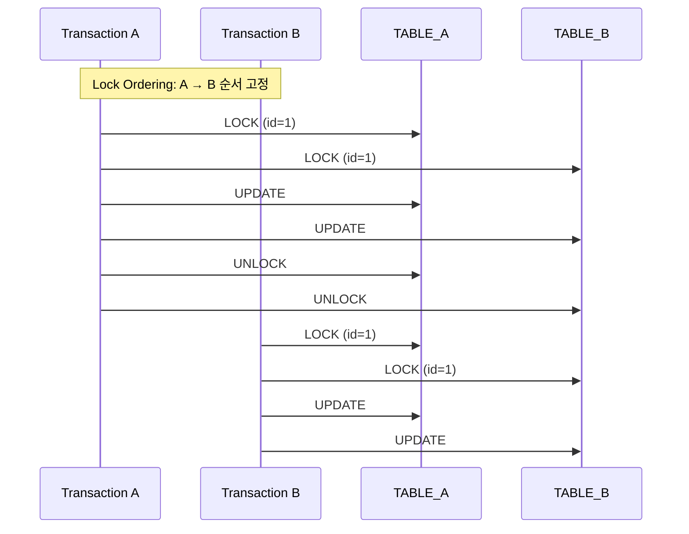
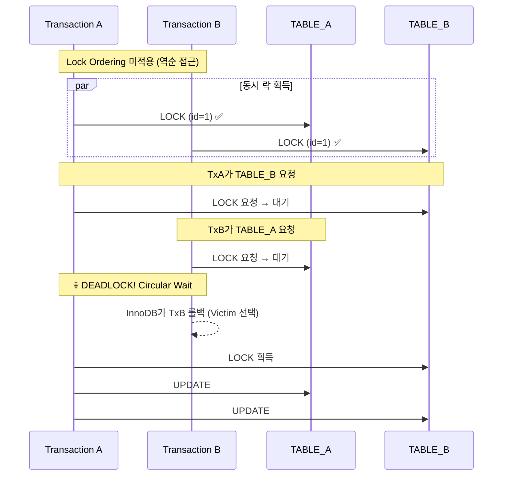

# Nightmare 02: The Deadlock Trap (Circular Lock)

> **담당 에이전트**: 🔴 Red (장애주입) & 🔵 Blue (아키텍처)
> **난이도**: P0 (Critical)
> **예상 결과**: FAIL

---

## 1. 테스트 전략 (🟡 Yellow's Plan)

### 목적
두 트랜잭션이 교차 순서로 테이블 락을 획득하여 순환 대기(Circular Wait)가 발생하는지 검증한다.
현재 시스템에 Lock Ordering이 적용되지 않아 **Deadlock 발생 예상**.

### 검증 포인트
- [ ] Deadlock 발생 여부 (InnoDB Deadlock Detection)
- [ ] 데드락 발생률 측정 (10회 반복)
- [ ] 데드락 후 데이터 무결성 유지

### 성공 기준
- Deadlock 발생 0건
- 데이터 무결성 100%

---

## 2. 장애 주입 (🔴 Red's Attack)

### 주입 방법
```sql
-- Transaction A (순서: TABLE_A → TABLE_B)
BEGIN;
UPDATE nightmare_table_a SET value = value + 1 WHERE id = 1;
-- 대기 (CyclicBarrier)
UPDATE nightmare_table_b SET value = value + 1 WHERE id = 1;
COMMIT;

-- Transaction B (역순: TABLE_B → TABLE_A)
BEGIN;
UPDATE nightmare_table_b SET value = value + 1 WHERE id = 1;
-- 대기 (CyclicBarrier)
UPDATE nightmare_table_a SET value = value + 1 WHERE id = 1;  -- DEADLOCK!
COMMIT;
```

### 시나리오 흐름
```
1. Transaction A: TABLE_A 락 획득
2. Transaction B: TABLE_B 락 획득
3. CyclicBarrier로 동기화 (정확한 교차 타이밍)
4. Transaction A: TABLE_B 락 요청 → 대기
5. Transaction B: TABLE_A 락 요청 → DEADLOCK!
6. InnoDB Deadlock Detection (50초 후 한 트랜잭션 롤백)
```

---

## 3. 그라파나 대시보드 전/후 비교 (🟢 Green's Analysis)

### 모니터링 대시보드
- URL: `http://localhost:3000/d/maple-chaos`

### 전 (Before) - 메트릭
| 메트릭 | 값 |
|--------|---|
| MySQL Deadlocks | 0 |
| Transaction Rollbacks | 0 |
| Lock Wait Timeout | 0 |
| Active Transactions | 0 |

### 후 (After) - 메트릭 (예상)
| 메트릭 | 변화 |
|--------|-----|
| MySQL Deadlocks | 0 → **1+** |
| Transaction Rollbacks | 0 → **1+** |
| Lock Wait Timeout | 0 → 가능 |
| Active Transactions | 0 → 2 (대기 상태) |

### 관련 로그 (예상)
```text
# MySQL Error Log (Deadlock Detection)
2026-01-19 10:05:00.001 INFO  [pool-1] DataSource - Transaction A: Acquired lock on TABLE_A
2026-01-19 10:05:00.002 INFO  [pool-2] DataSource - Transaction B: Acquired lock on TABLE_B
2026-01-19 10:05:00.003 INFO  [pool-1] DataSource - Transaction A: Requesting lock on TABLE_B... (waiting)
2026-01-19 10:05:00.004 INFO  [pool-2] DataSource - Transaction B: Requesting lock on TABLE_A... (waiting)
2026-01-19 10:05:50.000 ERROR [pool-2] DataSource - Deadlock found when trying to get lock; try restarting transaction
```
**(위 로그를 통해 Lock Ordering 미적용으로 인한 Circular Wait 현상 발생)**

---

## 4. 테스트 Quick Start

### 환경 설정
```bash
# 1. 컨테이너 시작
docker-compose up -d

# 2. 로그 레벨 설정
export LOG_LEVEL=DEBUG
```

### 실행 명령어
```bash
# Nightmare 02 테스트만 실행
./gradlew test --tests "maple.expectation.chaos.nightmare.DeadlockTrapNightmareTest" \
  2>&1 | tee logs/nightmare-02-$(date +%Y%m%d_%H%M%S).log
```

---

## 5. 테스트 실패 시나리오

### 실패 조건
1. Deadlock 1건 이상 발생
2. 트랜잭션 롤백으로 인한 데이터 불일치
3. Lock Wait Timeout 발생

### 예상 실패 메시지
```
org.opentest4j.AssertionFailedError:
[Nightmare] Lock Ordering으로 Deadlock 방지
Expected: a value equal to <0>
     but: was <1>
```

### 실패 시 시스템 상태
- MySQL: Deadlock Detection 발생
- Transaction: 한 쪽 롤백
- Data: 일부 업데이트 손실 가능

---

## 6. 복구 시나리오

### 자동 복구
1. InnoDB Deadlock Detection으로 한 트랜잭션 자동 롤백
2. 롤백된 트랜잭션 재시도 (애플리케이션 레벨)

### 수동 복구 필요 조건
- 데이터 불일치 발생 시 수동 보정 필요
- 반복적인 Deadlock 발생 시 Lock Ordering 적용 필요

---

## 7. 복구 과정 (Step-by-Step)

### Phase 1: 장애 인지 (T+0s)
1. MySQL 에러 로그: `Deadlock found when trying to get lock`
2. 애플리케이션 예외: `DeadlockLoserDataAccessException`

### Phase 2: 원인 분석 (T+30s)
1. `SHOW ENGINE INNODB STATUS` 실행
2. Deadlock 관련 트랜잭션 확인

```sql
SHOW ENGINE INNODB STATUS\G
-- LATEST DETECTED DEADLOCK 섹션 확인
```

### Phase 3: 복구 실행 (T+60s)
1. 롤백된 트랜잭션 재시도
2. 데이터 일관성 검증

---

## 8. 실패 복구 사고 과정

### 1단계: 증상 파악
- "왜 트랜잭션이 롤백되었는가?"
- "Deadlock 로그가 발생한 이유는?"

### 2단계: 가설 수립
- 가설 1: 두 트랜잭션이 서로 다른 순서로 락을 획득
- 가설 2: Lock Wait Timeout 초과

### 3단계: 가설 검증
```sql
-- Deadlock 상태 확인
SHOW ENGINE INNODB STATUS\G

-- 현재 락 상태 확인
SELECT * FROM information_schema.innodb_locks;
SELECT * FROM information_schema.innodb_lock_waits;
```

### 4단계: 근본 원인 확인
- Root Cause: Lock Ordering 미적용으로 Circular Wait 조건 충족

### 5단계: 해결책 결정
- 단기: 트랜잭션 재시도 로직 추가
- 장기: Lock Ordering 패턴 적용 (알파벳순 테이블 접근)

---

## 9. 데이터 흐름 (🔵 Blue's Blueprint)

### 정상 흐름 (Lock Ordering 적용 시)


### Deadlock 발생 시 (현재 상태)


---

## 10. 관련 CS 원리 (학습용)

### 핵심 개념

#### 1. Coffman Conditions (교착 상태 4가지 조건)
교착 상태가 발생하려면 다음 4가지 조건이 **모두** 충족되어야 함:

| 조건 | 설명 | 이 테스트에서 |
|------|------|-------------|
| Mutual Exclusion | 자원은 한 번에 하나의 프로세스만 사용 | ✅ Row Lock |
| Hold and Wait | 자원을 보유한 채로 다른 자원 대기 | ✅ TABLE_A 보유, TABLE_B 대기 |
| No Preemption | 강제로 자원을 빼앗을 수 없음 | ✅ InnoDB Lock |
| Circular Wait | 순환 형태의 대기 | ✅ A→B, B→A |

**해결책**: Circular Wait 조건을 깨면 Deadlock 방지 가능 → **Lock Ordering**

#### 2. Lock Ordering Pattern
```java
// Bad (Deadlock 가능)
Transaction A: lock(table_a) → lock(table_b)
Transaction B: lock(table_b) → lock(table_a)

// Good (Lock Ordering)
// 모든 트랜잭션이 알파벳순으로 락 획득
Transaction A: lock(table_a) → lock(table_b)
Transaction B: lock(table_a) → lock(table_b)  // 같은 순서!
```

#### 3. Two-Phase Locking (2PL)
락 획득 단계와 락 해제 단계를 분리하는 프로토콜:
```
Growing Phase: 락만 획득 (해제 불가)
Shrinking Phase: 락만 해제 (획득 불가)
```

#### 4. InnoDB Deadlock Detection
MySQL InnoDB는 Wait-for Graph를 사용하여 주기적으로 Deadlock을 감지:
- 감지 시 한 트랜잭션을 **Victim**으로 선택하여 롤백
- Victim 선택 기준: 롤백 비용이 적은 트랜잭션

### 참고 자료
- [MySQL InnoDB Deadlocks](https://dev.mysql.com/doc/refman/8.0/en/innodb-deadlocks.html)
- [Coffman Conditions](https://en.wikipedia.org/wiki/Deadlock#Coffman_conditions)
- [Two-Phase Locking](https://en.wikipedia.org/wiki/Two-phase_locking)

---

## 11. 이슈 정의 (실패 시)

### 📌 Problem Definition (문제 정의)
두 트랜잭션이 서로 다른 순서로 테이블 락을 획득하여 Deadlock이 발생함.
현재 시스템에 Lock Ordering 패턴이 적용되지 않음.

### 🎯 Goal (목표)
- Deadlock 발생률 0%
- 모든 다중 테이블 트랜잭션에 Lock Ordering 적용

### 🔍 Workflow (작업 방식)
1. 현재 다중 테이블 트랜잭션 식별
2. Lock Ordering 규칙 정의 (알파벳순)
3. 트랜잭션 서비스 리팩토링

### 🛠️ 해결 (Resolve)
```java
// 개선안: Lock Ordering Helper
public class LockOrderingHelper {

    /**
     * 테이블명을 알파벳순으로 정렬하여 락 획득 순서 결정
     */
    public static List<String> getOrderedTables(String... tables) {
        return Arrays.stream(tables)
                .sorted()
                .toList();
    }

    /**
     * 정렬된 순서로 FOR UPDATE 쿼리 실행
     */
    @Transactional
    public void executeWithLockOrdering(List<String> orderedTables,
                                         Map<String, Runnable> operations) {
        // 1. 정렬된 순서로 락 획득
        for (String table : orderedTables) {
            acquireLock(table);
        }

        // 2. 모든 락 획득 후 작업 수행
        operations.values().forEach(Runnable::run);
    }
}
```

### ✅ Action Items
- [ ] 다중 테이블 트랜잭션 코드 리뷰
- [ ] Lock Ordering Helper 구현
- [ ] 기존 트랜잭션 서비스 리팩토링
- [ ] Deadlock 테스트 추가

### 🏁 Definition of Done (완료 조건)
- [ ] Deadlock 발생률 0%
- [ ] Lock Ordering 규칙 문서화
- [ ] 10회 반복 테스트 통과

---

## 12. 최종 판정 (🟡 Yellow's Verdict)


### 결과: **FAIL**

현재 시스템에 Lock Ordering 패턴이 적용되지 않아 Deadlock이 발생함.

### 기술적 인사이트
- InnoDB Deadlock Detection은 약 50초 후 작동
- Victim 선택으로 한 트랜잭션이 롤백됨
- 데이터 일관성 유지를 위해 재시도 로직 필요
- 근본 해결책: Lock Ordering 패턴 적용

### 권장 개선 사항
1. **단기**: 트랜잭션 재시도 로직 (`@Retryable`)
2. **중기**: Lock Ordering Helper 구현
3. **장기**: 분산 락 사용 시에도 순서 보장

---

*Generated by 5-Agent Council*
