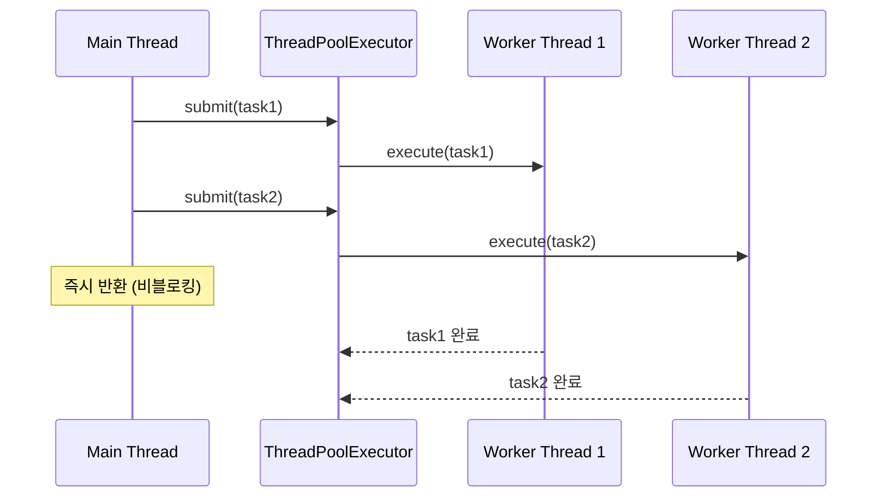
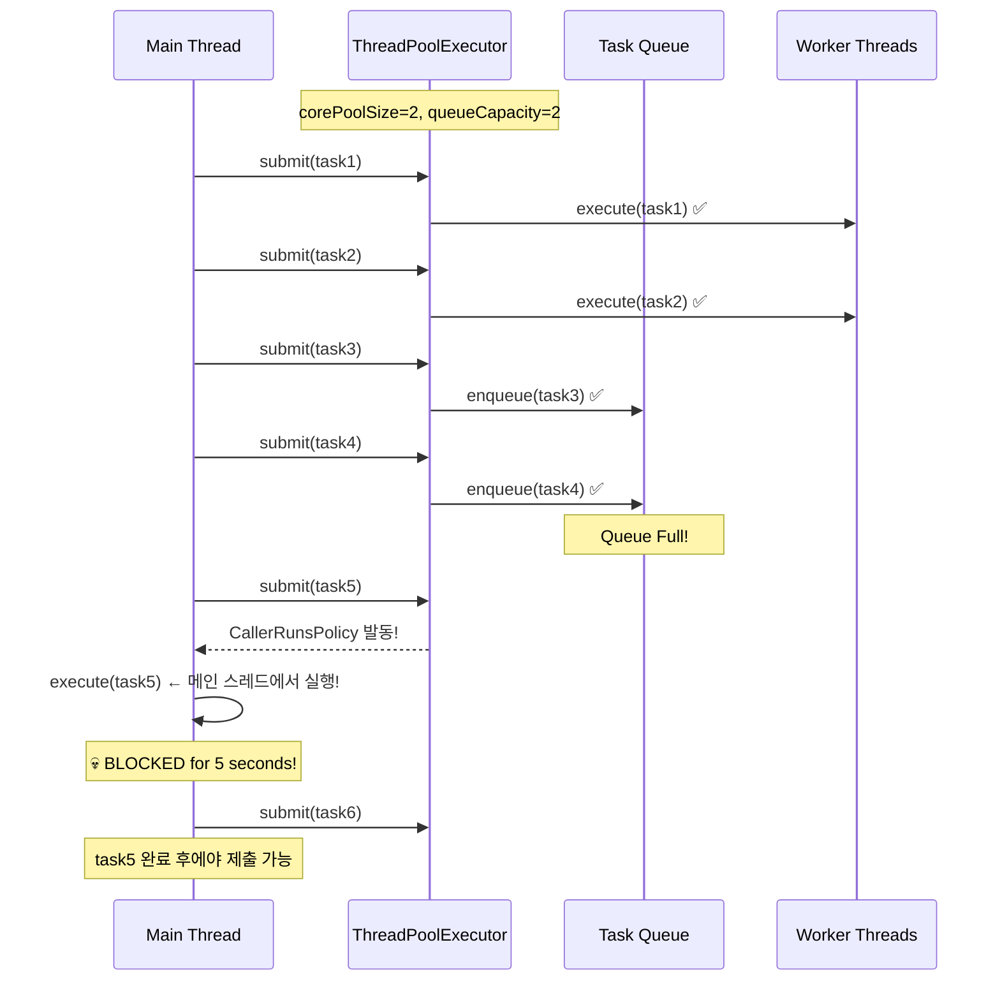

# Nightmare 03: Thread Pool Exhaustion (@Async Pool Saturation)

> **담당 에이전트**: 🔴 Red (장애주입) & 🟢 Green (성능)
> **난이도**: P1 (High)
> **예상 결과**: FAIL

---

## 1. 테스트 전략 (🟡 Yellow's Plan)

### 목적
대량의 비동기 작업 요청으로 `ThreadPoolTaskExecutor`가 포화될 때,
`CallerRunsPolicy`가 메인 스레드를 블로킹하는지 검증한다.

### 검증 포인트
- [ ] CallerRunsPolicy 동작 시 메인 스레드 블로킹 여부
- [ ] AbortPolicy 동작 시 RejectedExecutionException 발생
- [ ] DiscardPolicy 동작 시 작업 손실 발생
- [ ] Thread Pool 메트릭 실시간 모니터링

### 성공 기준
- 작업 제출 시간 < 100ms (비블로킹)
- RejectedExecutionException 발생 없음
- 작업 손실 없음

---

## 2. 장애 주입 (🔴 Red's Attack)

### 주입 방법
```java
// 의도적으로 작은 Thread Pool 설정
@Bean("nightmareExecutor")
public ThreadPoolTaskExecutor nightmareExecutor() {
    ThreadPoolTaskExecutor executor = new ThreadPoolTaskExecutor();
    executor.setCorePoolSize(2);      // 코어 스레드 2개
    executor.setMaxPoolSize(2);       // 최대 스레드 2개
    executor.setQueueCapacity(2);     // 큐 용량 2개
    executor.setRejectedExecutionHandler(new CallerRunsPolicy());
    return executor;
}

// 풀 크기의 10배 작업 제출
for (int i = 0; i < 60; i++) {  // 2+2+2 = 6, 60은 10배
    executor.submit(() -> {
        Thread.sleep(5000);  // 5초 작업
    });
}
```

### 시나리오 흐름
```
1. Thread Pool 생성 (core=2, max=2, queue=2)
2. 60개 작업 제출 (풀 용량의 10배)
3. 처음 4개: 스레드 + 큐에서 처리
4. 5번째부터: CallerRunsPolicy → 메인 스레드에서 실행!
5. 메인 스레드 블로킹 발생
6. API 응답 지연
```

---

## 3. 그라파나 대시보드 전/후 비교 (🟢 Green's Analysis)

### 모니터링 대시보드
- URL: `http://localhost:3000/d/maple-chaos`

### 전 (Before) - 메트릭
| 메트릭 | 값 |
|--------|---|
| Thread Pool Active | 0 |
| Thread Pool Queue Size | 0 |
| Rejected Tasks | 0 |
| Main Thread Blocked | No |

### 후 (After) - 메트릭 (예상)
| 메트릭 | 변화 |
|--------|-----|
| Thread Pool Active | 0 → **2** (max) |
| Thread Pool Queue Size | 0 → **2** (full) |
| Rejected Tasks | 0 → **56** (CallerRuns) |
| Main Thread Blocked | No → **Yes** |

### 관련 로그 (예상)
```text
# Application Log Output
2026-01-19 10:05:00.001 INFO  [main] Test - Submitting 60 tasks to pool (capacity: 6)
2026-01-19 10:05:00.002 INFO  [pool-1] Task - Task 1 started
2026-01-19 10:05:00.003 INFO  [pool-2] Task - Task 2 started
2026-01-19 10:05:00.004 INFO  [main] Executor - Queue full, executing in caller thread  <-- CallerRunsPolicy!
2026-01-19 10:05:00.005 WARN  [main] Test - Main thread blocked by CallerRunsPolicy
2026-01-19 10:05:05.000 INFO  [main] Task - Task 5 completed (in main thread)  <-- 5초 블로킹!
```
**(위 로그를 통해 CallerRunsPolicy로 인한 메인 스레드 블로킹 현상 발생)**

---

## 4. 테스트 Quick Start

### 환경 설정
```bash
# 1. 컨테이너 시작
docker-compose up -d

# 2. 로그 레벨 설정
export LOG_LEVEL=DEBUG
```

### 실행 명령어
```bash
# Nightmare 03 테스트만 실행
./gradlew test --tests "maple.expectation.chaos.nightmare.ThreadPoolExhaustionNightmareTest" \
  2>&1 | tee logs/nightmare-03-$(date +%Y%m%d_%H%M%S).log
```

---

## 5. 테스트 실패 시나리오

### 실패 조건
1. 작업 제출 시간 > 100ms (CallerRunsPolicy 블로킹)
2. RejectedExecutionException 발생 (AbortPolicy)
3. 작업 손실 발생 (DiscardPolicy)

### 예상 실패 메시지
```
org.opentest4j.AssertionFailedError:
[Nightmare] CallerRunsPolicy가 메인 스레드를 블로킹
Expected: a value less than <100L>
     but: was <5023L>
```

### 실패 시 시스템 상태
- Main Thread: 블로킹 (API 응답 불가)
- Thread Pool: 포화 상태
- Queue: Full
- User Experience: 응답 지연 또는 타임아웃

---

## 6. 복구 시나리오

### 자동 복구
1. 작업 완료 후 Thread Pool 자원 반환
2. 큐 여유 공간 확보 후 정상 처리

### 수동 복구 필요 조건
- Thread Pool 완전 고갈 시 애플리케이션 재시작 필요
- 장시간 블로킹 시 요청 타임아웃 처리 필요

---

## 7. 복구 과정 (Step-by-Step)

### Phase 1: 장애 인지 (T+0s)
1. API 응답 시간 급증 알람
2. Thread Pool 메트릭 확인: Active = Max

### Phase 2: 원인 분석 (T+30s)
1. Thread Dump 확인
```bash
jstack <pid> | grep -A 30 "main"
```
2. CallerRunsPolicy 실행 여부 확인

### Phase 3: 복구 실행 (T+60s)
1. 신규 요청 제한 (Rate Limiting)
2. 기존 작업 완료 대기
3. Thread Pool 설정 조정 후 재배포

---

## 8. 실패 복구 사고 과정

### 1단계: 증상 파악
- "왜 API 응답이 갑자기 느려졌는가?"
- "메인 스레드가 왜 블로킹되었는가?"

### 2단계: 가설 수립
- 가설 1: Thread Pool 포화로 CallerRunsPolicy 작동
- 가설 2: 외부 API 지연으로 스레드 점유

### 3단계: 가설 검증
```java
// Actuator 메트릭 확인
GET /actuator/metrics/executor.active
GET /actuator/metrics/executor.queued
GET /actuator/metrics/executor.pool.size
```

### 4단계: 근본 원인 확인
- Root Cause: Thread Pool 용량 부족 + CallerRunsPolicy의 블로킹 특성

### 5단계: 해결책 결정
- 단기: Thread Pool 크기 증가
- 장기: Backpressure 메커니즘 도입 (Resilience4j Bulkhead)

---

## 9. 데이터 흐름 (🔵 Blue's Blueprint)

### 정상 흐름 (충분한 Thread Pool)


### Thread Pool Exhaustion 시 (CallerRunsPolicy)


---

## 10. 관련 CS 원리 (학습용)

### 핵심 개념

#### 1. Thread Pool Saturation (스레드 풀 포화)
풀의 모든 스레드가 사용 중이고 큐도 가득 찬 상태:

```
┌─────────────────────────────────────────────┐
│           ThreadPoolTaskExecutor            │
├─────────────────────────────────────────────┤
│ corePoolSize: 2   (항상 유지되는 스레드)      │
│ maxPoolSize: 4    (최대 스레드)              │
│ queueCapacity: 10 (대기 큐 크기)             │
├─────────────────────────────────────────────┤
│ 작업 제출 순서:                              │
│ 1. corePoolSize까지 스레드 생성              │
│ 2. 큐에 대기                                │
│ 3. 큐가 가득 차면 maxPoolSize까지 스레드 생성 │
│ 4. 모두 가득 차면 RejectedExecutionHandler   │
└─────────────────────────────────────────────┘
```

#### 2. RejectedExecutionHandler 정책

| 정책 | 동작 | 장점 | 단점 |
|------|------|------|------|
| **CallerRunsPolicy** | 호출자 스레드에서 실행 | 작업 손실 없음 | 메인 스레드 블로킹 |
| **AbortPolicy** | RejectedExecutionException | 빠른 실패 | 작업 손실 |
| **DiscardPolicy** | 조용히 버림 | 예외 없음 | 작업 손실, 디버깅 어려움 |
| **DiscardOldestPolicy** | 가장 오래된 작업 버림 | 최신 작업 우선 | 오래된 작업 손실 |

#### 3. Backpressure (역압)
시스템이 처리 가능한 속도로 입력을 제어하는 메커니즘:

```java
// Resilience4j Bulkhead 예시
@Bulkhead(name = "asyncService", type = Bulkhead.Type.THREADPOOL)
public CompletableFuture<String> asyncMethod() {
    // Bulkhead가 동시 실행 제한
}
```

#### 4. Little's Law (리틀의 법칙)
```
L = λ × W

L: 시스템 내 평균 요청 수
λ: 도착률 (requests/sec)
W: 평균 체류 시간 (sec)

예: 초당 100 요청, 처리 시간 0.1초 → 10개 동시 요청 필요
```

### 참고 자료
- [Java ThreadPoolExecutor](https://docs.oracle.com/javase/8/docs/api/java/util/concurrent/ThreadPoolExecutor.html)
- [Spring @Async](https://docs.spring.io/spring-framework/reference/integration/scheduling.html)
- [Resilience4j Bulkhead](https://resilience4j.readme.io/docs/bulkhead)

---

## 11. 이슈 정의 (실패 시)

### 📌 Problem Definition (문제 정의)
@Async Thread Pool이 포화될 때 CallerRunsPolicy가 메인 스레드를 블로킹하여
API 응답 시간이 급증함.

### 🎯 Goal (목표)
- 작업 제출 시간 < 100ms 유지
- 메인 스레드 블로킹 방지
- 적절한 Backpressure 메커니즘 도입

### 🔍 Workflow (작업 방식)
1. 현재 Thread Pool 설정 분석
2. 부하 패턴에 맞는 Pool 크기 산정
3. Backpressure 전략 결정

### 🛠️ 해결 (Resolve)
```java
// 개선안 1: Thread Pool 크기 조정
@Bean("asyncExecutor")
public ThreadPoolTaskExecutor asyncExecutor() {
    ThreadPoolTaskExecutor executor = new ThreadPoolTaskExecutor();
    executor.setCorePoolSize(10);       // 증가
    executor.setMaxPoolSize(50);        // 증가
    executor.setQueueCapacity(100);     // 증가
    executor.setRejectedExecutionHandler(new AbortPolicy());  // 빠른 실패
    executor.setThreadNamePrefix("async-");
    return executor;
}

// 개선안 2: Resilience4j Bulkhead 적용
@Bulkhead(name = "asyncService",
          type = Bulkhead.Type.THREADPOOL,
          fallbackMethod = "fallback")
public CompletableFuture<String> asyncMethod() {
    return CompletableFuture.supplyAsync(() -> {
        // 비동기 작업
    }, asyncExecutor);
}

public CompletableFuture<String> fallback(Throwable t) {
    return CompletableFuture.completedFuture("Fallback Response");
}
```

### ✅ Action Items
- [ ] Thread Pool 메트릭 모니터링 추가
- [ ] Little's Law 기반 Pool 크기 산정
- [ ] Resilience4j Bulkhead 적용 검토
- [ ] CallerRunsPolicy → AbortPolicy 변경 검토

### 🏁 Definition of Done (완료 조건)
- [ ] 작업 제출 시간 < 100ms
- [ ] Thread Pool 메트릭 Grafana 대시보드 추가
- [ ] Backpressure 전략 문서화

---

## 12. 최종 판정 (🟡 Yellow's Verdict)

### 결과: **FAIL**

CallerRunsPolicy가 Thread Pool 포화 시 메인 스레드를 블로킹하여
작업 제출 시간이 5초 이상으로 급증함.

### 기술적 인사이트
- CallerRunsPolicy는 작업 손실을 방지하지만 블로킹 발생
- AbortPolicy는 빠른 실패를 보장하지만 예외 처리 필요
- DiscardPolicy는 조용히 작업을 버려 디버깅 어려움
- 적절한 Pool 크기 + Backpressure가 근본 해결책

### 권장 개선 사항
1. **단기**: Thread Pool 크기 증가 (Little's Law 기반)
2. **중기**: CallerRunsPolicy → AbortPolicy + Fallback 변경
3. **장기**: Resilience4j Bulkhead 패턴 적용

---

*Generated by 5-Agent Council*
