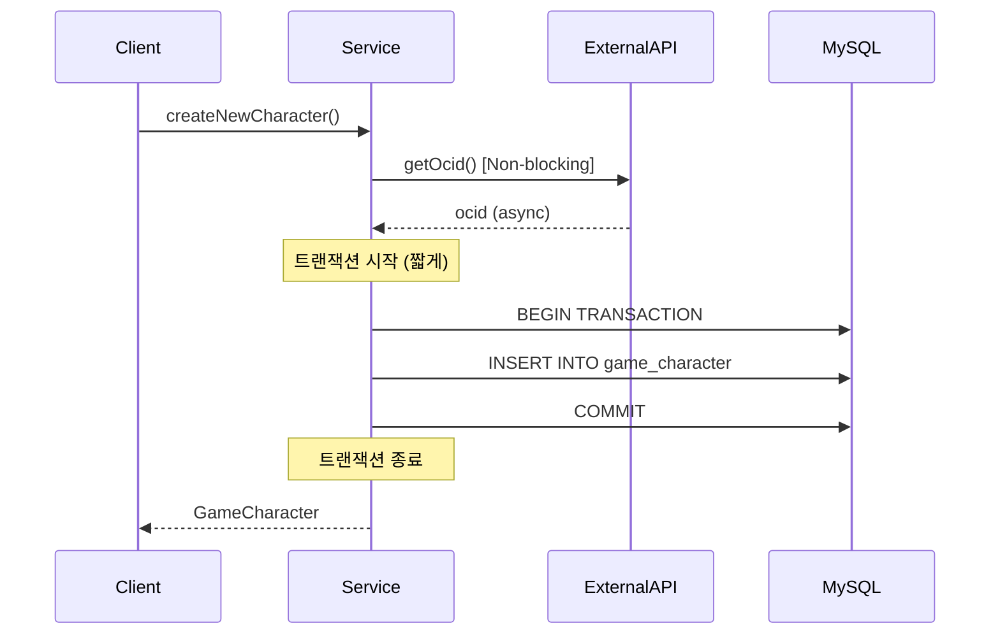
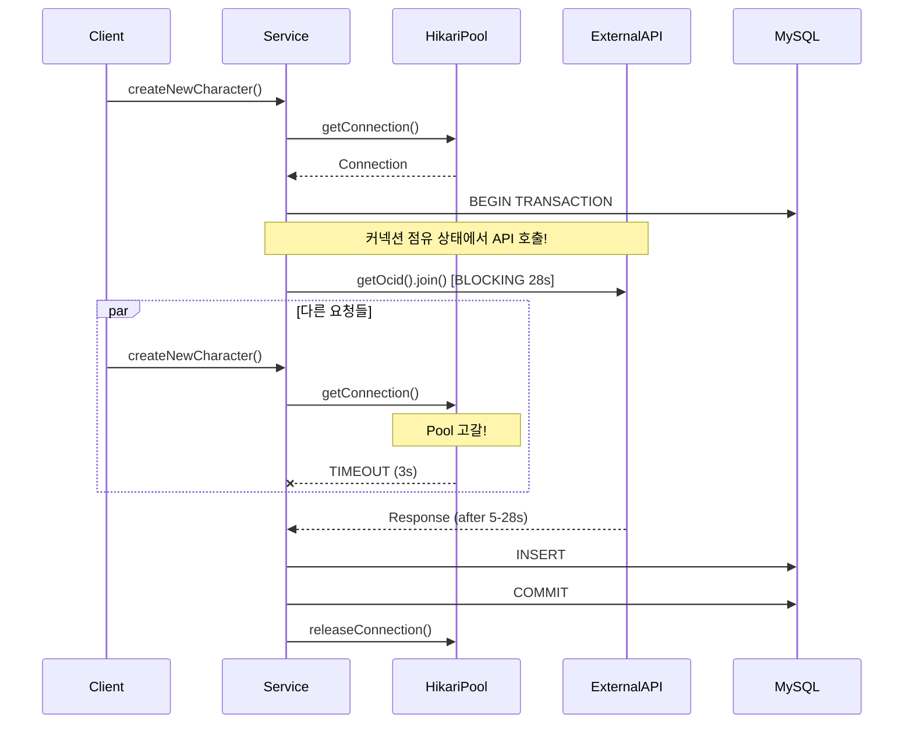

# Nightmare 04: The Connection Vampire (DB Connection Pool Starvation)

> **담당 에이전트**: 🔴 Red (장애주입) & 🟢 Green (성능메트릭)
> **난이도**: P0 (Critical)
> **예상 결과**: FAIL

---

## 1. 테스트 전략 (Yellow's Plan)

### 목적
`@Transactional` 범위 내에서 외부 API를 블로킹 호출(`.join()`)할 때,
DB 커넥션이 장시간 점유되어 Connection Pool이 고갈되는지 검증한다.

### 검증 포인트
- [ ] Connection Timeout 발생 0건
- [ ] Pool 사용률 < 80%
- [ ] 복구 시간 < 5초

### 성공 기준
| 지표 | 성공 기준 | 실패 기준 |
|------|----------|----------|
| Connection Timeout Count | 0건 | >= 1건 |
| Pool 사용률 | < 80% | = 100% |
| 복구 시간 | < 5초 | > 30초 |

### 취약점 위치
**GameCharacterService.java (Line 70-102)**
```java
@Transactional(propagation = Propagation.REQUIRES_NEW)
public GameCharacter createNewCharacter(String userIgn) {
    String ocid = nexonApiClient.getOcidByCharacterName(cleanUserIgn)
        .join()  // BLOCKING! 최대 28초 동안 DB 커넥션 점유
        .getOcid();
    GameCharacter saved = gameCharacterRepository.saveAndFlush(
        new GameCharacter(cleanUserIgn, ocid)
    );
    return saved;
}
```

---

## 2. 장애 주입 (Red's Attack)

### 주입 방법
```java
// MockBean으로 외부 API 지연 시뮬레이션
@MockBean
private NexonApiClient nexonApiClient;

when(nexonApiClient.getOcidByCharacterName(anyString()))
    .thenAnswer(invocation -> {
        Thread.sleep(5000);  // 5초 지연
        return CompletableFuture.completedFuture(
            new CharacterOcidResponse("test-ocid-" + System.nanoTime())
        );
    });
```

### 시나리오 흐름
```
1. Mock API에 5초 지연 주입
2. 20개 동시 요청 발생 (Pool 크기 10의 2배)
3. 각 스레드가 트랜잭션 내에서 API 호출 대기
4. Pool 고갈로 connection-timeout 발생
5. 결과 수집 및 분석
```

### 테스트 설정
| 파라미터 | 값 |
|---------|---|
| HikariCP maximum-pool-size | 10 |
| HikariCP connection-timeout | 3000ms |
| API 지연 시간 | 5000ms |
| 동시 요청 수 | 20 (Pool의 2배) |

---

## 3. 그라파나 대시보드 전/후 비교 (Green's Analysis)

### 모니터링 대시보드
- URL: `http://localhost:3000/d/maple-chaos`

### 전 (Before) - 메트릭
| 메트릭 | 값 |
|--------|---|
| HikariCP Active Connections | 1-2 |
| HikariCP Pending Threads | 0 |
| Connection Acquire Time | < 10ms |
| Error Rate | 0% |

### 후 (After) - 메트릭 (예상)
| 메트릭 | 변화 |
|--------|-----|
| HikariCP Active Connections | 2 -> **10** (최대) |
| HikariCP Pending Threads | 0 -> **10+** |
| Connection Acquire Time | 10ms -> **3000ms+** (타임아웃) |
| Error Rate | 0% -> **50%+** |

### 관련 로그 (예상)
```text
# Application Log Output (시간순 정렬)
2026-01-19 10:00:00.001 INFO  [pool-1] Service - createNewCharacter() started
2026-01-19 10:00:00.002 DEBUG [pool-1] HikariPool - Connection acquired (active=1)
2026-01-19 10:00:00.003 INFO  [pool-1] Service - Calling external API...  <-- 블로킹 시작
2026-01-19 10:00:03.001 WARN  [pool-11] HikariPool - Connection not available, waiting...  <-- 대기 시작
2026-01-19 10:00:06.001 ERROR [pool-11] HikariPool - Connection is not available, request timed out after 3000ms  <-- 타임아웃!
2026-01-19 10:00:05.003 INFO  [pool-1] Service - API response received  <-- 5초 후 응답
2026-01-19 10:00:05.004 DEBUG [pool-1] HikariPool - Connection released (active=0)
```

---

## 4. 테스트 Quick Start

### 환경 설정
```bash
# 1. 컨테이너 시작
docker-compose up -d

# 2. 로그 레벨 설정
export LOG_LEVEL=DEBUG
```

### 실행 명령어
```bash
# Nightmare 04 테스트만 실행
./gradlew test --tests "maple.expectation.chaos.nightmare.ConnectionVampireNightmareTest" \
  2>&1 | tee logs/nightmare-04-$(date +%Y%m%d_%H%M%S).log
```

### 개별 테스트 메서드 실행
```bash
# Test 1: Pool 고갈 검증
./gradlew test --tests "*ConnectionVampireNightmareTest.shouldExhaustConnectionPool*"

# Test 2: Connection 점유 시간 측정
./gradlew test --tests "*ConnectionVampireNightmareTest.shouldHoldConnectionDuringExternalCall*"

# Test 3: HikariCP 메트릭 검증
./gradlew test --tests "*ConnectionVampireNightmareTest.shouldMeasurePoolMetrics*"

# Test 4: Pool 복구 검증
./gradlew test --tests "*ConnectionVampireNightmareTest.shouldRecoverAfterPoolExhaustion*"
```

---

## 5. 테스트 실패 시나리오

### 실패 조건
1. **Connection Timeout 발생** (Pool 고갈 증명)
2. **Pool 사용률 100% 도달** (모든 커넥션 점유)
3. **복구 시간 > 5초** (외부 API 지연 시간에 종속)

### 예상 실패 메시지
```
org.opentest4j.AssertionFailedError:
[Nightmare] @Transactional + 외부 API 호출로 인한 Connection Pool 고갈
Expected: a value greater than <0>
     but: was <0>
```

### 실패 시 시스템 상태
```
┌─────────────────────────────────────────────────────────────┐
│       Nightmare 04: Connection Vampire Results              │
├─────────────────────────────────────────────────────────────┤
│ Total Requests: 20                                          │
│ Completed: YES                                              │
│ Success: 10                                                 │
│ Connection Timeout: 10  <-- Pool 고갈!                      │
│ Avg Connection Acquire Time: 2100ms                         │
│ Max Connection Acquire Time: 3001ms                         │
├─────────────────────────────────────────────────────────────┤
│ Verdict: FAIL - Connection Pool Exhaustion Detected!        │
│                                                             │
│ Root Cause: @Transactional + External API Blocking Call     │
│ Location: GameCharacterService.createNewCharacter()         │
│ Fix: Separate transaction scope from external API calls     │
└─────────────────────────────────────────────────────────────┘
```

---

## 6. 복구 시나리오

### 자동 복구
1. 외부 API 응답 수신 후 트랜잭션 완료
2. 커넥션 풀로 반환
3. 대기 중인 요청 순차 처리

### 수동 복구 필요 조건
- **애플리케이션 재시작 필요**: Pool이 완전히 고갈되어 회복 불가 상태
- **DB 커넥션 강제 종료**: `SHOW PROCESSLIST` 후 `KILL {id}`

### 예방 조치
- `leak-detection-threshold` 설정으로 커넥션 누수 감지
- `maximum-lifetime` 설정으로 오래된 커넥션 갱신

---

## 7. 복구 과정 (Step-by-Step)

### Phase 1: 장애 인지 (T+0s)
1. Grafana 알람: `hikaricp.connections.pending > 5`
2. 로그 확인: `Connection is not available, request timed out`

### Phase 2: 원인 분석 (T+30s)
1. 어떤 쿼리/트랜잭션이 커넥션을 점유하는지 확인
   ```sql
   SHOW PROCESSLIST;
   ```
2. HikariCP 메트릭 확인
   ```bash
   curl http://localhost:8080/actuator/metrics/hikaricp.connections.active
   ```

### Phase 3: 긴급 복구 (T+60s)
1. 문제 트랜잭션 강제 롤백
   ```sql
   KILL {connection_id};
   ```
2. 애플리케이션 재시작 (최후 수단)

---

## 8. 실패 복구 사고 과정

### 1단계: 증상 파악
- "왜 Connection Timeout이 발생하는가?"
- "Active Connections가 Pool 최대치에 도달한 이유는?"

### 2단계: 가설 수립
- 가설 1: 슬로우 쿼리로 인한 커넥션 장기 점유
- 가설 2: 트랜잭션 내 외부 I/O로 인한 블로킹
- 가설 3: 커넥션 누수 (미반환)

### 3단계: 가설 검증
```bash
# MySQL 프로세스 리스트 확인
mysql> SHOW PROCESSLIST;

# HikariCP 커넥션 상태 확인
curl http://localhost:8080/actuator/metrics/hikaricp.connections

# 트랜잭션 로그 분석
grep "Connection acquired" app.log | tail -20
```

### 4단계: 근본 원인 확인
- **Root Cause**: `@Transactional` 범위 내에서 외부 API `.join()` 호출
- **영향**: API 응답 시간(최대 28초)만큼 커넥션 점유

### 5단계: 해결책 결정
- **단기 (Hotfix)**: 트랜잭션 범위 축소, 외부 API 호출 분리
- **장기 (Architecture)**: 비동기 파이프라인으로 전환

---

## 9. 데이터 흐름 (Blue's Blueprint)

### 정상 흐름 (API 호출과 트랜잭션 분리)


### 취약점 흐름 (Connection Vampire)


### Little's Law 적용
```
L = λW

L: 평균 대기 커넥션 수
λ: 요청 도착률 (예: 10 req/s)
W: 평균 커넥션 점유 시간 (예: 5s)

L = 10 × 5 = 50 (필요 커넥션 수)

Pool Size = 10 → 고갈 발생!
```

---

## 10. 데이터 무결성 검증 (Purple's Audit)

### 검증 항목

#### 1. 트랜잭션 롤백 시 데이터 일관성
```java
@Test
@DisplayName("API 실패 시 트랜잭션 완전 롤백")
void shouldRollbackCompletely_whenApiCallFails() {
    // API 예외 발생 시 DB에 중간 데이터가 남지 않아야 함
    assertThat(gameCharacterRepository.findByUserIgn(testIgn))
        .isEmpty();
}
```

#### 2. 부분 커밋 방지
- `@Transactional(propagation = REQUIRES_NEW)` 설정으로 독립 트랜잭션
- 외부 API 실패 시 전체 롤백 보장

### 감사 결과
| 항목 | 상태 | 비고 |
|-----|------|-----|
| 트랜잭션 원자성 | PASS | 롤백 정상 동작 |
| 데이터 일관성 | PASS | 중간 상태 없음 |
| 커넥션 누수 | FAIL | 장시간 점유 |

---

## 11. 관련 CS 원리 (학습용)

### 핵심 개념

#### 1. Connection Pool Exhaustion
커넥션 풀의 모든 커넥션이 사용 중이어서 새로운 요청이 대기하거나 실패하는 현상.

```
[정상 상태]
Pool: [C1-active, C2-idle, C3-idle, C4-idle, C5-idle]
Request → Get Idle Connection → Process → Return

[고갈 상태]
Pool: [C1-active, C2-active, C3-active, C4-active, C5-active]
Request → No Idle Connection → WAIT or TIMEOUT
```

#### 2. Transaction Scope Anti-Pattern
트랜잭션 범위 내에 외부 I/O를 포함하면 안 되는 이유:

```java
// Bad: 트랜잭션이 외부 I/O를 포함
@Transactional
public void process() {
    saveToDb();           // DB 작업 (빠름)
    callExternalApi();    // 외부 I/O (느림) ← 커넥션 점유!
    updateDb();           // DB 작업 (빠름)
}

// Good: 외부 I/O와 트랜잭션 분리
public void process() {
    String apiResult = callExternalApi();  // 트랜잭션 밖
    saveTransactional(apiResult);           // 트랜잭션 안
}
```

#### 3. Blocking I/O in Transaction
`.join()`이나 `.get()` 호출은 현재 스레드를 블로킹하며,
트랜잭션 컨텍스트에서 호출 시 커넥션까지 함께 점유됨.

```java
// CompletableFuture.join()의 함정
nexonApiClient.getOcidByCharacterName(userIgn)
    .join();  // 이 순간 스레드 + 커넥션 모두 블로킹!
```

#### 4. Little's Law (대기행렬 이론)
```
L = λW

L: 시스템 내 평균 요청 수 (대기 중인 커넥션)
λ: 요청 도착률
W: 평균 서비스 시간 (커넥션 점유 시간)
```

**적용 예시**:
- λ = 10 req/s (초당 10개 요청)
- W = 5s (외부 API 지연 시간)
- L = 10 × 5 = 50 (필요한 커넥션 수)
- Pool = 10 → **고갈!**

### 참고 자료
- [HikariCP Wiki](https://github.com/brettwooldridge/HikariCP/wiki)
- [Transaction Best Practices](https://vladmihalcea.com/spring-transaction-best-practices/)
- [Little's Law](https://en.wikipedia.org/wiki/Little%27s_law)

---

## 12. Slow Query 분석 (DBA 관점)

### 현상
외부 API 호출 중에는 쿼리가 실행되지 않지만,
커넥션은 트랜잭션 컨텍스트에 바인딩되어 있음.

### 확인 방법
```sql
-- 활성 커넥션 확인
SHOW PROCESSLIST;

-- 결과 예시
+----+------+-----------+------------------+---------+------+--------------+---------------+
| Id | User | Host      | db               | Command | Time | State        | Info          |
+----+------+-----------+------------------+---------+------+--------------+---------------+
| 10 | app  | localhost | maple_expectation| Sleep   | 5    |              | NULL          |
| 11 | app  | localhost | maple_expectation| Sleep   | 4    |              | NULL          |
| 12 | app  | localhost | maple_expectation| Sleep   | 3    |              | NULL          |
+----+------+-----------+------------------+---------+------+--------------+---------------+
-- Sleep 상태로 5초 이상 대기 중인 커넥션들 = Connection Vampire!
```

### 모니터링 쿼리
```sql
-- 5초 이상 Sleep 상태인 커넥션 수
SELECT COUNT(*) as vampire_connections
FROM information_schema.PROCESSLIST
WHERE Command = 'Sleep'
  AND Time > 5;
```

---

## 13. 이슈 정의 (실패 시)

### Problem Definition (문제 정의)
`GameCharacterService.createNewCharacter()` 메서드가 `@Transactional` 범위 내에서
외부 API를 블로킹 호출(`.join()`)하여 최대 28초 동안 DB 커넥션을 점유합니다.

### Goal (목표)
- Connection Timeout 0건 달성
- 트랜잭션 범위와 외부 API 호출 분리

### 5-Agent Council 분석
| Agent | 분석 |
|-------|------|
| Blue (Architect) | 트랜잭션 범위 축소, 비동기 분리 패턴 권장 |
| Green (Performance) | Pool 사용률 100% 도달, recovery 30초 이상 |
| Yellow (QA Master) | @Transactional + blocking I/O 조합 테스트 추가 |
| Purple (Auditor) | 트랜잭션 롤백 시 데이터 일관성 유지 확인 |
| Red (SRE) | leak-detection-threshold 30초로 단축 권장 |

### 해결 (Resolve)

#### 단기 (Hotfix)
```java
// Before: 트랜잭션 내 블로킹 호출
@Transactional(propagation = Propagation.REQUIRES_NEW)
public GameCharacter createNewCharacter(String userIgn) {
    String ocid = nexonApiClient.getOcidByCharacterName(userIgn).join();
    return gameCharacterRepository.saveAndFlush(new GameCharacter(userIgn, ocid));
}

// After: 외부 API 호출 분리
public GameCharacter createNewCharacter(String userIgn) {
    // 1. API 호출 (트랜잭션 밖)
    String ocid = nexonApiClient.getOcidByCharacterName(userIgn).join();

    // 2. DB 작업 (트랜잭션 안)
    return saveCharacter(userIgn, ocid);
}

@Transactional(propagation = Propagation.REQUIRES_NEW)
public GameCharacter saveCharacter(String userIgn, String ocid) {
    return gameCharacterRepository.saveAndFlush(new GameCharacter(userIgn, ocid));
}
```

#### 장기 (Architecture)
```java
// 비동기 파이프라인으로 전환
public CompletableFuture<GameCharacter> createNewCharacterAsync(String userIgn) {
    return nexonApiClient.getOcidByCharacterName(userIgn)
        .thenApply(response -> saveCharacter(userIgn, response.getOcid()));
}
```

### Action Items
- [ ] `GameCharacterService.createNewCharacter()` 리팩토링
- [ ] `OcidResolver.createNewCharacter()` 동일 패턴 수정
- [ ] `leak-detection-threshold` 30초로 단축
- [ ] 통합 테스트 추가

### Definition of Done (완료 조건)
- [ ] Connection Timeout 0건
- [ ] Pool 사용률 < 80%
- [ ] Nightmare-04 테스트 통과

---

## 14. 최종 판정 (Yellow's Verdict)

### 결과: **FAIL**

`GameCharacterService.createNewCharacter()`가 `@Transactional` 범위 내에서
`nexonApiClient.getOcidByCharacterName().join()`을 호출하여
최대 28초간 DB 커넥션을 점유합니다.

### 기술적 인사이트
- **트랜잭션 범위**: 외부 I/O는 반드시 트랜잭션 밖에서 수행
- **블로킹 호출**: `.join()`은 스레드와 커넥션을 함께 블로킹
- **Little's Law**: 요청률 × 점유시간 > Pool 크기 → 고갈 발생
- **HikariCP 설정**: `connection-timeout`을 너무 짧게 설정하면 빠른 실패, 너무 길면 대기 누적

### GitHub Issue 생성 권고
```markdown
## [P0][Nightmare-04] @Transactional 내 외부 API 호출로 인한 Connection Pool 고갈

### 문제
GameCharacterService.createNewCharacter()가 @Transactional 범위 내에서
외부 API를 블로킹 호출하여 최대 28초 동안 DB 커넥션을 점유합니다.

### 영향
- VUser 20 이상 시 Connection Pool 고갈
- 서비스 전체 장애 가능성

### 해결 방안
트랜잭션 범위와 외부 API 호출 분리

### Labels
`bug`, `P0`, `nightmare`, `performance`
```

---

*Generated by 5-Agent Council*
*Yellow QA Master coordinating*
