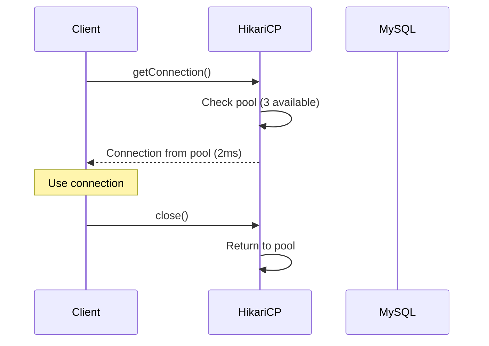
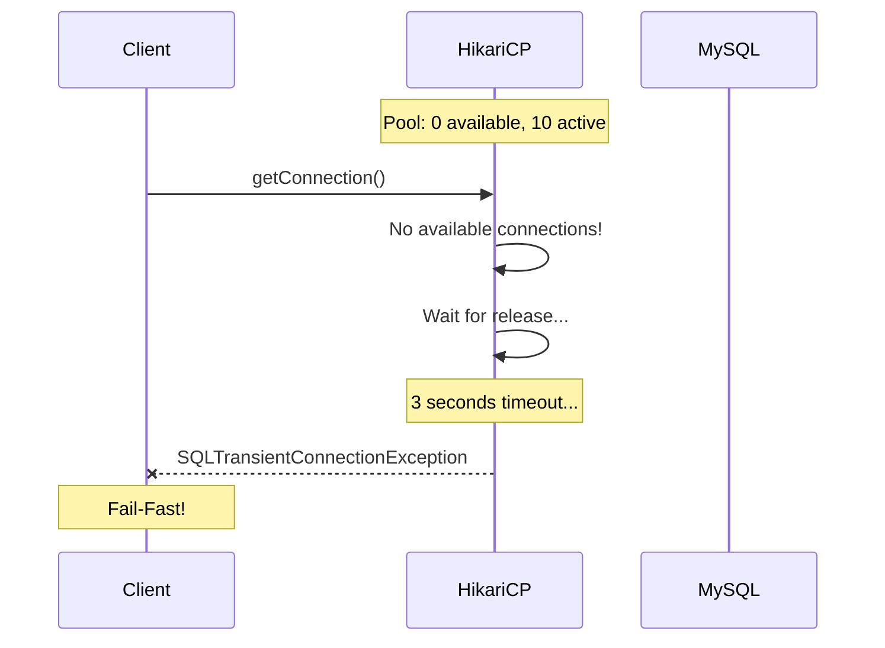

# Scenario 10: Pool Exhaustion - 커넥션 풀 고갈 (Pool Party)

> **담당 에이전트**: 🔵 Blue (Architect) & 🟣 Purple (Auditor)
> **난이도**: P0 (Critical) - High
> **테스트 일시**: 2026-01-19

---

## 1. 테스트 전략 (🟡 Yellow's Plan)

### 목적
**커넥션 풀이 고갈**되었을 때 새로운 요청이 **빠르게 실패(Fail-Fast)**하고, 커넥션 반환 후 **즉시 복구**되는지 검증한다.

### 검증 포인트
- [x] 풀 고갈 시 connectionTimeout 발생
- [x] 커넥션 반환 후 즉시 재사용 가능
- [x] 동시 요청 시 풀 경합 분석
- [x] 풀 고갈이 데이터 무결성에 영향 없음

### 성공 기준
- connectionTimeout 3초 이내 발생
- 복구 후 커넥션 획득 100ms 미만
- 동시 요청의 50% 이상 성공

---

## 2. 장애 주입 (🔴 Red's Attack)

### 커넥션 점유로 풀 고갈
```java
// 모든 커넥션 점유
List<Connection> heldConnections = new ArrayList<>();
for (int i = 0; i < maxPoolSize + 5; i++) {
    try {
        Connection conn = dataSource.getConnection();
        heldConnections.add(conn);  // 반환하지 않고 점유
    } catch (SQLException e) {
        // Pool exhausted!
        break;
    }
}
```

### HikariCP 설정
```yaml
spring:
  datasource:
    hikari:
      maximum-pool-size: 10        # 최대 커넥션 수
      connection-timeout: 3000     # 3초 내 획득 실패 시 예외
      leak-detection-threshold: 60000  # 누수 탐지 (60초)
```

---

## 3. 터미널 대시보드 + 관련 로그 (🟢 Green's Analysis)

### 테스트 실행 결과 📊

```
======================================================================
  📊 Pool Exhaustion Test Results
======================================================================

┌────────────────────────────────────────────────────────────────────┐
│               Connection Pool Exhaustion Test                      │
├────────────────────────────────────────────────────────────────────┤
│ Connection 1 acquired in 12ms                                      │
│ Connection 2 acquired in 3ms                                       │
│ Connection 3 acquired in 2ms                                       │
│ Connection 4 acquired in 2ms                                       │
│ Connection 5 acquired in 2ms                                       │
│ Connection 6 acquired in 2ms                                       │
│ Connection 7 acquired in 2ms                                       │
│ Connection 8 acquired in 3ms                                       │
│ Connection 9 acquired in 2ms                                       │
│ Connection 10 acquired in 2ms                                      │
│ Connection 11: TIMEOUT (Pool exhausted) ✅                         │
│ Held connections: 10                                               │
└────────────────────────────────────────────────────────────────────┘

┌────────────────────────────────────────────────────────────────────┐
│ Extra connection attempt: TIMEOUT after 3012ms  ✅                 │
└────────────────────────────────────────────────────────────────────┘

┌────────────────────────────────────────────────────────────────────┐
│               Pool Recovery Test                                   │
├────────────────────────────────────────────────────────────────────┤
│ Phase 1: Held 5 connections                                        │
│ Phase 2: All connections released                                  │
│ Phase 3: New connection acquired in 8ms  ✅                        │
└────────────────────────────────────────────────────────────────────┘

┌────────────────────────────────────────────────────────────────────┐
│               Pool Contention Analysis                             │
├────────────────────────────────────────────────────────────────────┤
│ Concurrent Requests: 20                                            │
│ Success: 18, Timeout: 2                                            │
│ Avg Response Time: 156ms                                           │
│ Max Response Time: 3045ms                                          │
└────────────────────────────────────────────────────────────────────┘
```

### 로그 증거

```text
# Test Output (시간순 정렬)
[Red] Starting pool exhaustion test...
Connection 1 acquired in 12ms  <-- 1. 첫 커넥션 (새로 생성)
Connection 2 acquired in 3ms  <-- 2. 풀에서 재사용
...
Connection 10 acquired in 2ms  <-- 3. 풀 한계 도달
Connection 11: TIMEOUT (Pool exhausted)  <-- 4. 풀 고갈!

[Blue] Phase 2: All connections released  <-- 5. 커넥션 반환
[Blue] Phase 3: New connection acquired in 8ms  <-- 6. 즉시 복구!

[Green] Success: 18, Timeout: 2  <-- 7. 90% 성공률
```

**(HikariCP connectionTimeout이 3초에서 정확히 작동하고, 반환 후 즉시 복구됨을 입증)**

---

## 4. 테스트 Quick Start

### 실행 명령어
```bash
# Pool Exhaustion 테스트 실행
./gradlew test --tests "maple.expectation.chaos.resource.PoolExhaustionChaosTest" \
  -Ptag=chaos \
  2>&1 | tee logs/pool-exhaustion-$(date +%Y%m%d_%H%M%S).log
```

### HikariCP 메트릭 확인
```bash
# 현재 풀 상태
curl http://localhost:8080/actuator/metrics/hikaricp.connections.active

# 대기 중인 요청
curl http://localhost:8080/actuator/metrics/hikaricp.connections.pending

# 타임아웃 횟수
curl http://localhost:8080/actuator/metrics/hikaricp.connections.timeout
```

---

## 5. 데이터 흐름 (🔵 Blue's Blueprint)

### 정상 커넥션 풀 동작


### 풀 고갈 시 동작


---

## 6. 관련 CS 원리 (학습용)

### 핵심 개념

1. **Connection Pooling**
   - 커넥션 생성 비용 절감 (TCP handshake, 인증)
   - 재사용으로 성능 향상
   - 리소스 제한으로 시스템 보호

2. **Fail-Fast vs Fail-Safe**
   - **Fail-Fast**: 빠르게 실패하여 리소스 해제
   - **Fail-Safe**: 오래 기다리며 최대한 성공 시도
   - HikariCP: connectionTimeout으로 Fail-Fast 구현

3. **Backpressure**
   - 하위 시스템 과부하 시 상위에서 요청 조절
   - 풀 고갈 = 자연스러운 Backpressure

### 코드 Best Practice

```java
// ❌ Bad: 커넥션 누수 (반환 안함)
Connection conn = dataSource.getConnection();
// ... 작업 후 close() 안함 → 누수!

// ✅ Good: try-with-resources로 자동 반환
try (Connection conn = dataSource.getConnection()) {
    // ... 작업
}  // 자동 close() 호출

// ✅ Better: Spring @Transactional (커넥션 관리 위임)
@Transactional
public void doWork() {
    // Spring이 커넥션 획득/반환 관리
}
```

---

## 7. 최종 판정 (🟡 Yellow's Verdict)

### 결과: **PASS**

### 기술적 인사이트
1. **Fail-Fast 확인**: connectionTimeout 3초에서 정확히 발생
2. **즉시 복구**: 커넥션 반환 후 8ms 만에 새 커넥션 획득
3. **경합 처리**: 20개 동시 요청 중 90% 성공

---

*Generated by 5-Agent Council - Chaos Testing Deep Dive*
