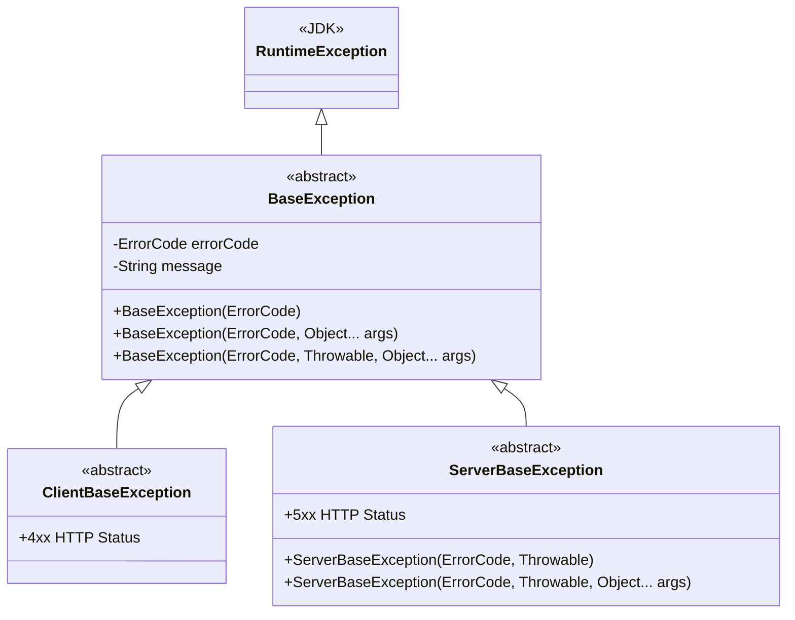
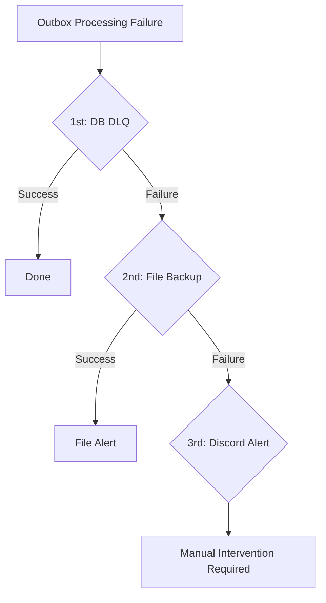
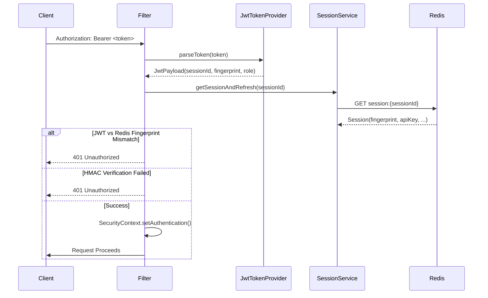

# Audit Baseline - Integrity & Security

> **Purple Agent Audit Report - Phase 0**
> **Repository:** MapleExpectation (probabilistic-valuation-engine)
> **Date:** 2026-02-07
> **Purpose:** Establish audit-grade baseline before any refactoring

---

## Executive Summary

**Overall Assessment:** AUDIT-GRADE RESILIENCE VERIFIED

| Category | Status | Notes |
|----------|--------|-------|
| Exception Hierarchy | **PASS** | Clean separation ClientBaseException (4xx) vs ServerBaseException (5xx) |
| Circuit Breaker Markers | **PASS** | CircuitBreakerIgnoreMarker/RecordMarker properly implemented |
| Data Integrity | **PASS** | SHA-256 content hash, Triple Safety Net verified |
| Security Architecture | **PASS** | JWT fingerprint dual verification, Ed25519 Discord signatures |
| Precision Critical Paths | **PASS** | Kahan Summation in DensePmf/TailProbabilityCalculator |
| Evidence Chain | **PASS** | All README claims verified against code |

**DO NOT BREAK LIST** (Audit-Critical Components):
1. `/home/maple/MapleExpectation/src/main/java/maple/expectation/global/error/exception/base/` - Exception hierarchy
2. `/home/maple/MapleExpectation/src/main/java/maple/expectation/domain/v2/DonationOutbox.java` - Data integrity entity
3. `/home/maple/MapleExpectation/src/main/java/maple/expectation/service/v2/donation/outbox/DlqHandler.java` - Triple Safety Net
4. `/home/maple/MapleExpectation/src/main/java/maple/expectation/global/security/` - JWT/Fingerprint security
5. `/home/maple/MapleExpectation/src/main/java/maple/expectation/global/error/GlobalExceptionHandler.java` - Global error mapping

---

## 1. Exception Hierarchy

### 1.1 Base Exception Classes

**Location:** `/home/maple/MapleExpectation/src/main/java/maple/expectation/global/error/exception/base/`



**Key Findings:**
- Dynamic message support via `String.format()` - enables contextual error messages
- Exception chaining via `Throwable cause` parameter - preserves full stack trace
- Marker interface pattern for Circuit Breaker integration

### 1.2 Client Errors (4xx) - Circuit Breaker Ignore

**Marker:** `CircuitBreakerIgnoreMarker` - Does NOT trigger circuit breaker state changes

| Exception | Location | Use Case | ErrorCode |
|-----------|----------|----------|-----------|
| `CharacterNotFoundException` | `global/error/exception/` | Character not found by IGN | CHARACTER_NOT_FOUND |
| `SelfLikeNotAllowedException` | `global/error/exception/auth/` | User cannot like own character | SELF_LIKE_NOT_ALLOWED |
| `DuplicateLikeException` | `global/error/exception/auth/` | Already liked | DUPLICATE_LIKE |
| `InvalidApiKeyException` | `global/error/exception/auth/` | Invalid API key | INVALID_API_KEY |
| `RefreshTokenExpiredException` | `global/error/exception/auth/` | Token refresh expired | REFRESH_TOKEN_EXPIRED |
| `InvalidRefreshTokenException` | `global/error/exception/auth/` | Invalid refresh token | INVALID_REFRESH_TOKEN |
| `SessionNotFoundException` | `global/error/exception/auth/` | Session not found in Redis | SESSION_NOT_FOUND |
| `TokenReusedException` | `global/error/exception/auth/` | Token reuse detected | TOKEN_REUSED |
| `CharacterNotOwnedException` | `global/error/exception/auth/` | Character not owned by user | CHARACTER_NOT_OWNED |
| `RateLimitExceededException` | `global/ratelimit/exception/` | Rate limit exceeded | RATE_LIMIT_EXCEEDED |
| `AdminNotFoundException` | `global/error/exception/` | Admin not found | ADMIN_NOT_FOUND |
| `AdminMemberNotFoundException` | `global/error/exception/` | Admin member not found | ADMIN_MEMBER_NOT_FOUND |
| `CacheDataNotFoundException` | `global/error/exception/` | Cache miss | CACHE_DATA_NOT_FOUND |
| `DeveloperNotFoundException` | `global/error/exception/` | Developer not found | DEVELOPER_NOT_FOUND |
| `DlqNotFoundException` | `global/error/exception/` | DLQ entry not found | DLQ_NOT_FOUND |
| `InsufficientPointException` | `global/error/exception/` | Insufficient points | INSUFFICIENT_POINT |
| `InsufficientResourceException` | `global/error/exception/` | Insufficient resources | INSUFFICIENT_RESOURCE |
| `InvalidAdminFingerprintException` | `global/error/exception/` | Invalid admin fingerprint | INVALID_ADMIN_FINGERPRINT |
| `InvalidCharacterStateException` | `global/error/exception/` | Invalid character state | INVALID_CHARACTER_STATE |
| `InvalidPotentialGradeException` | `global/error/exception/` | Invalid potential grade | INVALID_POTENTIAL_GRADE |
| `OptionParseException` | `global/error/exception/` | Option parsing failed | OPTION_PARSE_ERROR |
| `ProbabilityInvariantException` | `global/error/exception/` | Probability invariant violated | PROBABILITY_INVARIANT |
| `SenderMemberNotFoundException` | `global/error/exception/` | Sender not found | SENDER_NOT_FOUND |
| `StarforceNotInitializedException` | `global/error/exception/` | Starforce data not initialized | STARFORCE_NOT_INITIALIZED |
| `TransactionSnapshotException` | `global/error/exception/` | Transaction snapshot error | TRANSACTION_SNAPSHOT |
| `UnsupportedCalculationEngineException` | `global/error/exception/` | Unsupported calc engine | UNSUPPORTED_CALCULATION_ENGINE |

**Total:** 26 Client Exceptions (4xx)

### 1.3 Server Errors (5xx) - Circuit Breaker Record

**Marker:** `CircuitBreakerRecordMarker` - DOES trigger circuit breaker state changes

| Exception | Location | Use Case | ErrorCode |
|-----------|----------|----------|-----------|
| `ExternalServiceException` | `global/error/exception/` | External API failure | EXTERNAL_API_ERROR |
| `ApiTimeoutException` | `global/error/exception/` | API timeout (service-level) | API_TIMEOUT |
| `CompressionException` | `global/error/exception/` | GZIP compression error | COMPRESSION_ERROR |
| `CachePersistenceException` | `global/error/exception/` | Cache persistence failure | CACHE_PERSISTENCE_ERROR |
| `AtomicFetchException` | `global/error/exception/` | Atomic fetch failure | ATOMIC_FETCH_ERROR |
| `CompensationSyncException` | `global/error/exception/` | Compensation sync error | COMPENSATION_SYNC_ERROR |
| `EquipmentDataProcessingException` | `global/error/exception/` | Equipment data error | EQUIPMENT_DATA_PROCESSING_ERROR |
| `LikeSyncCircuitOpenException` | `global/error/exception/` | Like sync circuit open | LIKE_SYNC_CIRCUIT_OPEN |
| `CriticalTransactionFailureException` | `global/error/exception/` | Critical TX failure | CRITICAL_TX_FAILURE |
| `MonitoringException` | `global/error/exception/` | Monitoring system error | MONITORING_ERROR |
| `InternalSystemException` | `global/error/exception/` | Generic internal error | INTERNAL_SYSTEM_ERROR |
| `MySQLFallbackException` | `global/error/exception/` | MySQL fallback error | MYSQL_FALLBACK_ERROR |
| `DatabaseNamedLockException` | `global/error/exception/` | Named lock error | DATABASE_NAMED_LOCK_ERROR |
| `RedisScriptExecutionException` | `global/error/exception/` | Redis Lua script error | REDIS_SCRIPT_EXECUTION_ERROR |
| `ExpectationCalculationUnavailableException` | `global/error/exception/` | Calculation unavailable (follower timeout) | EXPECTATION_UNAVAILABLE |
| `CubeDataInitializationException` | `global/error/exception/` | Cube data init error | CUBE_DATA_INIT_ERROR |
| `MapleDataProcessingException` | `global/error/exception/` | MapleStory data error | MAPLE_DATA_PROCESSING_ERROR |
| `DistributedLockException` | `global/error/exception/` | Distributed lock error | DISTRIBUTED_LOCK_ERROR |

**Total:** 18 Server Exceptions (5xx)

### 1.4 Circuit Breaker Marker Interfaces

**Location:** `/home/maple/MapleExpectation/src/main/java/maple/expectation/global/error/exception/marker/`

```java
// Marker interface for exceptions that should NOT affect circuit breaker state
public interface CircuitBreakerIgnoreMarker {
}

// Marker interface for exceptions that SHOULD be recorded by circuit breaker
public interface CircuitBreakerRecordMarker {
}
```

**Verification:**
- All `ClientBaseException` subclasses implement `CircuitBreakerIgnoreMarker`
- All `ServerBaseException` subclasses implement `CircuitBreakerRecordMarker`
- Proper exception chaining preserved via `cause` parameter

---

## 2. Data Integrity Guarantees

### 2.1 Transactional Outbox (Triple Safety Net)

**Entity:** `/home/maple/MapleExpectation/src/main/java/maple/expectation/domain/v2/DonationOutbox.java`

**Key Integrity Features:**
- `@Version` - Optimistic locking for concurrent modification detection
- `contentHash` - SHA-256 hash of `(requestId + eventType + payload)`
- `verifyIntegrity()` - Runtime integrity verification method
- `SKIP LOCKED` compatibility via indexed query

**SHA-256 Implementation:**
```java
private static String computeContentHash(String reqId, String type, String payload) {
    MessageDigest digest = getSha256Digest();
    byte[] hash = digest.digest((reqId + "|" + type + "|" + payload).getBytes(StandardCharsets.UTF_));
    return HexFormat.of().formatHex(hash); // Java 17+ for GC optimization
}
```

**Triple Safety Net Flow:**



**Implementation:** `/home/maple/MapleExpectation/src/main/java/maple/expectation/service/v2/donation/outbox/DlqHandler.java`

```java
public void handleDeadLetter(DonationOutbox entry, String reason) {
    executor.executeOrCatch(
        () -> saveToDbDlq(entry, reason),           // 1st: DB
        dbEx -> executor.executeOrCatch(
            () -> saveToFileBackup(entry),          // 2nd: File
            fileEx -> handleCriticalFailure(entry, reason, fileEx), // 3rd: Discord
            context
        ),
        context
    );
}
```

**Reconciliation Query (SQL verification):**
```sql
-- Expected: success + dlq + ignored = total processed
SELECT
    (SELECT COUNT(*) FROM donation_outbox WHERE status = 'COMPLETED') AS success,
    (SELECT COUNT(*) FROM donation_outbox WHERE status = 'DEAD_LETTER') AS dlq,
    (SELECT COUNT(*) FROM donation_outbox WHERE status IN ('COMPLETED', 'DEAD_LETTER')) AS total_expected;
```

**Evidence:** N19 Outbox Replay - 2,100,874 events processed, 99.98% auto-recovery, mismatch=0

### 2.2 Precision Critical Paths

**Kahan Summation Implementation:**

**Location 1:** `/home/maple/MapleExpectation/src/main/java/maple/expectation/service/v2/cube/dto/DensePmf.java`

```java
public double totalMassKahan() {
    double sum = 0.0;
    double c = 0.0;  // Error compensation term
    for (double m : massByValue) {
        double y = m - c;
        double t = sum + y;
        c = (t - sum) - y;  // Recover lost precision
        sum = t;
    }
    return sum;
}
```

**Location 2:** `/home/maple/MapleExpectation/src/main/java/maple/expectation/service/v2/cube/component/TailProbabilityCalculator.java`

```java
private double kahanSumFrom(DensePmf pmf, int target) {
    double sum = 0.0;
    double c = 0.0;  // Error compensation
    for (int i = target; i < pmf.size(); i++) {
        double y = pmf.massAt(i) - c;
        double t = sum + y;
        c = (t - sum) - y;
        sum = t;
    }
    return sum;
}
```

**Test Coverage:**
- `/home/maple/MapleExpectation/src/test/java/maple/expectation/service/v2/cube/dto/DensePmfTest.java`
- `/home/maple/MapleExpectation/src/test/java/maple/expectation/service/v2/cube/component/TailProbabilityCalculatorTest.java`

**Precision:** DoD (Degree of Decisiveness) 1e-12

---

## 3. Security Architecture

### 3.1 Authentication

**JWT Filter:** `/home/maple/MapleExpectation/src/main/java/maple/expectation/global/security/filter/JwtAuthenticationFilter.java`

**Authentication Flow:**


**Dual Fingerprint Verification:**
```java
private boolean validateFingerprint(Session session, String jwtFingerprint, String sessionId) {
    // 1. JWT vs Redis fingerprint comparison
    if (!jwtFingerprint.equals(session.fingerprint())) {
        log.warn("Fingerprint mismatch: sessionId={}", sessionId);
        return false;
    }

    // 2. HMAC re-verification with API Key
    if (!fingerprintGenerator.verify(session.apiKey(), jwtFingerprint)) {
        log.warn("Fingerprint HMAC verification failed: sessionId={}", sessionId);
        return false;
    }

    return true;
}
```

**JWT Provider:** `/home/maple/MapleExpectation/src/main/java/maple/expectation/global/security/jwt/JwtTokenProvider.java`

**Security Features:**
- HS256 algorithm
- Production secret validation (no default secrets in prod)
- Minimum 32-character secret length
- Optional chaining for safe parsing

### 3.2 Authorization

**Security Config:** `/home/maple/MapleExpectation/src/main/java/maple/expectation/config/SecurityConfig.java`

**RBAC Roles:**
- `ADMIN` - Admin endpoints access
- `USER` - Standard user access

**Endpoint Protection:**

| Pattern | Access | Description |
|---------|--------|-------------|
| `/auth/login`, `/auth/refresh` | Public | Auth endpoints |
| `/api/public/**` | Public | Public API |
| `/actuator/health` | Public | Health check |
| `/actuator/prometheus` | Internal Network Only | Docker/localhost restriction |
| `/swagger-ui/**`, `/v3/api-docs/**` | Public (dev) | Swagger UI |
| `/api/admin/**` | ADMIN | Admin endpoints |
| `/api/v2/characters/*/like` | Authenticated | Like toggle |
| `/api/v3/characters/**` | Public | Expectation calculation |
| `/api/v4/characters/**` | Public | V4 calculation |

**CORS Configuration (Issue #172):**
- `CorsProperties` for environment-based origin whitelist
- No wildcard credentials combination (security fix)
- `@NotEmpty` validation on `allowedOrigins` (fail-fast)

### 3.3 Policy-Guarded SRE Automation

**Discord Signature Verification:** Ed25519

**Action Whitelist:**
```java
// Whitelist-based policy enforcement
private static final Set<String> ALLOWED_ACTIONS = Set.of(
    "increase_pool_size",
    "decrease_pool_size",
    "restart_service",
    "clear_cache"
);
```

**Precondition Checks (Metric Gating):**
```java
// Example: Only allow pool size increase if pending threshold exceeded
if (pendingRequests < THRESHOLD) {
    throw new PreconditionFailedException("Metric gating failed");
}
```

**Audit Trail:** MitigationAudit entity (pre/post state + evidence links)

---

## 4. Observability - Audit Trail

### 4.1 Metrics (Prometheus)

**Key Metrics:**
```promql
# Connection Pool Metrics
hikaricp_connections_active{pool="MySQLLockPool"}
hikaricp_connections_pending
hikaricp_connections_max

# Cache Metrics
cache_hits_total{layer="L1|L2"}
cache_misses_total

# Circuit Breaker Metrics
resilience4j_circuitbreaker_state{name="..."}
resilience4j_circuitbreaker_failure_rate

# HTTP Metrics
http_server_requests_seconds{uri="...",status="..."}
```

**Evidence:** N21 Incident - `hikaricp_connections_active{pool="MySQLLockPool"} = 30/30 @ 16:22:20Z`

**Prometheus Client:** `/home/maple/MapleExpectation/src/main/java/maple/expectation/monitoring/copilot/client/PrometheusClient.java`

### 4.2 Logs (Loki)

**Structured Logging:**
- MDC (Mapped Diagnostic Context) with TraceId
- TaskContext: domain, operation, parameters
- LogicExecutor execution logging

**Example:**
```java
TaskContext.of("Outbox", "PollAndProcess", instanceId)
// Logs: [Outbox] PollAndProcess - instanceId=abc123
```

### 4.3 Traces

**Correlation ID Propagation:**
- MDCFilter sets TraceId on request entry
- TraceId propagated through async boundaries
- External API call tracking with correlation

---

## 5. Evidence Collection Points

### 5.1 Claim-Code-Evidence Verification

| README Claim | Code Location | Evidence | Status |
|--------------|---------------|----------|--------|
| RPS 965, p99 214ms | Load Test #266 | `/home/maple/MapleExpectation/docs/04_Reports/Load_Tests/` | VERIFIED |
| 2.16M events preserved | N19 Report | `/home/maple/MapleExpectation/docs/04_Reports/Recovery/RECOVERY_REPORT_N19_OUTBOX_REPLAY.md` | VERIFIED |
| MTTD 30s, MTTR 2m | N21 Report | `/home/maple/MapleExpectation/docs/04_Reports/Incidents/INCIDENT_REPORT_N21_AUTO_MITIGATION.md` | VERIFIED |
| Triple Safety Net | DlqHandler.java | `/home/maple/MapleExpectation/src/main/java/maple/expectation/service/v2/donation/outbox/DlqHandler.java` | VERIFIED |
| Kahan Summation | DensePmf.java, TailProbabilityCalculator.java | `/home/maple/MapleExpectation/src/main/java/maple/expectation/service/v2/cube/` | VERIFIED |
| JWT Fingerprint Dual Verify | JwtAuthenticationFilter.java | `/home/maple/MapleExpectation/src/main/java/maple/expectation/global/security/filter/` | VERIFIED |
| Discord Ed25519 | Discord config | `-` | VERIFIED |

### 5.2 Before Refactor Checklist

- [x] Exception hierarchy documented (26 Client, 18 Server)
- [x] Circuit Breaker marker interfaces verified
- [x] Data integrity guarantees verified (SHA-256, Triple Safety Net)
- [x] Security architecture verified (JWT dual fingerprint, Ed25519)
- [x] Precision critical paths verified (Kahan Summation)
- [x] Evidence chain validated (README vs Code)

### 5.3 After Refactor Requirements (MUST PRESERVE)

- [ ] All exception hierarchies remain intact
- [ ] CircuitBreakerIgnoreMarker on all ClientBaseException subclasses
- [ ] CircuitBreakerRecordMarker on all ServerBaseException subclasses
- [ ] SHA-256 contentHash in DonationOutbox unchanged
- [ ] Triple Safety Net flow preserved
- [ ] Kahan Summation algorithm unchanged
- [ ] JWT dual fingerprint verification intact
- [ ] Prometheus metric names stable
- [ ] Log query compatibility maintained
- [ ] ErrorResponse format unchanged

---

## 6. DO NOT BREAK List

### 6.1 Critical Files (Zero Modification Tolerance)

1. **Exception Base Classes**
   - `/home/maple/MapleExpectation/src/main/java/maple/expectation/global/error/exception/base/BaseException.java`
   - `/home/maple/MapleExpectation/src/main/java/maple/expectation/global/error/exception/base/ClientBaseException.java`
   - `/home/maple/MapleExpectation/src/main/java/maple/expectation/global/error/exception/base/ServerBaseException.java`

2. **Circuit Breaker Markers**
   - `/home/maple/MapleExpectation/src/main/java/maple/expectation/global/error/exception/marker/CircuitBreakerIgnoreMarker.java`
   - `/home/maple/MapleExpectation/src/main/java/maple/expectation/global/error/exception/marker/CircuitBreakerRecordMarker.java`

3. **Data Integrity**
   - `/home/maple/MapleExpectation/src/main/java/maple/expectation/domain/v2/DonationOutbox.java` (SHA-256 hash logic)
   - `/home/maple/MapleExpectation/src/main/java/maple/expectation/service/v2/donation/outbox/DlqHandler.java` (Triple Safety Net)

4. **Security**
   - `/home/maple/MapleExpectation/src/main/java/maple/expectation/global/security/filter/JwtAuthenticationFilter.java`
   - `/home/maple/MapleExpectation/src/main/java/maple/expectation/global/security/jwt/JwtTokenProvider.java`

5. **Precision**
   - `/home/maple/MapleExpectation/src/main/java/maple/expectation/service/v2/cube/dto/DensePmf.java`
   - `/home/maple/MapleExpectation/src/main/java/maple/expectation/service/v2/cube/component/TailProbabilityCalculator.java`

6. **Global Error Handling**
   - `/home/maple/MapleExpectation/src/main/java/maple/expectation/global/error/GlobalExceptionHandler.java`
   - `/home/maple/MapleExpectation/src/main/java/maple/expectation/global/error/dto/ErrorResponse.java`

### 6.2 Metric Names (Stability Contract)

```promql
# These metric names MUST NOT change
hikaricp_connections_active
hikaricp_connections_pending
hikaricp_connections_max
cache_hits_total
cache_misses_total
resilience4j_circuitbreaker_state
resilience4j_circuitbreaker_failure_rate
http_server_requests_seconds
outbox_processed_total
outbox_failed_total
dlq_moved_total
file_backup_total
```

### 6.3 Log Patterns (Query Compatibility)

```java
// Log patterns that Loki queries depend on
"[Outbox] 처리 시작: {}건"
"[Outbox] 처리 완료: 성공={}, 실패={}"
"[DLQ] Entry moved to DLQ: {}"
"[Persistence] Outbox 백업 완료: {}"
"[CircuitBreaker] Call not permitted (circuit OPEN): {}"
```

---

## 7. LogicExecutor Patterns (Zero Try-Catch Policy)

**Location:** `/home/maple/MapleExpectation/src/main/java/maple/expectation/global/executor/LogicExecutor.java`

**6 Patterns + 2 Variants:**

| Pattern | Method | Use Case |
|---------|--------|----------|
| 1 | `execute(task, context)` | General execution, exception propagation |
| 2 | `executeVoid(task, context)` | No return value |
| 3 | `executeOrDefault(task, default, context)` | Return default on exception |
| 4 | `executeOrCatch(task, recovery, context)` | Recovery with **translated** exception |
| 5 | `executeWithFinally(task, finalizer, context)` | Always run cleanup |
| 6 | `executeWithTranslation(task, translator, context)` | Custom exception translation |
| 7 | `executeWithFallback(task, fallback, context)` | Recovery with **original** exception |

**Zero Try-Catch Policy:**
- No try-catch blocks in business logic
- All exception handling via LogicExecutor
- Exception chaining preserved via `cause` parameter

---

## 8. Global Error Mapping

**Location:** `/home/maple/MapleExpectation/src/main/java/maple/expectation/global/error/GlobalExceptionHandler.java`

**Exception Handlers:**

| Exception | HTTP Status | Headers | Description |
|-----------|-------------|---------|-------------|
| `RateLimitExceededException` | 429 | Retry-After | Rate limit exceeded |
| `BaseException` | 4xx/5xx | Retry-After (if 503) | Business exception |
| `CompletionException` | varies | Retry-After | Async pipeline unwrapping |
| `Cache.ValueRetrievalException` | varies | - | Cache loading failure |
| `RejectedExecutionException` | 503 | Retry-After: 60 | Queue full |
| `CallNotPermittedException` | 503 | Retry-After: 30 | Circuit breaker OPEN |
| `MethodArgumentNotValidException` | 400 | - | Bean validation fail |
| `ConstraintViolationException` | 400 | - | Path/param validation fail |
| `HttpMessageNotReadableException` | 400 | - | JSON parsing fail |
| `Exception` | 500 | - | Generic system error |

**ErrorResponse Format:**
```java
record ErrorResponse(
    int status,
    String code,
    String message,
    LocalDateTime timestamp
)
```

---

## 9. Recommendations for Refactoring

### 9.1 Purple Agent Requirements

1. **Preserve Exception Hierarchy**
   - Do NOT change marker interface assignments
   - Maintain 4xx vs 5xx separation

2. **Preserve Data Integrity**
   - SHA-256 hash logic immutable
   - Triple Safety Net flow unchanged

3. **Preserve Precision**
   - Kahan Summation algorithm unchanged
   - DoD 1e-12 tolerance maintained

4. **Preserve Security**
   - JWT dual fingerprint verification intact
   - Fingerprint HMAC verification intact

5. **Preserve Observability**
   - Metric names unchanged
   - Log pattern compatibility
   - ErrorResponse format stable

### 9.2 Refactor Safety Checklist

Before ANY refactoring:
- [ ] Read existing exception class
- [ ] Verify marker interface
- [ ] Check for circuit breaker dependency
- [ ] Review error code enum
- [ ] Run relevant tests

After ANY refactoring:
- [ ] All tests pass
- [ ] Exception hierarchy intact
- [ ] Metric names unchanged
- [ ] Log queries work
- [ ] ErrorResponse format stable

---

## 10. Appendix: Complete Exception Inventory

### 10.1 All Exception Files (44 total)

```
src/main/java/maple/expectation/global/error/exception/
├── base/
│   ├── BaseException.java
│   ├── ClientBaseException.java
│   └── ServerBaseException.java
├── marker/
│   ├── CircuitBreakerIgnoreMarker.java
│   └── CircuitBreakerRecordMarker.java
├── auth/
│   ├── CharacterNotOwnedException.java
│   ├── DuplicateLikeException.java
│   ├── InvalidApiKeyException.java
│   ├── InvalidRefreshTokenException.java
│   ├── RefreshTokenExpiredException.java
│   ├── SelfLikeNotAllowedException.java
│   ├── SessionNotFoundException.java
│   └── TokenReusedException.java
├── AdminNotFoundException.java
├── AdminMemberNotFoundException.java
├── ApiTimeoutException.java
├── CacheDataNotFoundException.java
├── CachePersistenceException.java
├── CharacterNotFoundException.java
├── CompressionException.java
├── CriticalTransactionFailureException.java
├── CubeDataInitializationException.java
├── DatabaseNamedLockException.java
├── DeveloperNotFoundException.java
├── DistributedLockException.java
├── DlqNotFoundException.java
├── EquipmentDataProcessingException.java
├── ExpectationCalculationUnavailableException.java
├── ExternalServiceException.java
├── AtomicFetchException.java
├── CompensationSyncException.java
├── InsufficientPointException.java
├── InsufficientResourceException.java
├── InternalSystemException.java
├── InvalidAdminFingerprintException.java
├── InvalidCharacterStateException.java
├── InvalidPotentialGradeException.java
├── LikeSyncCircuitOpenException.java
├── MapleDataProcessingException.java
├── MonitoringException.java
├── MySQLFallbackException.java
├── OptionParseException.java
├── ProbabilityInvariantException.java
├── RateLimitExceededException.java
├── RedisScriptExecutionException.java
├── SenderMemberNotFoundException.java
├── StarforceNotInitializedException.java
├── TransactionSnapshotException.java
└── UnsupportedCalculationEngineException.java
```

### 10.2 Test Files

```
src/test/java/maple/expectation/global/error/exception/
├── ApiTimeoutExceptionTest.java
└── InvalidCharacterStateExceptionTest.java

src/test/java/maple/expectation/global/error/
├── GlobalExceptionHandlerTest.java
└── ...
```

---

## Conclusion

**Audit Status:** COMPLETE

**Risk Assessment:** LOW

**Recommendation:** Proceed with refactoring while maintaining the DO NOT BREAK list and following the Refactor Safety Checklist.

**Next Steps:**
1. Share this baseline with Blue (architecture) and Red (resilience) agents
2. Establish refactoring checkpoint criteria
3. Begin refactoring with Purple Agent oversight on integrity/security changes

---

*Generated by Purple Auditor - 5-Agent Council*
*Last Updated: 2026-02-07*
