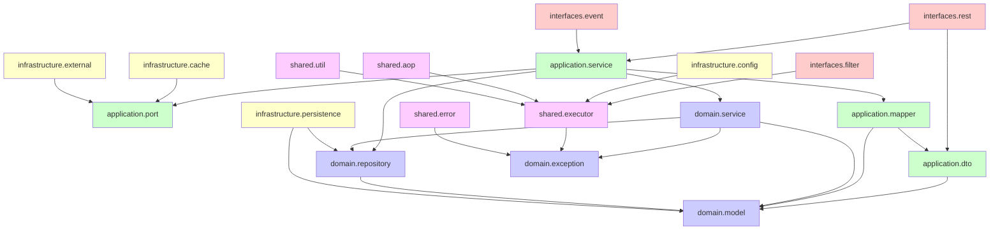
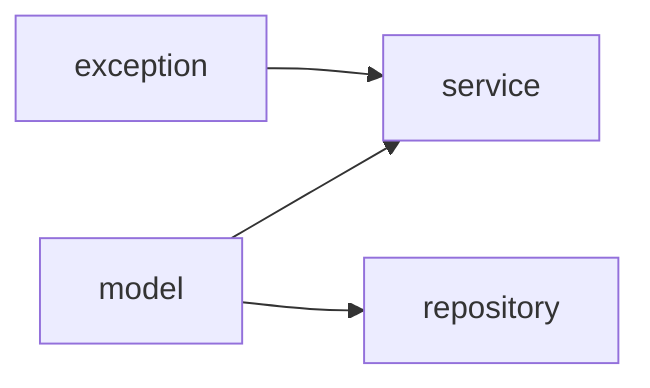
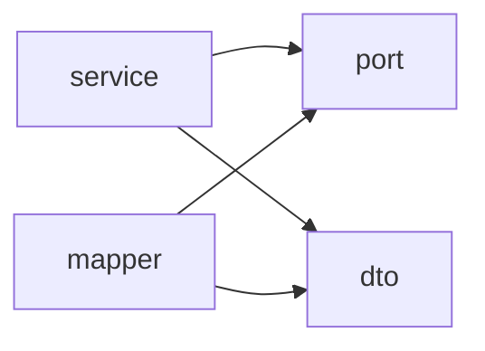
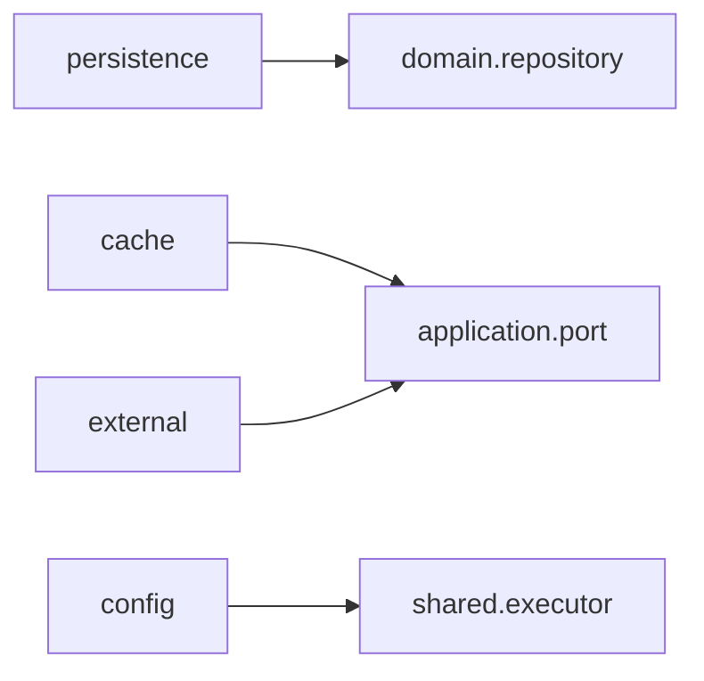
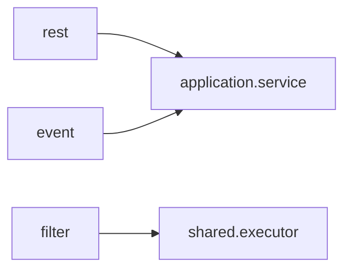
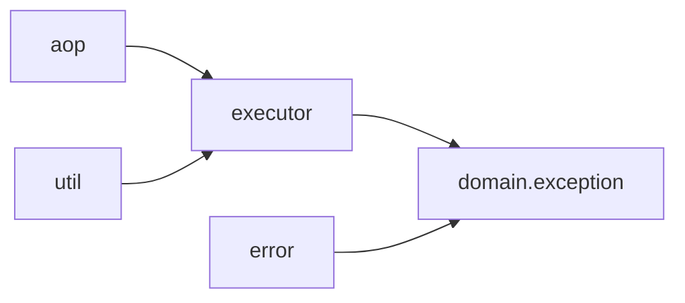

# Package Structure Documentation

## Overview

This document describes the Clean Architecture (Hexagonal) package structure adopted for MapleExpectation as part of Issue #325 - Refactor to Clean Architecture.

## Architecture Principles

### Dependency Rule

```
┌─────────────────────────────────────────────────────────────┐
│                            Interfaces                        │
│  ┌────────────────────────────────────────────────────────┐ │
│  │                      Application                       │ │
│  │  ┌──────────────────────────────────────────────────┐ │ │
│  │  │                       Domain                     │ │ │
│  │  └──────────────────────────────────────────────────┘ │ │
│  └────────────────────────────────────────────────────────┘ │
│  ┌────────────────────────────────────────────────────────┐ │
│  │                      Shared                            │ │
│  └────────────────────────────────────────────────────────┘ │
└─────────────────────────────────────────────────────────────┘

Infrastructure (Adapters) ────────┘
```

**Core Rule:** Dependencies must point inward only. Outer layers can depend on inner layers, but inner layers never depend on outer layers.

### Package Dependency Graph



## Layer Descriptions

### Domain Layer (`domain.*`)

**Purpose:** Pure business logic, independent of any framework.



#### `domain.model`

- **Business entities:** User, Character, Equipment, etc.
- **Value objects:** Money, DamageRange, etc.
- **Domain events:** CharacterCreated, EquipmentUpgraded
- **Constraints:** No Spring, JPA, Jackson, or Lombok annotations

**Examples:**
```java
// Pure domain entity
public class Character {
    private final CharacterId id;
    private final String name;
    private final Level level;

    // Business logic methods
    public boolean canUpgradeEquipment(Equipment equipment) {
        return this.level.value() >= equipment.requiredLevel();
    }
}
```

#### `domain.service`

- **Domain service interfaces:** Business rules that don't naturally fit in entities
- **Domain logic orchestration:** Coordinating multiple domain objects
- **Constraints:** No I/O, database, or cache operations

**Examples:**
```java
// Domain service interface
public interface EquipmentUpgradeDomainService {
    UpgradeCost calculateCost(Character character, Equipment equipment);
    boolean validateRequirements(Character character, Equipment equipment);
}
```

#### `domain.repository`

- **Repository interfaces:** Port definitions for data access
- **Query method signatures:** Read/write operations
- **Constraints:** No implementation classes (those go to infrastructure)

**Examples:**
```java
// Repository interface (port)
public interface CharacterRepository {
    Character findById(CharacterId id);
    void save(Character character);
    List<Character> findByLevelGreaterThan(Level minLevel);
}
```

#### `domain.exception`

- **Business exceptions:** Domain-specific error conditions
- **Domain errors:** Validation failures, rule violations
- **Constraints:** No framework-specific exceptions

**Examples:**
```java
// Domain exception
public class InvalidUpgradeException extends DomainException {
    public InvalidUpgradeException(String message) {
        super(ErrorCode.INVALID_UPGRADE, message);
    }
}
```

### Application Layer (`application.*`)

**Purpose:** Orchestrate domain logic and integrate with infrastructure through ports.



#### `application.service`

- **Use case implementations:** Application-specific workflows
- **Transaction management:** @Transactional boundaries
- **Orchestration:** Coordinating domain services via ports

**Examples:**
```java
// Application service (use case)
@Service
@RequiredArgsConstructor
public class UpgradeEquipmentUseCase {
    private final CharacterRepository characterRepo;
    private final EquipmentUpgradeDomainService upgradeService;

    @Transactional
    public UpgradeResult upgrade(UpgradeCommand command) {
        Character character = characterRepo.findById(command.characterId());
        return upgradeService.calculateCost(character, command.equipment());
    }
}
```

#### `application.dto`

- **Request DTOs:** API request contracts
- **Response DTOs:** API response contracts
- **API contracts:** Version-stable data structures

**Examples:**
```java
// Request DTO
public record UpgradeRequest(
    String characterId,
    String equipmentId,
    int targetLevel
) {}

// Response DTO
public record UpgradeResponse(
    long cost,
    double successRate,
    String message
) {}
```

#### `application.port`

- **Inbound ports:** Use case interfaces
- **Outbound ports:** Repository, external service interfaces
- **Hexagonal boundaries:** Clear separation between core and adapters

**Examples:**
```java
// Inbound port (use case interface)
public interface UpgradeEquipmentUseCasePort {
    UpgradeResponse upgrade(UpgradeRequest request);
}

// Outbound port (repository interface)
public interface NexonApiPort {
    CharacterData fetchCharacter(String ocid);
}
```

#### `application.mapper`

- **Domain ↔ DTO mapping:** Conversion between layers
- **MapStruct mappers:** Compiler-generated mapping code
- **Mapper implementations:** Manual mapping when needed

**Examples:**
```java
// Mapper interface
@Mapper(componentModel = "spring")
public interface CharacterMapper {
    CharacterDto toDto(Character character);
    Character toEntity(CharacterDto dto);
}
```

### Infrastructure Layer (`infrastructure.*`)

**Purpose:** Implement ports and integrate with external systems.



#### `infrastructure.persistence`

- **JPA entities:** Database table mappings
- **Repository implementations:** Spring Data JPA repositories
- **Database configuration:** Datasource, JPA settings

**Examples:**
```java
// JPA entity
@Entity
@Table(name = "characters")
public class CharacterEntity {
    @Id @GeneratedValue(strategy = GenerationType.IDENTITY)
    private Long id;

    private String name;
    private Integer level;
    // ... JPA annotations
}

// Repository implementation
@Repository
@RequiredArgsConstructor
public class CharacterRepositoryImpl implements CharacterRepository {
    private final SpringDataCharacterRepository springRepo;

    @Override
    public Character findById(CharacterId id) {
        // Map JPA entity to domain model
    }
}
```

#### `infrastructure.cache`

- **Redis configurations:** Redisson, RedisTemplate
- **Caffeine cache configurations:** Local cache setup
- **Cache adapters:** Tiered cache implementations
- **Cache strategies:** Write-through, write-behind

**Examples:**
```java
// Cache adapter
@Component
@RequiredArgsConstructor
public class CharacterCacheAdapter implements CharacterRepository {
    private final CharacterRepository delegate;
    private final RedissonClient redis;

    @Cacheable(value = "characters", key = "#id.value()")
    public Character findById(CharacterId id) {
        return delegate.findById(id);
    }
}
```

#### `infrastructure.external`

- **Nexon Open API client:** External API integration
- **Circuit breaker configurations:** Resilience4j setup
- **API response handlers:** Parsing and error handling

**Examples:**
```java
// External API client
@Component
@RequiredArgsConstructor
public class NexonApiClientImpl implements NexonApiPort {
    private final RestClient restClient;
    private final CircuitBreaker circuitBreaker;

    @Override
    @CircuitBreaker(name = "nexonApi")
    public CharacterData fetchCharacter(String ocid) {
        return restClient.get()
            .uri("/maplestory/v1/character/{ocid}", ocid)
            .retrieve()
            .body(CharacterData.class);
    }
}
```

#### `infrastructure.config`

- **Bean definitions:** Spring configuration classes
- **Property configurations:** @ConfigurationProperties
- **Infrastructure setup:** Connection pools, thread pools

**Examples:**
```java
// Configuration class
@Configuration
@EnableRedisRepositories
public class RedisConfig {
    @Bean
    public RedissonClient redissonClient(Config config) {
        return Redisson.create(config);
    }
}
```

### Interfaces Layer (`interfaces.*`)

**Purpose:** Interface adapters (REST, events, filters) that coordinate with application layer.



#### `interfaces.rest`

- **REST controllers:** @RestController endpoints
- **Request validation:** @Valid, @RequestBody
- **Response formatting:** HTTP status codes, headers

**Examples:**
```java
// REST controller
@RestController
@RequiredArgsConstructor
@RequestMapping("/api/v1/characters")
public class CharacterController {
    private final UpgradeEquipmentUseCase upgradeUseCase;

    @PostMapping("/{id}/upgrade")
    public ResponseEntity<UpgradeResponse> upgrade(
        @PathVariable String id,
        @Valid @RequestBody UpgradeRequest request
    ) {
        UpgradeResponse response = upgradeUseCase.upgrade(request);
        return ResponseEntity.ok(response);
    }
}
```

#### `interfaces.event`

- **Domain event listeners:** Spring @EventListener
- **Application event listeners:** @Async event processing
- **Event publishing:** ApplicationEventPublisher

**Examples:**
```java
// Event listener
@Component
@RequiredArgsConstructor
public class EquipmentUpgradeListener {
    private final NotificationService notificationService;

    @EventListener
    @Async("taskExecutor")
    public void handleEquipmentUpgraded(EquipmentUpgradedEvent event) {
        notificationService.sendUpgradeNotification(event.characterId());
    }
}
```

#### `interfaces.filter`

- **Security filters:** Spring Security filter chains
- **Logging filters:** Request/response logging
- **MDC propagation:** Trace ID correlation

**Examples:**
```java
// Logging filter
@Component
@Order(Ordered.HIGHEST_PRECEDENCE)
public class MdcFilter extends OncePerRequestFilter {
    @Override
    protected void doFilterInternal(
        HttpServletRequest request,
        HttpServletResponse response,
        FilterChain filterChain
    ) {
        MDC.put("traceId", UUID.randomUUID().toString());
        try {
            filterChain.doFilter(request, response);
        } finally {
            MDC.clear();
        }
    }
}
```

### Shared Layer (`shared.*`)

**Purpose:** Cross-cutting concerns used by all layers.



#### `shared.error`

- **GlobalExceptionHandler:** @RestControllerAdvice
- **Error response builders:** Consistent error format
- **Exception mapping:** Domain exceptions to HTTP status

**Examples:**
```java
// Global exception handler
@RestControllerAdvice
@RequiredArgsConstructor
public class GlobalExceptionHandler {
    private final LogicExecutor executor;

    @ExceptionHandler(InvalidUpgradeException.class)
    public ResponseEntity<ErrorResponse> handleInvalidUpgrade(
        InvalidUpgradeException ex
    ) {
        return ResponseEntity
            .status(HttpStatus.BAD_REQUEST)
            .body(ErrorResponse.from(ex));
    }
}
```

#### `shared.executor`

- **LogicExecutor interface:** Structured execution framework
- **TaskContext:** Structured logging context
- **Execution pipelines:** Metrics, tracing, error handling

**Examples:**
```java
// LogicExecutor usage
@Service
@RequiredArgsConstructor
public class CharacterService {
    private final LogicExecutor executor;
    private final CharacterRepository repository;

    public Character findById(CharacterId id) {
        return executor.executeOrDefault(
            () -> repository.findById(id),
            null,
            TaskContext.of("Character", "FindById", id)
        );
    }
}
```

#### `shared.aop`

- **Logging aspects:** @Loggable annotation
- **Metrics aspects:** @Timed annotation
- **Retry aspects:** @Retryable annotation
- **Tracing aspects:** Distributed tracing

**Examples:**
```java
// Logging aspect
@Aspect
@Component
public class LoggingAspect {
    @Around("@annotation(loggable)")
    public Object logMethodExecution(ProceedingJoinPoint joinPoint, Loggable loggable) {
        log.info("Entering: {}", joinPoint.getSignature());
        try {
            Object result = joinPoint.proceed();
            log.info("Exiting: {}", joinPoint.getSignature());
            return result;
        } catch (Throwable ex) {
            log.error("Error in: {}", joinPoint.getSignature(), ex);
            throw ex;
        }
    }
}
```

#### `shared.util`

- **Common helpers:** Utility methods
- **Validation utilities:** Custom validators
- **Conversion utilities:** Type converters
- **Date/time utilities:** Temporal helpers

**Examples:**
```java
// Utility class
public final class ValidationUtils {
    public static void requirePositive(long value, String fieldName) {
        if (value <= 0) {
            throw new IllegalArgumentException(
                "%s must be positive: %d".formatted(fieldName, value)
            );
        }
    }
}
```

## Migration Strategy

### Phase 1: Package Structure (✓ COMPLETED)

- [x] Create empty packages for all layers
- [x] Add package-info.java documentation
- [x] Define ArchUnit rules for layer isolation
- [x] Verify build succeeds

### Phase 2: Define Interfaces

- [ ] Create base interfaces in `application.port`
- [ ] Create domain repository interfaces
- [ ] Document interface contracts

### Phase 3: Migrate Domain Logic

1. **Extract domain models**
   - Move JPA entities → Domain entities
   - Remove framework annotations
   - Add business logic methods

2. **Extract domain services**
   - Move business rules to `domain.service`
   - Remove infrastructure dependencies

3. **Create repository interfaces**
   - Define in `domain.repository`
   - Implement in `infrastructure.persistence`

### Phase 4: Migrate Application Layer

1. **Create use case services**
   - Orchestrate domain logic via ports
   - Manage transactions

2. **Create DTOs**
   - Define request/response contracts
   - Add mappers

### Phase 5: Migrate Infrastructure

1. **Implement repositories**
   - JPA entities remain in infrastructure
   - Implement domain repository interfaces

2. **Implement external service clients**
   - Nexon API client
   - Circuit breakers

### Phase 6: Migrate Interfaces

1. **Refactor controllers**
   - Thin delegates to application services
   - Remove business logic

2. **Move filters/events**
   - Organize under `interfaces` package

## ArchUnit Rules

The following architectural constraints are enforced by ArchUnit tests:

### Domain Isolation

```java
// Domain should not depend on infrastructure/frameworks
noClasses()
    .that().resideInAPackage("..domain..")
    .should().dependOnClassesThat()
    .resideInAnyPackage(
        "..springframework..",
        "..hibernate..",
        "..persistence..",
        "..jackson..",
        "..lombok.."
    );
```

### Application Layer Constraints

```java
// Application should only depend on domain (through ports)
noClasses()
    .that().resideInAPackage("..application..")
    .should().dependOnClassesThat()
    .resideInAnyPackage("..infrastructure..", "..interfaces..");
```

### Infrastructure Dependency Rule

```java
// Infrastructure depends on ports (interfaces), not implementations
noClasses()
    .that().resideInAPackage("..infrastructure..")
    .should().dependOnClassesThat()
    .resideInAPackage("..application.service..");
```

## Benefits

### 1. Testability

- **Domain layer:** Pure unit tests without mocking
- **Application layer:** Mock ports for integration tests
- **Infrastructure layer:** Separate integration tests with real databases

### 2. Maintainability

- **Clear separation:** Each layer has a single responsibility
- **Dependency direction:** Always inward, preventing circular dependencies
- **Framework independence:** Domain logic can be reused in different contexts

### 3. Scalability

- **Independent evolution:** Each layer can change independently
- **Portability:** Domain logic can be extracted to a library
- **Performance:** Optimize infrastructure without touching domain

### 4. Team Collaboration

- **Parallel development:** Teams can work on different layers
- **Clear boundaries:** Interface contracts enable API-first development
- **Onboarding:** New developers understand structure quickly

## Verification

### Build Verification

```bash
# Compile main code
./gradlew compileJava

# Run ArchUnit tests
./gradlew test --tests "*ArchitectureTest"

# Run all tests (after fixing existing test issues)
./gradlew test
```

### Package Structure Verification

```bash
# Verify all packages exist
find src/main/java/maple/expectation -type d | sort

# Verify package-info.java files
find src/main/java/maple/expectation -name "package-info.java"
```

## Next Steps

1. **Phase 2D:** Define base interfaces (Issue #325)
2. **Phase 3A:** Extract domain models from existing entities
3. **Phase 3B:** Create domain repository interfaces
4. **Phase 4A:** Create application use case services
5. **Phase 5A:** Implement repositories in infrastructure

## References

- [Clean Architecture by Robert C. Martin](https://www.amazon.com/Clean-Architecture-Craftsmanship-Software-Structure/dp/0134494164)
- [Hexagonal Architecture by Alistair Cockburn](https://alistair.cockburn.us/hexagonal-architecture/)
- [ArchUnit Documentation](https://www.archunit.org/)
- [Spring Boot Best Practices](https://spring.io/guides/gs/spring-boot/)

---

**Document Version:** 1.0
**Last Updated:** 2026-02-07
**Related Issue:** #325 - Refactor to Clean Architecture
**Author:** Blue Architect (5-Agent Council)
