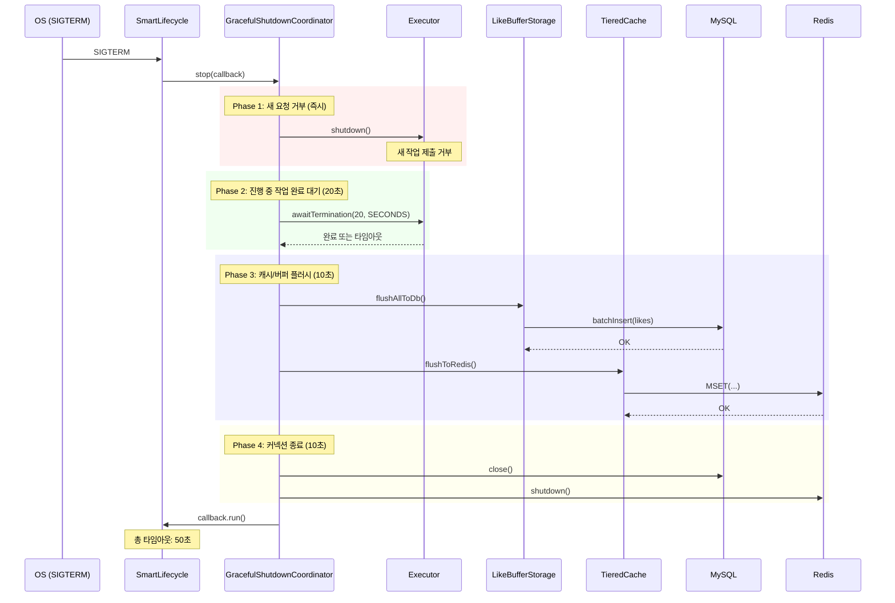
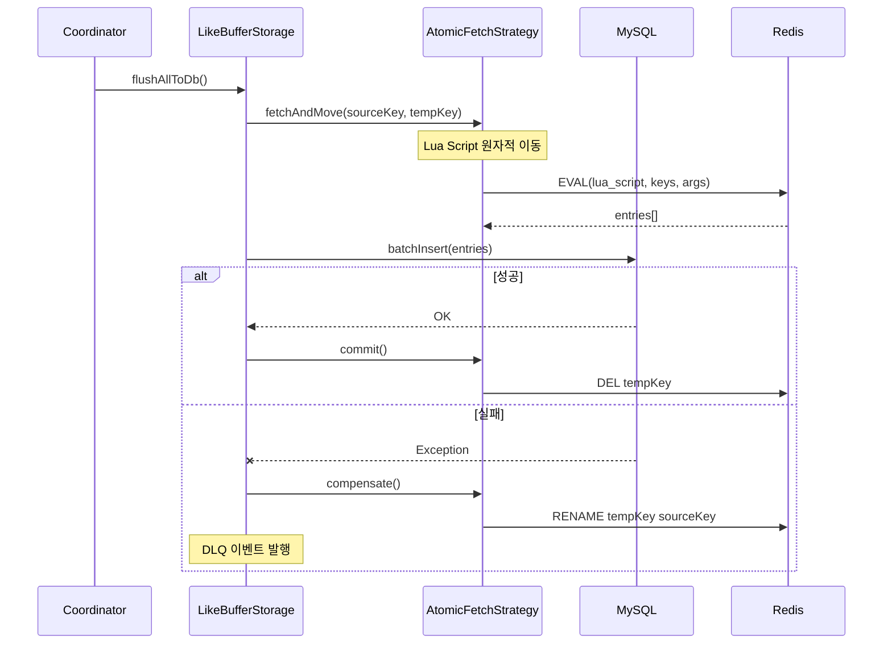
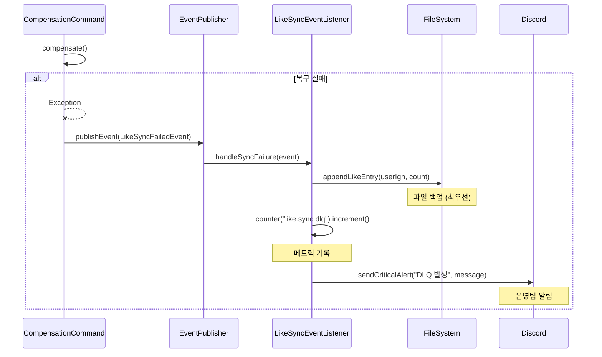

# Graceful Shutdown 시퀀스 다이어그램

## 개요

4단계 순차 종료로 진행 중인 작업과 데이터를 안전하게 보존합니다.

## 전체 종료 시퀀스



## Phase별 상세

### Phase 1: 새 요청 거부

```java
@Override
public void stop(Runnable callback) {
    // 즉시 실행
    executorService.shutdown();
    log.info("[Shutdown] Phase 1: Executor 새 작업 제출 중단");
    ...
}
```

### Phase 2: 진행 중 작업 완료 대기

```java
boolean terminated = executorService.awaitTermination(20, TimeUnit.SECONDS);
if (!terminated) {
    log.warn("[Shutdown] Phase 2: 일부 작업 강제 종료");
    executorService.shutdownNow();
}
```

### Phase 3: 캐시/버퍼 플러시



### Phase 4: 커넥션 종료

```java
hikariDataSource.close();
redissonClient.shutdown();
log.info("[Shutdown] Phase 4: 모든 커넥션 종료 완료");
```

## DLQ (Dead Letter Queue) 처리



## 파일 백업 구조

```
backup/
├── shutdown-{serverId}/
│   ├── likes-{timestamp}.json
│   └── equipment-{timestamp}.json
```

## SmartLifecycle 설정

```java
@Override
public int getPhase() {
    return Integer.MAX_VALUE;  // 가장 마지막에 종료
}

@Override
public boolean isAutoStartup() {
    return true;
}

// 총 타임아웃: 50초
private static final Duration TOTAL_TIMEOUT = Duration.ofSeconds(50);
```

## 관련 파일

- `src/main/java/maple/expectation/global/shutdown/GracefulShutdownCoordinator.java`
- `src/main/java/maple/expectation/service/v2/shutdown/ShutdownDataPersistenceService.java`
- `src/main/java/maple/expectation/service/v2/shutdown/ShutdownDataRecoveryService.java`
